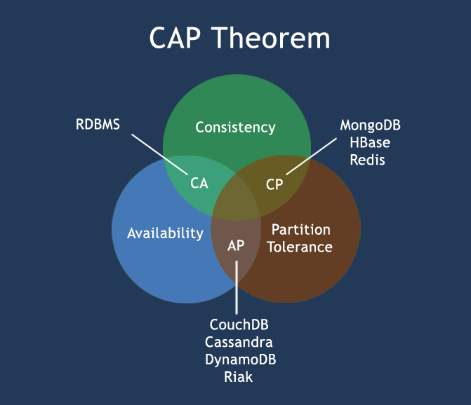

# CAP
- 분산환경에서는 일관성과 가용성의 트레이드 오프를 선택해야 하는 경우가 많다.

## Consistency 일관성
- 모든 노드가 동일한 순서로 업데이트된 데이터를 본다.
    - 쓰기가 **commit 상태**가 되기 전에, 모든 노드에 commit 되어야 한다.

## Availability 가용성
- 정상적으로 사용 가능한가
    - 분산환경의 가용성이란, 어느 노드가 작동 중지된 상태에서도 클라이언트가 유효한 응답을 받을 수 있는가를 의미한다.
    - 가용성 = 정상 서비스 시간 / 전체 서비스 시간 (정상 + 에러)
- 고가용성?
    - 1년에 5분 15초 이하의 장애 99.999% 5Nines

    
## Partition Tolerance 분할 내성
- 분할 상태에도 불구하고, 클러스터가 작동 가능한가
- 분할 상태? Partition
    - 노드와 네트워크의 조합에 걸쳐 데이터가 복제된 상태에서, 노드 간 연결이 유실되거나 지연된 상태

# CAP 정리
- 분산 환경에서 세가지 중 두가지만 제공할 수 있다.

## CA
- RDBMS
- 분할된 노드간 일관성을 위해, 응답을 기다리느라, 시간 초과 오류 (timeout error)가 발생할 수 있다.
- CP는 원자성 읽기와 쓰기를 필요로 하는 비즈니스 로직에 좋은 선택이 될 것이다.
- 분산 환경에서 내결함성을 가질 수는 없다. 
    - 분산 환경에서 분할은 피할 수 없으므로 
    - 내결함성?
        - 하위 시스템 고장을 견디고 가용성을 유지하는 능력

## CP
- 어느 노드에 분할이 발생하면, 분할이 해결될 때까지 사용불가하게 한다.
- MongoDB, HBase, Redis
- MongoDB는 단일 마스터 시스템으로, 
    - 복제본 노드(2차 노드)들은 1차 노드의 조작 로그를 복제하여 적용한다.
    - 복제 노드에서 읽기를 허용 할 수도 있다.
    - 1차 노드가 사용 불가능해졌을 때(기능 정지), 가장 최신 로그의 2차 노드를 새 1차 노드로 선정한다.
        - 다른 모든 2차 노드들이 새 마스터를 따라잡았을 때, 클러스터가 다시 활성화된다.(기능 재활성화) => 가용성이 떨어진다.
        - 클라이언트가 이 동안, 쓰기 요청을 할 수 없으므로, 데이터는 전체 네트워크에서 일관성을 유지한다.

## AP
- 응답 요청을 모든 노드에서 받을 수 있으나, 그 노드의 최신 버전 데이터를 반환한다.
    - 분할된 데이터일 수 있다.
- 외부 장애에도 시스템을 유지해야 하며, 데이터가 궁극적으로 일관성 있으면 되는 비즈니스 모델
- CouchDB, Cassandra, DynamoDB, Riak
- Cassandra는 마스터리스 아키텍처로,
    - 하나가 아닌 다수의 장애 지점이 있을 수 있다.
    - 가용성과 파티션을 제공하지만, 상시 일관성을 갖지 못한다.
    - 마스터 노드가 없어, 모든 노드는 지속적으로 사용 가능하다.
        - 클라이언트는 모든 노드에서 쓰기 요청할 수 있으며,
        - 불일치를 빨리 조정하여, 궁극적인 일관성을 제공한다.
    - 지속적 가용성과 고성능 시스템을 갖추나, 분할이 생김으로 상쇄 효과가 있다.
