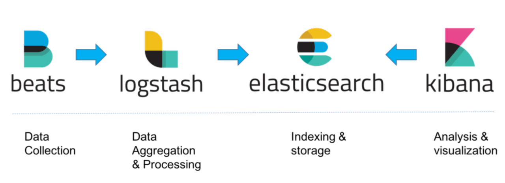
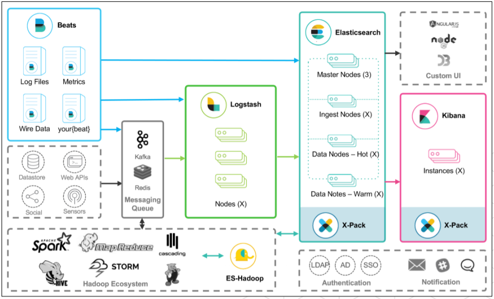

## Telemetry 혹은 Observation
- 로깅
- 모니터링
- 트레이싱

## filebeat
- 데이터를 애플리케이션으로부터 모아줌
- `docker pull elastic/filebeat:8.8.1`
- docker.elastic.co/elasticsearch/elasticsearch-oss:7.10.2
- `docker run -d --name filebeat --network elk -v "./filebeat.yml:/usr/share/filebeat/filebeat.yml" -v  "../logs:/logs" elastic/filebeat`

## logstash
- 데이터를 집계하고 정제
- `docker pull logstash:8.8.1`
- docker.elastic.co/logstash/logstash-oss:7.10.2
- `docker run -d --name logstash --network elk -p 5044:5044 -v "./logstash.conf:/usr/share/logstash/pipeline/logstash.conf" logstash`

## elasticsearch
- 데이터를 저장 및 인덱싱
- `docker pull elasticsearch:8.8.1`
- docker.elastic.co/kibana/kibana-oss:7.10.2
- `docker run -d --network=elk --name elasticsearch -p 9200:9200 -p 9300:9300 -e "discovery.type=single-node" elasticsearch`

## kibana
- 데이터 시각화
- `docker pull kibana:8.8.1`
- docker.elastic.co/kibana/kibana:7.6.2
- `docker run -d --network=elk --name kibana -p 5601:5601 kibana`

## 참조
- <https://www.seomse.com/posts/elk-stack/>
- <https://sharplee7.tistory.com/m/120>
