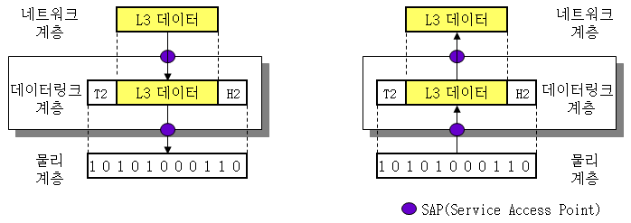
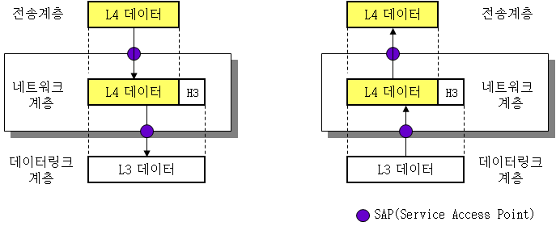
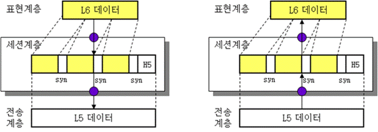
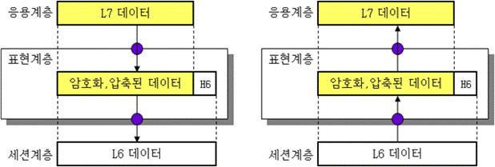
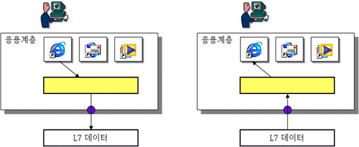
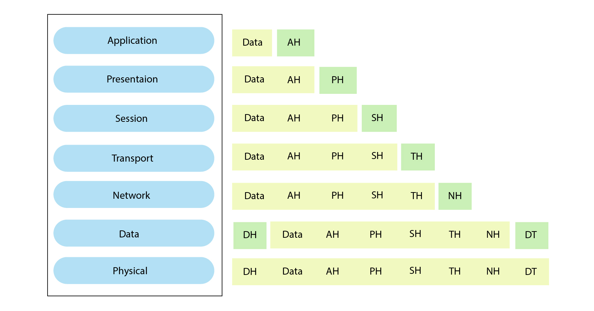

# OSI 7 layer
## L1 물리Physical
    - 장비. 허브 리피터
    - 비트, 물리 이동
    - target <- 1010101001.. 전송매체 ..1010101001 -> target

## L2 데이터링크DataLink 
    - 장비. 스위치 브리지 (지네를 어디로 보낼지 정한다)
    - 흐름 제어
    - 데 이 터 .. <-> 데이터데이터데이터.. (1010101001..)
        - Frame 틀

## L3 네트워크Network 
    - 장비. 라우터 L3스위치
    - 라우팅, IP
    - 데.이.터 <-> 데 이 터 .. <-> 데이터데이터데이터..
        - Packet 봉지

## L4 전송Transport
    - L4 스위치
    - TCP, UDP
        - 가상 회선, 소켓 통신
    - 데~이~터 <-> 데.이.터 <-> 데 이 터 ..
        - Segment 분할(부분)

## L5 세션Session
    - 프로세스와 프로세스 사이의 **논리적인 연결**
    - 데이터 <-> 데~이~터 <-> 데.이.터

## L6 표현Presentation
    - 압축, 암호화
    - 포맷
    - "와우" <-> 데이터 <-> 데~이~터

## L7 응용Application
    - L7 스위치
    - HTTP, FTP

## 헤더 구조

- Encapsulation
- Decapsulation
- AH : Application Header
- PH : Presentation Header
- SH : Session Header
- TH : Transport Header
- NH : Network Header / NT : Network Tail
- DH : Data Link Header / DT : Data Link Tail

