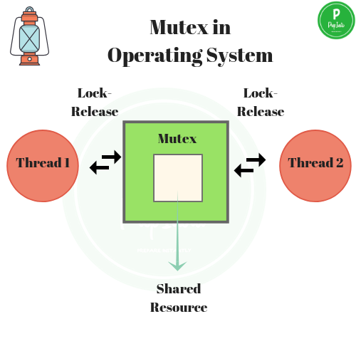
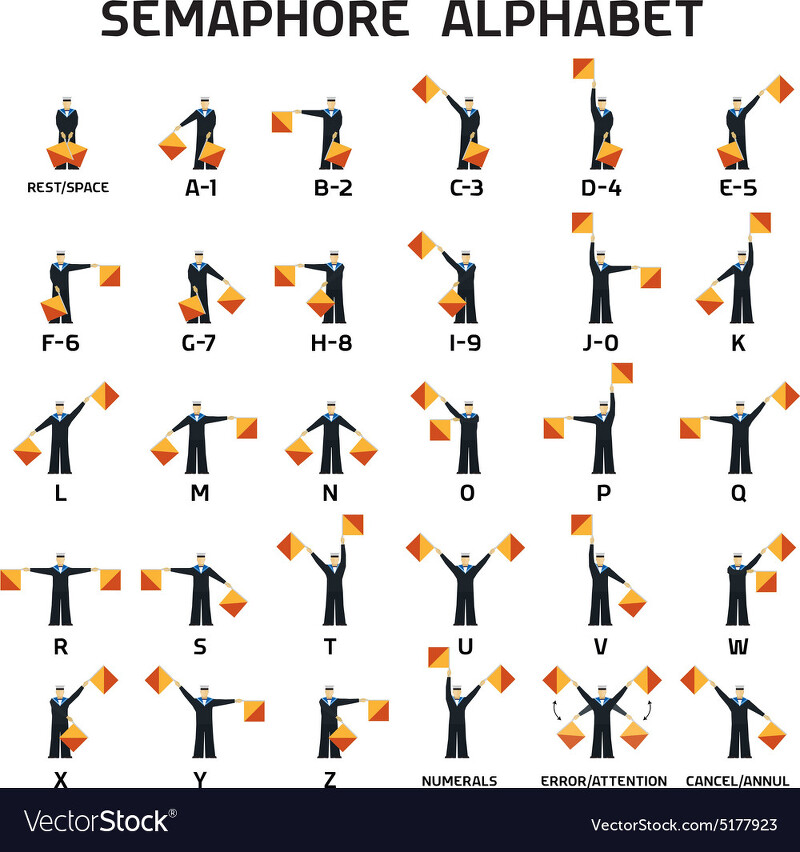
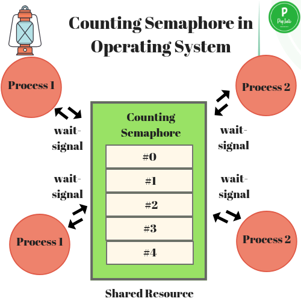

# Mutex와 Semaphore
- https://www.guru99.com/ko/mutex-vs-semaphore.html
## Mutex
- Mutual Exclusion
- 상호간의 배제
- 잠금 메커니즘
  


## Semaphore
- 원거리에서 정보를 전달하는 시각 신호 장치. 알파벳 코드에 따라 팔 또는 두 개의 깃발 또는 기둥을 특정 위치에 고정하여 메시지를 보내는 시스템
- 신호 메커니즘
  



## 비교
- 세마포어는 소유할 수 없으며, 뮤텍스는 소유할 수 있고 소유주가 그에 대한 책임을 가진다.
- 세마포어는 동기화 대상이 여러개 일 때 사용하고, 뮤텍스는 동기화 대상이 오로지 하나 일 때 사용된다.


# Lock
## ReentrantLock
- 재진입 가능한 Lock
- 가장 일반적인 배타 Lock
- 특정 조건에서 Lock을 풀고, 나중에 다시 Lock을 얻어 임계영역으로 진입이 가능
```java
public class Myclass{
    private Object lock1 = new Object();
    private Object lock2 = new Object();

    public void methodA(){
        synchronized(lock1){
            methodB();
        }
    }

    public void methodB(){
        synchronized(lock2){
            methodA();  // 재진입 가능
        }
    }
}
```
- 데드락이 발생할 수 있으나,
    - ReentrantLock은 같은 스레드가 이미 락을 가지고 있더라도, 락을 유지하며 계속 실행할 수 있다.
- 코드의 유연성을 높일 수 있다.

## ReentrantReadWriteLock
- 읽기와 쓰기 Lock을 따로 제공한다. 
    - 읽기는 공유
        - 읽기 Lock에 대해서, 다른 읽기 Lock을 할 수 있다.(read only)
    - 쓰기는 배타
        - 읽기 Lock에 대해서, 쓰기 Lock을 할 수 없다.(데이터 변경 방지)

## StampedLock
- ReentrantReadWriteLock + 낙관적인 Lock
- 낙관적인 읽기 Lock: 데이터를 변경하기 전에 락을 걸지 않는다.
    - 충돌이 적은 상황에서만 사용
- 낙관적인 읽기 Lock은 쓰기 Lock에 의해 바로 해제가 가능
- 읽을때, 무조건 읽기 Lock을 걸지 않고, 쓰기와 읽기가 충돌시에만 쓰기 후, 읽기 Lock을 건다.


