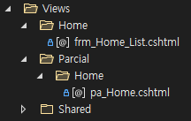
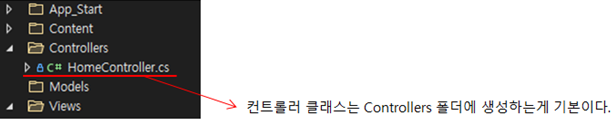
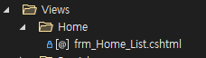

> [Home](../README.md)

- [2. 폴더 및 파일 구조 ](#2-폴더-및-파일-구조)   
    - [2.1 폴더 및 파일 생성 ](#21-폴더-및-파일-생성)   
        - [2.1.1 폴더명명 규칙 ](#211-폴더명명-규칙)   
        - [2.1.2 파일명명 규칙 ](#212-파일명명-규칙)   
    - [2.2 ASP.NET MVC ](#22-aspnet-mvc)   
        - [2.2.1 MVC 기본 구조 ](#221-mvc-기본-구조)   
        - [2.2.2 Layout 페이지 활용하기 ](#222-layout-페이지-활용하기)
        - [2.2.3 파샬뷰(ParcialView) 생성 및 활용 ](#223-파샬뷰parcialview-생성-및-활용)
        - [2.2.4 Controller의 역할](#224-controller의-역할)
        - [2.2.5 View 페이지 생성 ](#225-view-페이지-생성)


# 2. 폴더 및 파일 구조
## 2.1 폴더 및 파일 생성
- 신규로 폴더 및 파일을 생성 할 시 명명 규칙을 따른다.

### 2.1.1 폴더명명 규칙
- ASP.NET은 기본적으로 파스칼표기법을 따른다.


- 폴더의 첫 단어를 대문자로 작성한다.

- 복수의 단어를 합칠 경우 다음과 같이 활용한다.
```
UserControl 
DomainModel
```


### 2.1.2 파일명명 규칙
- 파일명은 파스칼 표기법이 아닌 언더스코어 표기법을 사용한다.

- 파일 작성 구조는 다음을 참고하자.
```
frm_Home_List.aspx
frm_Home_View.aspx
pop_Home_Detail.aspx
```

- 첫 번째 블럭은 frm과 pop의 명칭만 이용한다.
    - frm : 일반 페이지
    - pop : 팝업 페이지
- 두 번째 블록은 폴더경로를 나타낸다.
- 세 번째 블록은 페이지의 유형을 나타낸다.


- 파일명은 접두어를 제외하고 첫자리는 대문자로 표현한다.


## 2.2 ASP.NET MVC
### 2.2.1 MVC 기본 구조


### 2.2.2 Layout 페이지 활용하기
- Layout 페이지는 기존 ASP.NET의 마스터페이지(.master)나 SpringBoot의 레이아웃과 동일한 기능이다.


- _Layout.cshtml에는 공통으로 사용되는 JAVASCRIPT 및 CSS가 정의되어 있으며 변경되지 않은 프레임 역할
의 HTML로 구성되어 있다.


- @RenderBody()에서 페이지별 컨텐츠의 내용을 출력한다.


### 2.2.3 파샬뷰(ParcialView) 생성 및 활용
- 파샬뷰는 부분적으로 필요한 내용을 INCLUDE 하여 페이지에 구성요소를 더하는 기능이다.
- 파샬뷰는 반드시 /Views/Parcial/ 하위 폴더에 생성하도록 한다. (아래의 그림을 참조)



  - /Views/Home/frm_Home_List.cshtml 에서 사용하는 파샬뷰를 만든다고 가정했을 경우
  - Parcial 폴더 하단의 동일한 Home폴더를 생성 후 pa_로 시작하는 페이지를 생성한다.
  - 파샬뷰를 INCLUDE 하기 위하여 파샬뷰를 호출하는 페이지에서 다음 코드를 추가한다.
```javascript
@Html.Partial("~/Views/Parcial/Home/App.csHtml")
```

### 2.2.4 Controller의 역할
- ASP.NET에서 Controller 기능은 **거의 사용하지 않는 것을 원칙으로 한다.**
- Controllers 폴더 하단에 HomeController.cs 컨트롤러 클래스를 추가한다.



- Controller의 간략한 내용은 아래와 같다.

```C#
[RoutePrefix('Home')] // 1. 컨트롤러 경로명 설정
public class HomeController : Controller
{
    [Route("{act}")] // 2. Action 메소드를 반드시 동적으로 설정한다.
    public ViewResult Index(int PageNo = 1)
    {
        ViewBag.PageNo = PageNo;

        return View("~/Views/Home/frm_Home_List.cshtml");
        // 생성한 cshtml 파일의 경로를 지정한다.
    }
}
```
2. 여러 이름의 Action으로 접근해도 Index 메소드를 호출하도록 하기 위함이다.

- Controller에서 최초 진입에 필요한 Action만 설정하면 ASP.NET Controller의 역할은 끝난다.


### 2.2.5 View 페이지 생성
- Views 폴더 하단에 Controller명의 폴더를 생성한다. (우리는 HomeController 이므로 Home이라고 생성)


- Home 폴더 하단에 frm_Home_List.cshtml 파일을 추가한다. (우리는 Action메소드에서 해당 페이지로 
이동하도록 설정 했었다.)



