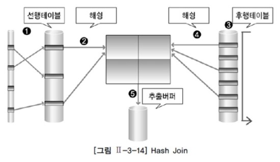

# OperatingSystem

# Network
## OSI 7 Layers
- [osi7 layers](../infra/network/osi7.md)
1. 물리
2. 데이터링크
    - 데이터 스트림
    - 단위: Frame
        - 헤더와 테일
    - 장비: 스위치, 브릿지
3. 네트워크 Network
    - IP/라우팅 (물리 타겟)
    - 단위: Packet
        - 헤더와 테일
    - 장비: 라우터, L3 스위치
4. 전송 Transport
    - TCP/UDP (소켓)
    - 단위: Segment
        - 헤더만
    - 장비: L4 스위치
5. 세션 Session
    - logical connection 논리적 연결
        - 헤더만
6. 표현 Presentation
    - encoding/decoding (압축, 암호화)
        - 헤더만
7. 응용 application
    - HTTP 등..
        - 헤더만
    - 장비(?): L7 스위치

## TCP/IP 소켓
- [l4_socket](../infra/network/l4_socket.md)
- 클라이언트를 받아, 소켓을 만들어 준다.
1. tcp/ip 소켓 (tcp 소켓)
    - l3와 l4에 걸친 연결
        - l3 ip
        - l4 tcp 정보
    - 서버 포트: [ip address:port]
        - 클라이언트에서 서버 포트 주소를 이용해서 서버 소켓에 연결을 시도
    - 클라이언트 포트: 
        - 서버는 클라이언트의 요청시에, 단기(ephemeral) 포트를 생성
    - 스트림 Stream
2. udp
    - 데이터그램 Datagram

### 방식

#### 멀티 프로세싱
    - 컨텍스트 스위칭 이슈
    - 송수신이 끊김없이 연속적일 때 유리

#### 멀티 스레딩
    - 스레드 간 메모리 공유
        - 동시성 이슈

#### 멀티 플렉싱
    - 하나의 전송로
    - I/O 멀티 플렉싱
        - 클라이언트와 입출력 프로세스를 하나로 묶음
    - 논블로킹 핸들러와 콜백
    - 하나의 프로세스, 하나의 스레드

# DB
## ACID
- 트랜잭션의 성질 기준
1. Atomicity 원자성
    - 성공하든 실패하든 하나만 반영
    - Transaction
2. Consistency 정합성
    - 트랜잭션 전 후 데이터 모순이 없는 상태
3. Isolation 독립성
    - 트랜잭션 수행에 다른 트랜잭션의 작업이 반영되지 못하는 특성
    - Isolation level
4. Durability 영속성
    - 수행된 트랜잭션의 결과는 지속적으로 유지

## Index
1. B-Tree
2. B+Tree
3. HashMap

## Join
1. Nested Loop
    - Inner table 데이터에 반복 접근하여 매치
        - Inner table은 인덱스 필요 (없으면 테이블 스캔)
            - Driving table(Outer table): 기준이 되는 테이블
            - Inner table: 조인 테이블
        - 단일 테이블에서 인덱스가 많아도 차이가 크지 않다. 1-2블럭 비효율
            - 하지만 nl join에 의한 인덱스 높이 효율은 다르다.
                - 예컨데, outer table이 1000만건일때, inner table과 nl조인을 한다면,
                - index level이 3 5의 차이는 단순 2블럭이 아닌, 2 * 1000만 블럭의 비효율이다.
            - 때문에, 전체 테이블의 데이터를 얼마나 가져오느냐에 따라서, 실행계획의 효율이 달라진다.
    - OLTP
2. Hash
    - 드라이빙 테이블에서 생성한 해시 테이블로 조인키를 매치
    - =, OLAP
3. Sort Merge
    - 조인 컬럼을 기준으로 두 테이블을 정렬 후, merge하여 매치
    - Scan, OLAP

## Lock과 Isolation Level

# NoSQL
- 관계형 데이터베이스가 아닌 데이터베이스
    - RDBMS: Consistency에 중점
    - NoSQL: Scalability에 중점

## CAP
- [cap 정리](../db/nosql/cap.md)
- 분산환경에서는 일관성과 가용성의 트레이드 오프를 선택해야 하는 경우가 많다.

### Consistency 일관성
- 모든 노드가 동일한 순서로 업데이트된 데이터를 본다.
    - 쓰기가 **commit 상태**가 되기 전에, 모든 노드에 commit 되어야 한다.

### Availability 가용성
- 정상적으로 사용 가능한가
    - 분산환경의 가용성이란, 어느 노드가 작동 중지된 상태에서도 클라이언트가 유효한 응답을 받을 수 있는가를 의미한다.
    - 가용성 = 정상 서비스 시간 / 전체 서비스 시간 (정상 + 에러)
    
### Partition Tolerance 분할 내성
- 분할 상태에도 불구하고, 클러스터가 작동 가능한가

## CAP 정리
- 분산 환경에서 세가지 중 두가지만 제공할 수 있다.

## 유형
- 문서
    - MongoDB, CouchDB, Riak, Azure Cosmos DB
- 키-값
    - Redis, Oracle NoSQL DB, VoldeMorte
- 와이드 컬럼
    - Hbase, Cassandra, GoogleBigTable, Vertica
- 그래프
    - Sones, AllegroGraph, neo4j, BlazeGraph, OrientDB

# OOP
## SOLID
1. Single Reponsibillity
    - 단일 책임을 갖는다.
2. Open-Closed
    - 소프트웨어 개체는 확장에 대해 열려 있어야 하고, 수정에 대해서는 닫혀 있다.
3. Liskov 치환 (Substitution)
    - 자식과 부모는 서로 대체 가능하다
4. Interface segregation
    - 인터페이스 분리
5. Dependecy Inversion Principal
    - 의존성 역전

