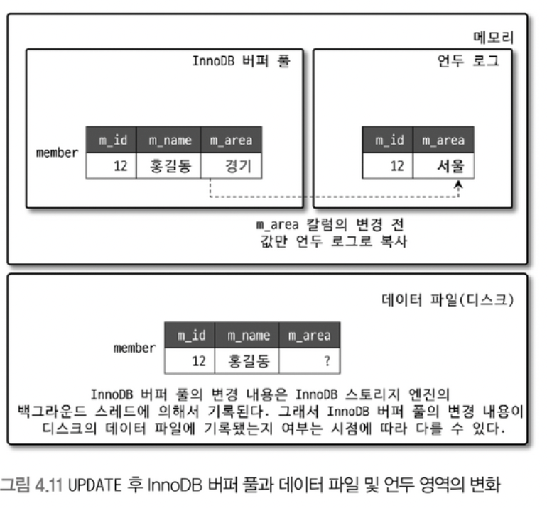
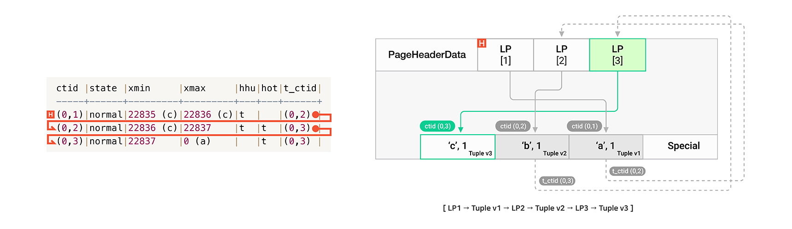

# 배경
0. 요즘 postgres가 핫한데,, 왜 핫할까 궁금해졌다.
    - [IBM: PostgreSQL이란 무엇입니까?](https://www.ibm.com/kr-ko/topics/postgresql)
    - [postgre jdbc developer interview](https://www.ibm.com/blog/database-deep-dives-postgresql/)
    - [postgreSQL이란?](https://www.postgresql.org/about/)
    - [vs mssql](https://web.archive.org/web/20191222230242/https://www.pg-versus-ms.com/)
    - [PostgreSQL 16.1 문서](https://www.postgresql.org/docs/16/index.html)
    - open source object-relational database system 오픈 소스 객체 관계형 데이터베이스 시스템
    1. 장점
        - open source project 공개 라이센스의 오픈소스
            - 벤더 종속 제거
        - stability 투명성에서 오는 안정성
        - predictable 예측 가능성
        - extensibility 확장성 
        1. 성능 및 확장성
        2. 동시성 지원
        3. 심층적인 언어 지원
        4. 비즈니스 연속성
        5. 100% 오픈소스
    2. 단점
        1.  lack of a native scale-out story like native sharding 기본 샤딩 같은 기본 확장 스토리가 부족
        2. connection model is also really limiting. 연결 모델도 정말 제한적
        3. overreliance on external tooling. 기본 작업을 적절하게 수행하기 위해 외부 도구에 지나치게 의존
    3. 기능
        - 특정 시점 복구
            - PITR
            - WAL 미리 쓰기 로그. 모든 데이터베이스 변경 사항을 기록
        - 저장 프로시저
# MVCC
- [MVCC 소개](https://appmaster.io/ko/blog/gwangyehyeong-deiteobeiseuyi-mvcc)

# MySQL (InnoDB 스토리지 엔진 기반)
- MyISAM의 기본 스토리지 엔진은 MVCC를 지원하지 않지만
- InnoDB를 사용할 때 MySQL은 동시 읽기 및 쓰기 작업을 허용하기 위해
    - 여러 버전의 레코드를 유지함으로써 잠금 경합을 줄이고 성능을 향상
- MySQL의 Isolation Level의 Default값은 **Repetable Read**
- [MySQL InnoDB의 MVCC](https://velog.io/@juy4556/DatabaseMVCC%EC%99%80-InnoDB%EA%B8%B0%EB%B0%98%EC%9D%98-MySQL)

## MySQL MVCC - Buffer Pool, Redo, Undo
- [MVCC](https://dev.mysql.com/doc/refman/8.0/en/innodb-multi-versioning.html)
- [언두 로그](https://dev.mysql.com/doc/refman/8.0/en/innodb-undo-logs.html)
- [리두 로그](https://dev.mysql.com/doc/refman/8.0/en/innodb-redo-log.html)
- Update/Delete 쿼리 처리 과정
1. 요청이 들어오면 Redo 로그에 요청 내용 기록
    - 시스템 장애 대응, 시스템 복구를 위함
2. 버퍼 풀에 요청 내용 기록
3. 변경되기 전 데이터는 index와 함께, Undo 로그에 복사
    - 때문에, 컨텍스트 스위칭된 다른 쓰레드에서 조회시, 업데이트 이전 데이터가 조회된다.
4. 트랜잭션 종료
    - 커밋
        - 버퍼 풀 내용을 디스크에 저장
    - 롤백
        - Undo 로그의 내용으로 복원

## default isolation level - Repeatable Read
- 보통의 DBMS는 Default가 Read Committed(Level 1) 이상
    - 커밋된 데이터를 읽는다.
- MySQL은 Repeatable Read(Level 2)이기 때문에
    - 컨텍스트 스위칭 되었던 다른 쓰레드에서는 버퍼 풀이 아닌 **Undo Log** 데이터를 읽어온다.
- Isolation Level을 Read Uncommitted(Level 0)으로 설정한다면, 
    - 트랜잭션은 InnoDB 버퍼 풀에 있는 값을 읽는다.

## Gap lock
- [MySQL Gap Lock](https://medium.com/daangn/mysql-gap-lock-%EB%8B%A4%EC%8B%9C%EB%B3%B4%EA%B8%B0-7f47ea3f68bc)
- [15.7.2.4 읽기 잠금](https://dev.mysql.com/doc/refman/8.0/en/innodb-locking-reads.html)
- [15.7.3 InnoDB의 다양한 SQL 문에 의해 설정된 잠금](https://dev.mysql.com/doc/refman/8.0/en/innodb-locks-set.html)

# PostgreSQL
- 트랜잭션을 효과적으로 격리하고 동시성을 최적화하며 데이터 일관성을 보장
    - PostgreSQL은 읽기 및 쓰기 트랜잭션을 분리하고,
    - 각 트랜잭션에 대해 서로 다른 데이터 스냅샷을 유지하는 스냅샷 격리 기술을 사용
        - 이 접근 방식은 잠금 경합을 줄이고 여러 트랜잭션이 지연 없이 동시에 실행
- [PostgreSQL의 트랜잭션](https://www.postgresql.org/docs/current/transaction-iso.html)

## 정합성 이상 증상
- dirty read 
    - 더티 리드
    - 트랜잭션은 커밋되지 않은, 다른 진행중인 트랜잭션이 쓴 데이터를 읽는다.
- nonrepeatable read (fuzzy read)
    - 반복 불가능한 읽기
    - 한 트랜잭션에서 읽었는데, 레코드의 값이 달라지는 현상
    - 트랜잭션에서 이전에 읽은 데이터를 다시 읽었을 때, 다른 트랜잭션의 커밋에 의해 수정된 데이터를 읽는다.
- phantom read 
    - 팬텀 리드
    - 한 트랜잭션에서 같은 조건으로 2번 읽었는데, 레코드 갯수가 추가되었다. (없던 데이터가 생겼다.)
    - 트랜잭션이 검색 조건을 만족하는 행 집합을 반환하는 쿼리를 다시 실행했을때, 조건을 만족하는 행 집합이 최근에 커밋된 다른 트랜잭션으로 인해 추가되었다.
    - [포스트그레의 팬텀 리드](https://postgresql.kr/blog/pg_phantom_read.html)
    - [위키피디아 참조](https://en.wikipedia.org/wiki/Isolation_(database_systems)#Phantom_reads)
- serialization anomaly 
    - 불규칙한 직렬화
    - 트랜잭션 그룹을 성공적으로 커밋한 결과는, 해당 트랜잭션을 한 번에 하나씩 실행하는 모든 가능한 순서와 일치하지 않는다.

## postgreSQL의 격리 수준에 따른 현상(비교)
|격리 수준|dirty read|nonrepeatable read|phantom read|serialization anomaly|
|---|---|---|---|---|
|Read uncommitted|Allowed, PG는 허용 안함|Possible|Possible|Possible|
|Read committed|Not Possible|Possible|Possible|Possible|
|Repeatable read|Not Possible|Not Possible|Allowed, PG는 허용 안함|Possible|
|Serializable|Not possible|Not possible|Not possible|Not Possible|
- 사실상 postgreSQL은 Read uncommitted가 없다.
    - Read Committed: 더티 리드만 허용 안함
    - Repeatable Read: 팬텀 리드까지 허용 안함
    - Serializable: 트랜잭션의 순서까지 일치해야 한다.

## PostgreSQL MVCC - Update Case
- PostgreSQL Update 동작 확인 <https://blog.ex-em.com/1771>
- Update시, 새로운 버전의 Tuple을 Insert 후, 이전 버전을 논리적으로 Delete 처리하여 대체
- Hot Update
    - 제약 조건
        1. 테이블의 인덱스가 참조하는 컬럼이 Update 대상이 아니다.
        2. Update 이전 버전과 동일한 페이지에 새로운 버전의 Tuple을 저장할 수 있는 공간이 충반해야한다.
            - Update 전/후 Tuple이 한 테이블 페이지에 위치해야 한다.
### 1. 인덱스가 없는 테이블

- Hot chain을 이루고 있다.
- Hot Update
    - Heap Hot Update(HHU)
        - Hot Update가 수행되어, Hot Chain에 포함된 Tuple 중, Chain을 통해 연결되는 다음 Tuple이 HOT인 경우
    - Heap Only Tuple(HOT)
        - Hot Update로 생성된 Tuple 중, 해당 Tuple이 가리키는 인덱스가 없을 경우
        - HOT 체인의 Head를 통해서만 간접 Access 할 수 있다.

### 2. 인덱스에 포함되지 않은 컬럼을 Update

### 3. 인덱스에 포함된 컬럼을 Update

## 행 수준의 Lock

|Lock Mode|FOR KEY SHARE|FOR NO KEY UPDATE|FOR SHARE|FOR KEY SHARE|
|---|---|---|---|---|
|FOR KEY SHARE||||X|
|FOR SHARE|||X|X|
|FOR NO KEY UPDATE||X|X|X|
|FOR UPDATE|X|X|X|X|

### FOR UPDATE
- FOR UPDATESELECT 업데이트를 위해 문 이 검색된 행을 잠금
- 이는 현재 트랜잭션이 종료될 때까지 다른 트랜잭션에 의해 잠기거나 수정되거나 삭제되는 것을 방지
- 배타 잠금

### FOR NO KEY UPDATE
- 

### FOR SHARE
- 공유 잠금

### FOR KEY SHARE
- 
