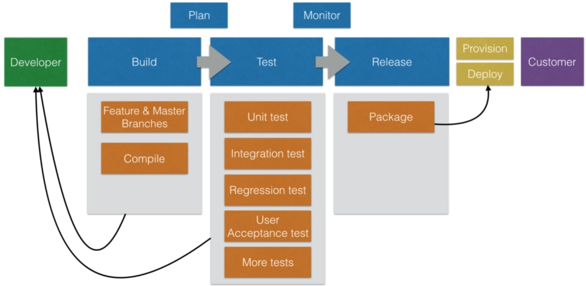

# 젠킨스?
- 지속적 통합과 지속적 제공을 지원하는 도구
- Continuous Integration, Continuous Delivery
- 소프트웨어를 짧은 주기로 제공하는 것을 도와준다.

## Continous Integration
- 작업 복사본을 공유된 mainline으로 지속적으로 병합하는, 소프트웨어 엔지니어링 작업 방식
    - 깃

## Continous Delivery
- 소트프웨어를 짧은 주기로 안정적으로 출시될 수 있도록 하는 소프트웨어 엔지니어링 접근법

## Continous Deploy
- 최종 배포는 비즈니스 결정이 있어야 하기 때문에, 마지막 배포 단계는 수동이다.
    - 지속적 인도를 통해 항상 최신화된 소프트웨어의 릴리스를 준비한다.

## 특징
- verify and publish
    - 자동화된 빌드와 테스트를 진행한다.
- 형상관리를 해주지 않는다.
    - 코드를 병합하지 않는다.
    - 코드 충돌을 해결하지 않는다.

## 장점
- 개발자에게 빌드 오류에 대해, feedback loop를 제공한다.
- 빌드는 이미 자동화된 테스트를 거친다. 
    - 코드의 양호도
    - 기능의 실제 작동 여부
- 이런 결과로, SDLC Software Development Lifecycle을 줄일 수 있다.

# 대안
## Self-hosted
- Drone CI
- TeamCity (by Jetbrains)

## Hosted (as a service)
- Wercker
- CircleCI
- CodeShip
- SemaphoreCI
- AWS CI/CD tools

