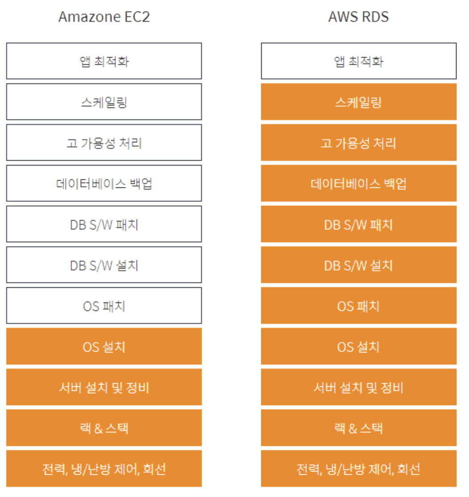
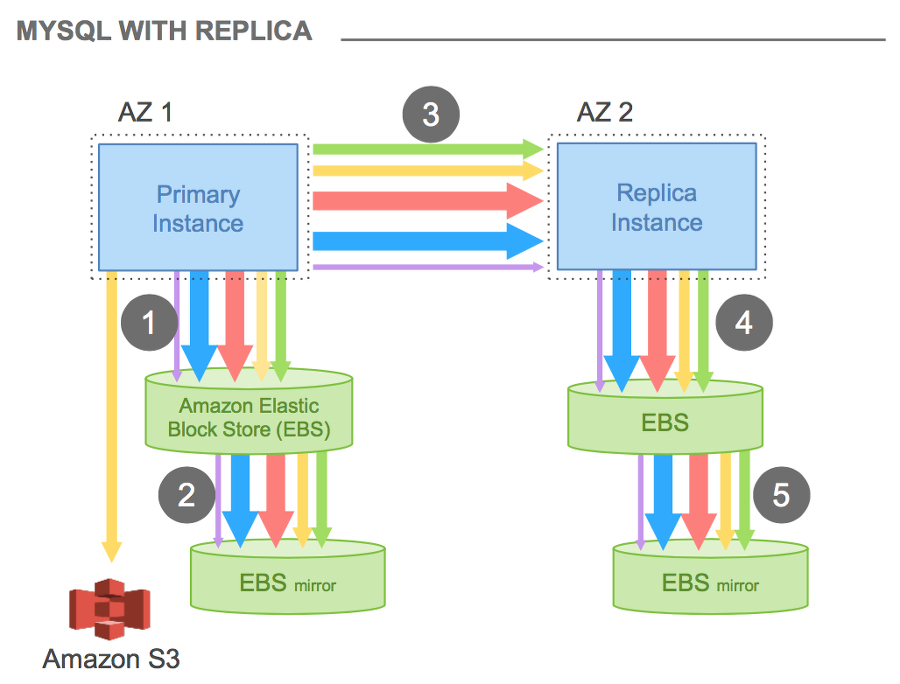
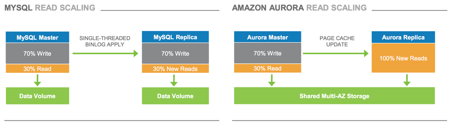

## 보안
- [rds의 보안](https://aws.amazon.com/ko/blogs/korea/applying-best-practices-for-securing-sensitive-data-in-amazon-rds/)

## rds vs ec2

## RDS MySQL vs AWS Aurora

- RDS MySQL은 쓰기시, 
    - 마스터가 스토리지에 데이터를 쓴다.
    - 마스터는 레플리카로 데이터를 보내, 스토리지에 데이터를 쓰게 한다.
- AWS Aurora
    - 마스터가 분산 환경의 스토리지에 전부 쓴다.
    - 마스터는 레플리카에 신규 데이터가 업데이트 되었음을 캐시 시킨다.
    - 레플리카는 읽을때, 분산 환경의 스토리지를 읽는다.

||Aurora MySQL|Aurora PostgreSQL||
|---|---|---|---|
|DB 관리 방식|RDBMS|[ORDBMS](#ordbms)||
|작동 방식|멀티 쓰레드|멀티 프로세스||
|사용환경|OLTP|OLTP, OLAP|단순 CRUD시에는 MySQL에 비해 PostgreSQL의 성능이 조금 떨어진다.
PostgreSQL은 복잡한 쿼리를 요구하고 대규모 서비스인 경우에 특화되어 있다.|
|MVCC|[Undo Segment](#undo-segment)|[MGA](#multi-generation-architecture)||
|UPDATE|UPDATE|INSERT & DELETE (check)|PostgreSQL UPDATE시 내부적으로 새 행을 INSERT하고, 이전 데이터에 삭제 표시를 한다. 모든 인덱스는 행의 실제 위치값에 대한 링크가 표기되어 있어, 행이 업데이트되면 위치값이 변경되고,인덱스 정보도 업데이트한다. 때문에 MySQL보다 UPDATE에서 성능이 떨어진다.|
|JOIN|NL JOIN, HASH JOIN|NL JOIN, HASH JOIN, SORT JOIN||
|Parallel Query for SELECT|5.7 2.09.2~ 지원|9.6 ~ 지원||
|Default Transaction Isolation|REPEATABLE READ|READ COMMITTED||
|테이블 기본 구성 인덱스|CLUSTERD INDEX|NON-CLUSTERED INDEX||
|인덱스 구성 방식|B-tree|[Partial Index](#partial-index)||

- MySQL 8.0에서 정식 지원되는 hash join, parallel query 기능이 사용하는 Aurora MySQL 5.7 버전에서 일부(또는 조금 다른 방식으로) 지원하나, 제한적
    - PostgreSQL은 오래전부터(9버전~) 대부분의 select쿼리에서 parallel 기능이 지원되고 있고 다양한 join 방식을 지원하기 때문에 개선이 필요한 정산 쿼리의 성능적인 이점이 있다.
- OLAP성 쿼리 처리에서 7배 정도 차이가 난다.

#### ORDBMS
- 객체Object 관계형Relation DBMS: 기존 데이터 type에서 확장된 type을 정의하여 사용할 수 있다. 테이블 상속기능이 제공되어 자식 테이블은 부모 테이블로부터 컬럼을 받을 수 있다.

#### Undo Segment
- update 하는 최신 데이터는 기존 데이터 블록의 레코드에 반영하고, 변경 전 값을 undo 이름의 별도 공간에 저장하여 갱신에 대한 버전관리로 처리

#### Multi Generation Architecture
- 튜플을 update할 때 새로운 값으로 replace 하지 않고, 새로운 튜플을 추가하고 이전 튜플의 유효 범위를 마킹하여 처리

#### Partial Index
- 전체 데이터의 부분집합에 대해서 인덱스를 생성
    - MySQL와 인덱스로 인한 속도는 차이가 없으나, 용량 차이가 10배 정도 생길 수 있다.
    - 인덱스 관리가 쉽다. (인덱스 생성, 컬럼 추가 - Secondary Index)

