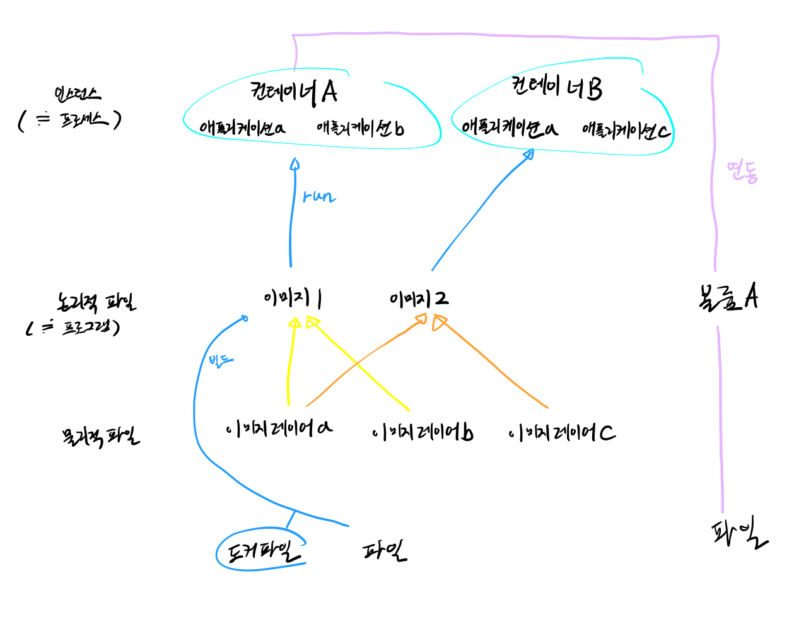
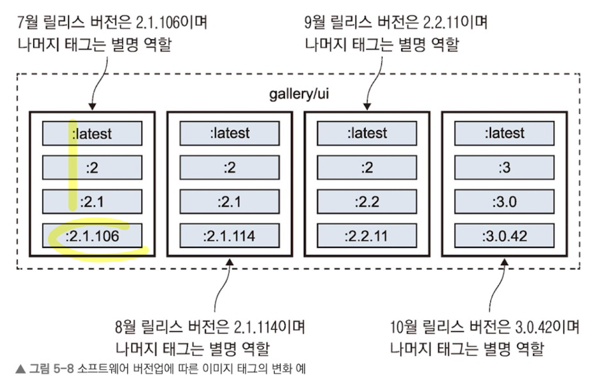

# 도커
- [도커 파일](#도커-파일)
- [이미지](#이미지)
    - [이미지 레이어](#이미지-레이어)
    - [이미지 빌드](#이미지-빌드)
    - [도커 레지스트리](#도커-레지스트리)
- [파일 시스템](#파일-시스템)
    - [이미지 레이어]()
    - [기록 가능 레이어]()
    - [바인드 마운트]()
        - [로컬 바인드 마운트]()
        - [분산 바인드 마운트]()
    - [볼륨 마운트]()
- [도커 컴포즈](#도커-컴포즈)
    - [여러 개의 서비스로 구성된 컴포즈 스크립트](#여러-개의-서비스로-구성된-컴포즈-스크립트)
    - [도커 네트워크](#도커-네트워크)
    - [환경 구성](#환경-구성)
        - 환경변수
        - 비밀값
    - [모니터링](#모니터링)
        - [프로메테우스](#프로메테우스)
        - [그라파나](#그라파나)
    - [CI/CD](#cicd)
        - [인자가 적용된 도커 파일](#인자가-적용된-도커-파일)
        - [인자가 적용된 컴포즈 파일](#인자가-적용된-컴포즈-파일)
        - [젠킨스 파일](#젠킨스-파일)
        - [안전 소프트웨어 공급 체인](#안전-소프트웨어-공급-체인)

# 도커 파일
## 인스트럭션
- FROM
    - 모든 이미지는 다른 이미지로부터 출발한다.
- ENV
    - 환경 변수 값을 지정
    - `ENV [key]="[value]"` 형식
- WORKDIR
    - 컨테이너 이미지 파일 시스템에 디렉터리를 만들고, 해당 디렉터리를 작업 디렉터리로 지정
- COPY
    - 로컬 파일 시스템의 파일/디렉터리를 컨테이너 이미지 내부 경로로 복사
    - `COPY [원본경로] [복사경로]`
- CMD
    - 이미지로부터 컨테이너를 실행시, 실행할 명령

- Ex) 도커 파일 예제
```Dockerfile
FROM diamol/node

CMD ["node", "/web-ping/app.js"]

ENV TARGET="blog.sixeyed.com" \
    METHOD="HEAD" \
    INTERVAL="3000"

WORKDIR /web-ping-optimized
COPY app.js .
```

# 이미지

## 이미지 레이어
- 하나의 이미지는 여러 이미지가 계층적으로 쌓인 형태로 저장된다.
- 도커가 레이어들을 조합하여, 컨테이너 내부 파일 시스템을 만든다.
- 하나의 이미지 레이어가 바뀌게 된다면, 그 위에 쌓인 이미지 레이어들은 모두 다시 쌓여야 한다.
- 이미지들은 동일한 이미지 레이어를 공유한다. 때문에 실질적인 디스크 용량을 덜 차지한다.
- 도커 파일 스크립트를 최적화한다면, 이미지 용량을 줄이고, 빠른 빌드를 유도할 수 있다.

## 이미지 빌드
- `docker image build --tag [이미지명] [컨텍스트]`
    - 컨텍스트: Dockerfile 및 이미지에 포함시킬 파일이 위치한 경로의 디렉터리

## 도커 레지스트리
- 이미지 형상관리 저장소
    - 도커 허브
        - 검증된 퍼블리셔: MS, 오라클, IBM 등의 신뢰할 수 있는 기업. 
            - 취약점 탐지 등의 승인 절차를 거쳐 공개
        - 공식 이미지: 오픈소스 소프트웨어. 
            - 해당 프로젝트 개발팀과 도커가 같이 관리
- 버전관리

    - `gallery/ui:latest`
        - `latest`: 최신
    - `gallery/ui:[major].[minor].[patch]`
        - major: 완전히 다른 기능
        - minor: 추가된 기능은 있으되, 기존 기능 유지
        - patch: 버그 수정
    - 태그를 릴리스에 따라 옮긴다.
    - latest는 빈번하게
- 골든 이미지
    - 선호하는 기반 이미지
    - 공식 이미지를 기반으로 자주 쓰이는 참조와 인스트럭션을 모은 기반 이미지
        - 인증서나 환경 설정값 등의 필요한 설정을 추가한 것
    - 도커 허브의 기업 리포지터리나 자체 리포지터리에서 관리된다.
    - 각 기업은 모든 애플리케이션 이미지를 바로 이 골든 이미지를 기반 이미지로 한다.
        - CI/CD 과정에서 Dockerfile 스크립트를 확인하는 방법으로 골든 이미지 사용을 강제하는 것을 추천한다.

# 파일 시스템
- 모든 컨테이너는 도커가 다양한 출처로부터 모아 만든 단일 가상 디스크로 구성된 파일 시스템을 갖는다.
- 유니언 파일 시스템 이라고 한다.
- 출처는 이하와 같다.

## 이미지 레이어
- 컨테이너의 초기 파일 시스템을 구성한다.
- 레이어는 적층 구조를 갖기 때문에, 후속 레이어와 충돌시, 후속 레이어의 내용이 적용된다.
- 읽기 전용이며, 해당 레이어를 사용한 모든 이미지의 컨테이너가 공유한다.

## 기록 가능 레이어

- 각 컨테이너마다 갖는 파일 시스템
- 기존 이미지 레이어 파일 수정 시, 이미지 레이어를 복사하여 만들어진다. (copy-on-write)
- 비용이 비싼 계산, 데이터 캐싱 등 단기 저장에 적합하다.
- 컨테이너 삭제시, 유실된다.

## 바인드 마운트
- 파일 시스템 경로를 외부 출처로 바인딩함으로써 공유
- 이식성이 떨어지며, 외부 출처의 파일 시스템에 종속된다.
    - 권한, 기능 등에 영향을 받는다.

### 로컬 바인드 마운트
- 호스트 머신과 컨테이너 간 데이터를 공유
- 개발자의 로컬 컴퓨터에서 컨테이너로 소스 코드를 전달하기 위해 사용시, 로컬 컴퓨터의 수정 내용이 이미지 빌드 없이 즉시 컨테이너로 전달 가능하다.

```sh
# 윈도
$source="$(pwd)\databases".ToLower(); $target="c:\data"
# 리눅스
source="$(pwd)/databases" && target='/data'
# 윈도 환경에서 리눅스 컨테이너를 실행하는 경우
$source="$(pwd)\databases".ToLower(); $target='/data'

mkdir ./databases
docker container run --mount type=bind,source=$source,target=$target -d -p 8012:80 diamol/ch06-todo-list
```

### 분산 바인드 마운트
- 네트워크 스토리지(AWS S3 등)와 컨테이너 간 데이터를 공유
- 가용성이 높지만, 로컬 디스크와 비교해 지원하지 않는 파일 시스템 기능이 있거나, 성능 면에서 차이가 있을 수 있다.
- 읽기 전용으로 설정 파일을 전달하거나, 공유 캐시로 활용
- 동일 네트워크상의 모든 컨테이너나 컴퓨터와 데이터를 공유하는 데 적합

## 볼륨 마운트
- 컨테이너와 도커 객체인 볼륨 간 데이터를 공유
- 애플리케이션이 데이터를 볼륨에 영구적으로 저장한다.
- 도커 엔진이 관여한다.

- 도커 파일
```Dockerfile
FROM diamol/dotnet-aspnet
WORKDIR /app
ENTRYPOINT ["dotnet", "ToDoList.dll"]

VOLUME /data
COPY --from=builder /out/ .
```
```sh
# 도커 파일을 실행할 때, 볼륨 생성
docker container run --name todo1 -d -p 8010:80 diamol/ch06-todo-list
docker container inspect --format '{{.Mounts}}' todo1

# 볼륨 공유
docker container run -d --name t3 --volumes-from todo1 diamol/ch06-todo-list

# 볼륨 생성 방식
# 1. 복사 대상 경로
# 윈도
$target='\data'
# 리눅스
target='/data'
# 2. 볼륨 생성
docker volume create todo-list
# 3. 볼륨을 연결해 애플리케이션 실행
docker container run -d -p 8011:80 -v -p todo-list:$target --name todo-v1 diamol/ch06-todo-list
```

___
# 도커 컴포즈
- 도커 컴포즈 파일?
    - 애플리케이션 실행용.
    - 애플리케이션의 '원하는 상태', 컴포넌트가 실행할 때, 어떤 상태여야 하는지를 기술하는 파일
    - docker container run 명령으로 컨테이너를 실행할 때 지정하는 옵션을 모아놓을 수 있다.
    - YAML로 기술
    - 애플리케이션의 소스 코드, 도커 파일 스크립트와 함께 형상 관리 도구로 관리한다.

```YAML
# 도커 컴포즈 파일 형식의 버전
version: '3.7'

# 구동할 서비스를 구성하는 컴포넌트들 설정
services:
    accesslog:
        # 이미지만을 가져옴
        image: diamol/ch04-access-log
    iotd:
        image: diamol/ch04-image-of-the-day
        ports:
            - "80"
        networks:
            - app-net
    image-gallery:
        image: diamol/ch04-image-gallery
        ports:
            - "8010:80"
        # 위 두 서비스에 의존
        depends_on:
            - accesslog
            - itod
        networks:
            - app-net

# 서비스 컨테이너가 연결될 모든 도커 네트워크를 열거하는 부분
networks:
    app-net:
        # 도커 외부
        external:
            name: nat
```
- 도커 컴포즈는 실제 컨테이너 대신, 서비스 개념을 단위로 삼는다.
    - 하나의 서비스는 여러 컨테이너에서 실행될 수 있기 때문.
```sh
# 도커 네트워크 생성
docker network create nat
# 도커 컴포즈 파일위치로 이동 후, 실행
cd ./ch07/exersices/todo-list
docker-compose up
```

## 여러 개의 서비스로 구성된 컴포즈 스크립트
```YAML
version: '4.1.1'

services:
    accesslog:
        # 이미지만을 가져옴
        image: diamol/ch04-access-log
        networks:
            - app-net
    iotd:
        image: diamol/ch04-image-of-the-day
        ports:
            - "80"
        networks:
            - app-net
    image-gallery:
        image: diamol/ch04-image-gallery
        ports:
            - "8010:80"
        # 위 두 서비스에 의존
        depends_on:
            - accesslog
            - itod
        networks:
            - app-net

networks:
    app-net:
        external:
            name: nat
```
```sh
# 분리 모드로 애플리케이션을 실행
docker-compose up --detach
```
- image-gallery 서비스는 나중에 실행된다. (의존 관계를 명시했기 때문)
```sh
# iotd의 컨테이너 수를 늘려서 실행
docer-compose up -d --scale iotd=3
# iotd들의 마지막 로그 확인
docker-compose logs --tail=1 iotd
# 중지
docker-compose stop
# 재시작
docker-compose start
# 현재 실행중인 컨테이너 목록 확인
docker container ls
# 컴포즈 종료 (컨테이너와 요소들 제거)
docker-compose down
```
- 도커 컴포즈는 클라이언트 측에서 동작하는 도구
- cli는 도커 API로 comand를 보낸다.
- 도커 엔진은 컨테이너를 실행만 한다.
- 여러 컨테이너가 하나의 애플리케이션으로 동작함은, YAML로 적힌 컴포즈 파일을 읽어 애플리케이션의 구조를 이해한 도커 컴포즈이다.
- 컴포즈 파일 수정 또는 도커 명령행으로 직접 애플리케이션 수정시, 컴포즈가 애플리케이션을 관리시, 비정상적인 동작을 보일 수 있다.
- 컴포즈 파일에 포함됐으나, external 플래그가 붙지 않았다면, 네트워크와 볼륨도 제거 대상이된다.

## 도커 네트워크
- 도커는 DNS를 이용해 서비스 디스커버리 기능을 제공한다.
- `docker network create nat`
- `nslookup accesslog`
    - 명령을 인자로 도메인을 지정하면, 해당 도메인을 DNS 서비스에서 조회하고 결과를 출력한다
    - 스케일 업해도 서비스 명으로 알아서 찾아가준다. (lb)

## 환경 구성
```YAML
# docker-compose-dev.yml (개발자 환경)
version: "3.7"

services:
  todo-web:
    ports:
      - 8089:80
    environment:
      - Database:Provider=Sqlite
    env_file:
      - ./config/logging.debug.env

secrets:
  todo-db-connection:
    file: ./config/empty.json

# docker-compose-dev-windows.yml (개발자 환경 - 윈도)
version: "3.7"

services:
  todo-web:
    secrets:
      - source: todo-db-connection
        target: C:\app\config\

secrets:
  todo-db-connection:
    file: ./config/dev

# docker-compose-test.yml (테스트 환경)
version: "3.7"

services:
  todo-web:
    ports:
      - "${TODO_WEB_PORT}:80"
    environment:
      - Database:Provider=Postgres
    env_file:
      - ./config/logging.information.env
    networks:
      - app-net

  todo-db:
    image: diamol/postgres:11.5
    ports:
      - "${TODO_DB_PORT}:5432"
    networks:
      - app-net

networks:
  app-net:
    name: todo-test

secrets:
  todo-db-connection:
    file: ./config/secrets.json

# docker-compose.yml (프로덕트)
version: "3.7"

services:
  todo-web:
    image: diamol/ch06-todo-list
    secrets:
      - source: todo-db-connection
        target: /app/config/secrets.json
```
- 환경변수 파일
```env_file
# /config/logging.debug.env
Logging__LogLevel__Default=Debug
Logging__LogLevel__System=Debug
Logging__LogLevel__Microsoft=Debug

# /config/logging.information.env
Logging__LogLevel__Default=Information
Logging__LogLevel__System=Warning
Logging__LogLevel__Microsoft=Warning
```
- 비밀값 파일
```json
// /config/secrets.json
{
    "ConnectionStrings": {
      "ToDoDb": "Server=todo-db;Database=todo;User Id=postgres;Password=postgres;"
    }
}
```

## 모니터링


- 전체 컴포즈 파일
```YAML
version: "3.7"

services:
  todo-list:
    image: diamol/ch09-todo-list
    ports:
      - "8050:80"
    networks:
      - app-net

  prometheus:
    image: diamol/ch09-lab-prometheus
    ports:
      - "9090:9090"
    networks:
      - app-net

  grafana:
    image: diamol/ch09-lab-grafana
    ports:
      - "3000:3000"
    depends_on:
      - prometheus
    networks:
      - app-net

networks:
  app-net:
    external:
      name: nat
```

### 프로메테우스
- 매트릭스 수집
- 도커 파일
```DockerFile
FROM diamol/prometheus:2.13.1
COPY prometheus.yml /etc/prometheus/prometheus.yml
```
- 도커 컴포즈 파일
    - prometheus.yml
```YAML
global:
  scrape_interval: 10s

scrape_configs:
  - job_name: "todo-list"
    metrics_path: /metrics
    static_configs:
      - targets: ["todo-list"]
```
- 젠킨스 파일
```jenkins
library identifier: 'diamol-jenkins-library@master', 
        retriever: modernSCM([$class: 'GitSCMSource', remote: 'https://github.com/sixeyed/diamol-jenkins-library.git'])

multiArchBuild linuxContext: 'ch09/lab/prometheus', 
               windowsContext: 'ch09/lab/prometheus'
```

### 그라파나
- 대시보드
- 도커 파일
```DockerFile
FROM diamol/grafana:6.4.3

COPY datasource-prometheus.yaml ${GF_PATHS_PROVISIONING}/datasources/
COPY dashboard-provider.yaml ${GF_PATHS_PROVISIONING}/dashboards/
COPY dashboard.json /var/lib/grafana/dashboards/
```
- 컴포즈 파일
```YAML
# dashboard-provider.yaml
apiVersion: 1

providers:
- name: 'default'
  orgId: 1
  folder: ''
  type: file
  disableDeletion: true
  updateIntervalSeconds: 0
  options:
    path: /var/lib/grafana/dashboards

# datasource-prometheus.yaml
apiVersion: 1

datasources:
- name: Prometheus
  type: prometheus
  access: proxy
  url: http://prometheus:9090
  basicAuth: false
  version: 1
  editable: true
```

- 젠킨스 파일
```jenkins
library identifier: 'diamol-jenkins-library@master', 
        retriever: modernSCM([$class: 'GitSCMSource', remote: 'https://github.com/sixeyed/diamol-jenkins-library.git'])

multiArchBuild linuxContext: 'ch09/lab/grafana', 
               windowsContext: 'ch09/lab/grafana'
```

## CI/CD
- 형상관리: Gogs
- 이미지 배포: 오픈 소스 도커 레지스트리
- 자동화 서버: 젠킨스
```YAML
# docker-compose.yml
version: "3.7"

services:
  gogs:
    image: diamol/gogs
    ports:
      - "3000:3000"
    networks:
      - infrastructure

  registry.local:
    image: diamol/registry
    ports:
      - "5000:5000"
    networks:
      - infrastructure

  jenkins:
    image: diamol/jenkins
    ports:
      - "8080:8080"
    networks:
      - infrastructure

networks:
  infrastructure:
    name: build-infrastructure

# docker-compose-linux.yml
version: "3.7"

services:
  jenkins:
    volumes:
      - /var/run/docker.sock:/var/run/docker.sock

# docker-compose-windows.yml
version: "3.7"

services:
  jenkins:
    volumes:
      - type: npipe
        source: \\.\pipe\docker_engine
        target: \\.\pipe\docker_engine
```

```sh
# 1. 파일 위치로 이동하여 컴포즈 파일들을 실행
# 리눅스 컨테이너 환경
docker-compose -f docker-compose.yml -f docker-compose-linux.yml up -d
# 윈도
docker-compose -f docker-compose.yml -f docker-compose-windows.yml up -d
# --file --detach

# 2. 레지스트리의 도메인을 hosts 파일에 추가
# 리눅스
echo $'\n127.0.0.1 registry.local | sudo tee -a /etc/hosts'
# 윈도
Add-Content -Value "127.0.0.1 registry.local" -Path /windows/system32/drivers/etc/hosts

# 실행된 컨테이너 확인
docker container ls
```

### 인자가 적용된 도커 파일
```Dockerfile
# numbers-api/Dockerfile.v4

FROM diamol/dotnet-sdk AS builder

WORKDIR /src
COPY src/Numbers.Api/Numbers.Api.csproj .
RUN dotnet restore

COPY src/Numbers.Api/ .
RUN dotnet publish -c Release -o /out Numbers.Api.csproj

# http check utility
FROM diamol/dotnet-sdk AS http-check-builder

WORKDIR /src
COPY src/Utilities.HttpCheck/Utilities.HttpCheck.csproj .
RUN dotnet restore

COPY src/Utilities.HttpCheck/ .
RUN dotnet publish -c Release -o /out Utilities.HttpCheck.csproj

# app image
FROM diamol/dotnet-aspnet

ARG BUILD_NUMBER=0
ARG BUILD_TAG=local

LABEL version="3.0"
LABEL build_number=${BUILD_NUMBER}
LABEL build_tag=${BUILD_TAG}

ENTRYPOINT ["dotnet", "Numbers.Api.dll"]
HEALTHCHECK CMD ["dotnet", "Utilities.HttpCheck.dll", "-u", "http://localhost/health"]

WORKDIR /app
COPY --from=http-check-builder /out/ .
COPY --from=builder /out/ .
```
- `ARG`: argument
- `LABEL`

### 인자가 적용된 컴포즈 파일
``` YAML
# docker-compose-build.yml
version: "3.7"

x-args: &args
  args:
    BUILD_NUMBER: ${BUILD_NUMBER:-0}
    BUILD_TAG: ${BUILD_TAG:-local}

services:
  numbers-api:
    build:
      context: numbers
      dockerfile: numbers-api/Dockerfile.v4
      <<: *args

  numbers-web:
    build:
      context: numbers
      dockerfile: numbers-web/Dockerfile.v4
      <<: *args

networks:
  app-net:
```
- `context`: 작업 디렉터리 경로
- `dockerfile`: DockerFile 스크립트 경로
- `args`: 빌드 시에 전달할 인자. Dockerfile의 ARG 인스트럭션의 키와 일치해야 한다.

### 젠킨스 파일
- 리눅스
```jenkins
pipeline {
    agent any
    environment {
       REGISTRY = "registry.local:5000"
    }
    stages {
        stage('Verify') {
            steps {
                dir('ch11/exercises') {
                    sh 'chmod +x ./ci/00-verify.bat'
                    sh './ci/00-verify.bat'
                }
            }
        }
        stage('Build') {
            steps {
                dir('ch11/exercises') {
                    sh 'chmod +x ./ci/01-build.bat'
                    sh './ci/01-build.bat'
                }
            }
        }
        stage('Test') {
            steps {
                dir('ch11/exercises') {
                    sh 'chmod +x ./ci/02-test.bat'
                    sh './ci/02-test.bat'
                }
            }
        }
        stage('Push') {
            steps {
                dir('ch11/exercises') {
                    sh 'chmod +x ./ci/03-push.bat'
                    sh './ci/03-push.bat'
                    echo "Pushed web to http://$REGISTRY/v2/diamol/ch11-numbers-web/tags/list"
                    echo "Pushed api to http://$REGISTRY/v2/diamol/ch11-numbers-api/tags/list"
                }
            }
        }
    }
}
```
- 윈도우
```jenkins
pipeline {
    agent any
    environment {
       REGISTRY = "registry.local:5000"
    }
    stages {
        stage('Verify') {
            steps {
                dir('ch11/exercises') {
                    bat './ci/00-verify.bat'
                }
            }
        }
        stage('Build') {
            steps {
                dir('ch11/exercises') {
                    bat './ci/01-build.bat'
                }
            }
        }
        stage('Test') {
            steps {
                dir('ch11/exercises') {
                    bat './ci/02-test.bat'
                }
            }
        }
        stage('Push') {
            steps {
                dir('ch11/exercises') {
                    bat './ci/03-push.bat'
                    echo "Pushed web to http://$REGISTRY/v2/diamol/ch11-numbers-web/tags/list"
                    echo "Pushed api to http://$REGISTRY/v2/diamol/ch11-numbers-api/tags/list"
                }
            }
        }
    }
}
```

- bat 파일
```bat
# ci/00-verify.bat
docker version && docker-compose version

# ./ci/01-build.bat
docker-compose -f docker-compose.yml -f docker-compose-build.yml build --pull

# ./ci/02-test.bat
docker-compose up -d && docker-compose ps && docker-compose down

# ./ci/03-push.bat
docker-compose -f docker-compose.yml -f docker-compose-build.yml push
```
- pull 옵션: 빌드에 필요한 이미지를 무조건 최신 버전으로 새로 내려받기

### 안전 소프트웨어 공급 체인


