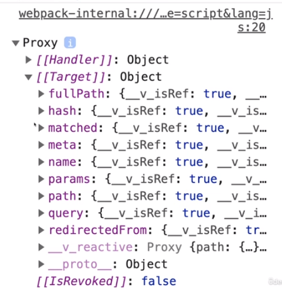

# 개론

> - [vs Options api](#vs-options-api)
> - [Options API](#options-api)
>   - [Options API의 한계](#options-api의-한계)
> - [Composition API](#composition-api)
> - [setup](#setup)
>   - [setup 축약](#setup-축약)
>   - [ref](#ref)
>       - [value](#value)
>   - [props](#props)
>   - [computed](#computed)
>   - [function](#function)
>   - [watch](#watch)
> - [etc](#etc)
>   - [reactive](#reactive)
>       - [isRef(), isReactive()](#isref-isreactive)
>       - [toRef()](#toref)
>   - [기존 템플릿의 ref](#기존-템플릿의-ref)
>   - [props](#props-1)
>   - [context](#context)
>   - [provide(), inject()](#provide-inject)
>   - [defineProps(), defineEmits()](#defineprops-defineemits)
>   - [defineExpose()](#defineexpose)
> - [정리](#정리)
> - [LifeCycle Hooks](#lifecycle-hooks)
> - [라우터](#라우터)
>   - [동적 세그먼트 받기](#동적-세그먼트-받기)
> - [라우트 객체 정보 받기](#라우트-객체-정보-받기)
>   - [useLink](#uselink)
>   - [useRoute](#useroute)
>   - [useRouter](#userouter)
> - [Vuex](#vuex)
>   - [useStore](#usestore)

# vs Options api
- 템플릿과 스타일링은 그대로
- 프로퍼티, 사용자 설정 이벤트도 그대로
- JavaScript 코드는 격변
- 컴포지션 API는 어디까지나 옵션

## Options API
```js
// Options API의 예시
{
    data(){
        return { name: 'Max' };
    },
    watch: {},
    computed: {},
    methods: {},
}
```
- 구성 객체에 데이터와 메서드를 설정하고, 이벤트를 발생시키는 구조

## Options API의 한계
- 더 큰 Vue app을 제작하는데, 문제가 있을 수 있다.
1. 한번에 실행되는 로직에서 필요한 여러가지 기능/ 옵션들이, data, methods, computed 등으로 나뉘어져 있다.

2. 컴포넌트 재사용시, 로직이 까다롭거나 복잡하기 쉽다.

# Composition API
- **setup()** 메서드를 이용해, 로직을 번들로 만든다. 
    - 그리고 골라서 컴포넌트 구성 객체에 추가한다.

```js
{
    setup(){
        const name = ref('Max');
        function doSmth(){...}
        return { name, doSmth };
    }
}
```
- data(), methods 등 다음에 setup() 메서드를 추가해도 되나,
    - setup() 메서드는 data()와 methods의 기능을 대체한다.
    - 데이터, 함수 연산, 감시자 모두 setup() 메서드에서 관리하게 된다.
        - setup은 이를 상호작용 가능하게 한다.
        - 템플릿 코드나, v-if, 데이터 바인딩과 같은 [vue 내장 디렉티브](./01_dom_widget.md/#vue-내장-디렉티브) 기능은 Options API와 똑같이 그대로 사용 가능하다.
        - props, emits, components도 그대로이다.
        - 한마디로, setup 메서드는 **vue 객체를 구성시킨다는 것!**
        - 생명 주기는 조금 달라진다.

- setup 메서드는 Options API 기능들을 하나로 통합시키는데 의의를 둔다.


# setup
- data를 대체
    - setup 안에서 호출
    - DOM 요소를 참조하는 것처럼, 
        - setup 안에서 값을 참조하여, 
        - 템플릿 안에서 사용가능하게 한다.
    - 반응형 객체를 생성하여, vue가 인식하고 감시한다.
        - 값이 바뀌거나 템플릿에 사용시, Vue가 반응하는 것
            - 반응: 값이 변경(setter)되었을 때, DOM에서 템플릿을 업데이트

```html
<template>
    <h2>{{ userName }}</h2>
</template>
<script>
    import { ref } from 'vue';
    
    export default{
        setup() {
            const uName = ref('lshh');

            setTimeout(function(){
                uName.value = 'Iol';
            }, 2000);

            return {
                userName: uName
            };
        }
    };
</script>
```
- setup은 export default 객체 내부에 있어서, this가 참조가 불필요 하다.
    - setup은 vue가 컴포넌트 초기화 프로세스의 초반에 실행되는 메서드이다.
        - 컴포넌트가 제대로 초기화되지 않은 시점이다.
        - 때문에, this를 통해 제대로 액세스할 수 없다.
- setup의 변수를 template이 인식하기 위해선 return되어야 한다.

## setup 축약
- setup을 script 태그에 어트리뷰트로 붙임으로써, 많은 코드를 생략 가능하다.
```html
<script setup>
    import { ref } from 'vue';
    
    const uName = ref('lshh');

    setTimeout(function(){
        uName.value = 'Iol';
    }, 2000);
</script>
```

## ref
- 평범한 순수 변수나 상수를 저장한다.
    - ref는 내부적으로 객체를 생성하고, 값을 그 객체에 저장한다. 
        - 프록시는 아니다
        - vue는 이 객체를 감시한다.
        - 값이 변경되면, 변화를 인식하고 DOM을 업데이트한다.
- ref 없이 변수에 값을 할당하고, return 할 수 있지만,
    - 반응형을 갖지 않는다. (리엑트가 감시하지 않는다.)

### value
- ref 내장 프로퍼티로, getter, setter 기능을 지원한다.
    - 템플릿에서는 .value를 쓸 필요없다.
        - vue가 감시하고 있기때문에 알아서, .value 값을 보여준다.
    - source의 setup 메서드 안에서는 vaule를 써야 값에 접근 가능하다.

## props
- setup에서 props에 접근하기
```js
props: ['users'],
setup(props) {  // setup은 props를 인자로 받는다.
    let users = [];
    users = props.users;
}
```

## computed
- setup에서 computed 하기
    - ref의 computed 버전이다.
    - 템플릿에서 필요하면 return 시키면 된다.

## function
- setup에서 method 대안으로 작성하기
    - 그냥 function 작성하고, 템플릿에서 필요하면 return 시키면 된다.

## watch
- setup에서 watch 하기
    - ref의 watch 버전이다.
    - 템플릿에서 필요하면 return 시키면 된다.
- watch의 인자
    - **첫번째 인자**는 **의존성**.
        - 첫번째 인자에 변화가 있을때마다, 동작한다.
        - 배열을 제공할 수도 있다.
            - 배열의 요소들에 변화가 있을때마다, 동작한다.
    - **두번째 인자**는 **함수로써 watch 로직**
        - 원래 watch와 마찬가지로 `newValue`, `oldValue` 두개의 인수를 갖는다.

```js
// ref, computed, watch 사용할꺼면 import 해야 한다.
import { ref, computed, watch} from 'vue';  

export default {
    props: ['users'],
    setup(props){
        const enteredSearchTerm = ref('');
        const activeSearchTerm = ref('');

        // computed 예시1
        const searchedUsers = computed(function(){
            let users = [];
            users = [];
            if (activeSearchTerm.value){
                users = props.users.filter((user)=>
                    user.fullName.inclueds(activeSearchTerm.value)
                );
            } else if (props.users){
                users = props.users
            }
            return users;
        });

        // watch 예시
        watch(enteredSearchTerm, function(newValue){
            setTimeout(() => {
                if (newValue === enteredSearchTerm.value){
                    activeSearchTerm.value = newValue;
                }
            }, 300)
        });

        // function 예시1
        function updateSearch(val){
            enteredSearchTerm.value = val;
        }

        const sorting = ref(null);
        // computed 예시2
        const displayedUsers = computed(function() {
            if(!sorting.value){
                return availableUsers.value;    // 같은 setup내의 computed도 사용
            }
            return availableUsers.value.slice().sort((u1, u2) => {
                if(sorting.value === 'asc' && u1.fullName > u2.fullName){
                    return 1;
                } else if(sorting.value === 'asc'){
                    return -1;
                } else if(sorting.value === 'desc' && u1.fullName < u2.fullName){
                    return -1;
                } else {
                    return 1;
                }
            })
        });

        // function 예시2
        function sort(mode){
            sorting.value = mode;
        }

        return {
            enteredSearchTerm,
            searchedUsers,
            updateSearch,
            displayedUsers,
            sorting,
            sort
        }
    }
}
```

# etc
## reactive
- 객체용 ref
    - ref처럼 객체의 프로퍼티들을 각각 래핑하고, 기존 값에 포인터를 가리키지 않는다.
    - 객체를 통째로 프록시로 매핑하고, 래퍼가 없는 것처럼 한다. (트랩이 다르다.)
```js
import { reactive } from 'vue';

export default {
    setup(){
        const user = reactive({
            name: 'lshh',
            age: 20,
        });

        // 기존 option api의 data처럼, 프록시를 통해, 래퍼가 없는 것처럼 된다.
        setTimeout(function(){
            user.name = '';
            user.age = 1;
        }, 2000)

        return { user };
    }
}
```

### isRef(), isReactive()
- 인자가 각가 ref, reactive 객체인지 boolean 결과를 알려주는 함수
```js
import { isRef, isReactive } from 'vue';
```
- vue는 동작시, 해당 함수들을 이용해, 템플릿의 변화를 확인할 대상을 찾는다.

### toRef()
- 객체를 중첩 ref로 바꿔준다.
    - 좀 무겁지 않을까..?
```js
import { toRefs } from 'vue';

~~~
const userRefs = toRefs(user);
// user의 프로퍼티들이 전부 ref가 된다.
```

## 기존 템플릿의 ref
- 스크립트에서 ref를 만들어 반환하고, 템플릿과 연계한다.
- 기존 템플릿의 ref는 어차피 같은 ref이기 때문에, vue가 잘 가져다 써준다.

```html
<template>
    <input type="text" ref="lastNameInput"/>
</template>
<script setup>
    const lastNameInput = ref(null);

    let answer = lastNameInput.value.value; // ref.value = input 이므로
</script>
```

## props
- 옵션 API props와 같이 작성된 컴포지션 API 방식
```js
export default {
    props: ['firstName', 'lastName'],
    setup(props){
        const userName = computed(function() {
            return props.firstName + ' ' + props.lastName;
        });
        return { userName };
    }
}
```

## context
- 폴스루의 동작에 영향 받음
    - 템플릿 내에 단일 루트 돔 태그여야 한다.(복수개의 루트일때 폴스루가 정상적으로 작동하지 않음)
- context
    - attrs
    - emit
        - 옵션 API의 `this.$emit()` 대체재로써, setup 내에서 `context.emit()`으로 사용한다.
    - slots
        - 컴포넌트의 슬롯 데이터에 액세스 `<slot></slot>`
```js
export default {
    setup(props, context){
        // this.$emit('save-data', 1);
        context.emit('save-data', 1);
    }
}
```

## provide(), inject()
```js
//
const uAge = 1;
provide('userAge', uAge);

//
const age = inject('userAge');
```


## defineProps(), defineEmits()
- 기존 props와 emits 사용
- setup에서 모듈 범위로 호이스트 된다.
```html
<script setup>
const props = defineProps({
    foo: String
});

const emit = defineEmits(['change', 'delete']);

////
const props = defineProps<{
    foo: string,
    bar?: number
}>();

const emit = defineEmits<{
  (e: 'change', id: number): void,
  (e: 'update', value: string): void
}>();

// 3.3+: alternative, more succinct syntax
const emit = defineEmits<{
  change: [id: number], // named tuple syntax
  update: [value: string]
}>();
</script>
```

## defineExpose()
- <script setup>을 사용하는 컴포넌트는 기본적으로 닫혀 있다. 
- 템플릿 참조 또는 $parent 체인을 통해 검색되는 컴포넌트의 공개 인스턴스는 `<script setup>` 내부에서 선언된 바인딩을 노출하지 않는다.
- 명시적으로 노출하려면 defineExpose 컴파일러 매크로를 사용해야 한다.
```html
<script setup>
import { ref } from 'vue'

const a = 1
const b = ref(2)

defineExpose({
    a,
    b
})
</script>
```

# 정리
| Option API | Composition API |
|---|---|
| data(){} | ref(), reactive() |
| methods:{} | function |
| computed:{} | computed() |
| watch:{} | watch(dep, (new, old)=>{}) |
| provide:{}, inject:[] | provide(key, val), inject(key) |

# LifeCycle Hooks
| | Option API | => | Composition API |
|---|---|---|---|
| 1 | beforeCreate, created | | setup() |
| 2 | beforeMount, mounted | | onBeforeMount(), onMounted() |
| 3 | beforeUpdate, updated | | onBeforeUpdate(), onUpdated() |
| 4 | beforeUnmount, unmounted | | onBeforeUnmount(), onUnmounted() |

- setup이 created가 실행되는 시점
```js
import {onBeforeMount, onMounted } from 'vue';

export default {
    setup(){
        onBeforeMount(function() {
            console.log('onBeforeMount');
        });
        onMounted(function() {
            console.log('onMounted');
        });
    }
}
```
- 해당 시점에 인자로 받은 function을 호출한다.


# 라우터
## 동적 세그먼트 받기
- props를 통한 전달
```js
// router
{path: '/products/:pid', component: ProductDetails, props: true}

// ProductDetails.vue
export default {
    props: ['pid'],
    setup(props){
        return {
            pid: props.pid,
        }
    }
}
```
- `computed()`: 값 할당을 vue에 인지시킬 때
- `watch()`: 변수(ref)로 vue가 인지하는 동작을 트리거할 때

# 라우트 객체 정보 받기
## useLink
- this.$route 대용
```js
// router
{path: '/products/:pid', component: ProductDetails, props: true}

// ProductDetails.vue
import { use } from 'vue-router';

export default {
    props: ['pid'],
    setup(props){
        return {
            pid: props.pid,
        }
    }
}
```
- 훅, 컴포저블 사용자 지정 컴포지션 함수 (컴포지션 API 내장)

    - useLink
    - useRoute
    - useRouter

## useRoute
```js
import { useRoute } from 'vue-router';

export default {
    setup(){
        const route = useRoute();
    }
}
```


- useRoute가 반환하는 객체
    - 리엑트 Proxy 객체
    - 라우트가 변경될 때, 이 객체를 이용해서 의존하는 데이터를 업데이트할 수 있다.
        - compute 또는 watch로..!
    - 라우트에 한정, `props를 통한 전달` 방식을 대체한다!

```js
// router
{path: '/products/:pid', component: ProductDetails, props: true}

// ProductDetails.vue
export default {
    props: ['pid'],
    setup(){
        const route = useRoute();
        return {
            pid: route.params.pid,
        }
    }
}
```

## useRouter
- 옵션 API에서는 `this.$router.push`를 사용했다.
```js
import { useRouter } from 'vue-router'

export default{
    setup(){
        const router = useRouter();

        function submitForm(){
            addProduct({
                title: enteredTitle,
            });
            //this.$router.push('/products');
            router.push('/products');
        }
    }
}
```

# Vuex
## useStore()
- store를 setup 내부에서 사용하는 방법
    - 나머지는 동일하다.
```js
//// ControlCenter.vue
import { useStore } from 'vuex';

export default {
  setup() {
    const store = useStore();

    function inc() {
      store.dispatch('increment');
    }

    return { inc };
  },
};


//// TheCounter.vue
import { computed } from 'vue';
import { useStore } from 'vuex';

export default {
  setup() {
    const store = useStore();

    const counter = computed(function() {
      return store.getters.counter;
    });

    return { counter };
  },
};
```
- ControlCenter => TheCounter 
    - vuex를 이용하여 데이터 값을 변경하고, 
    - vuex를 이용하여 데이터 값을 가져오고 있다.


 