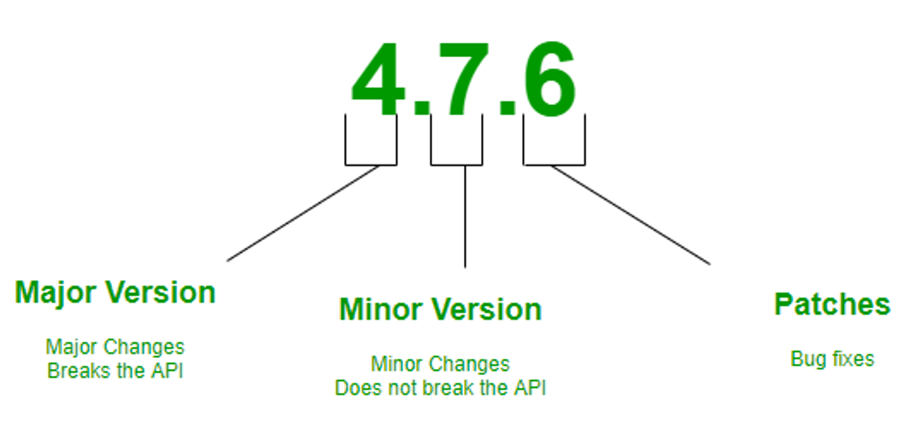
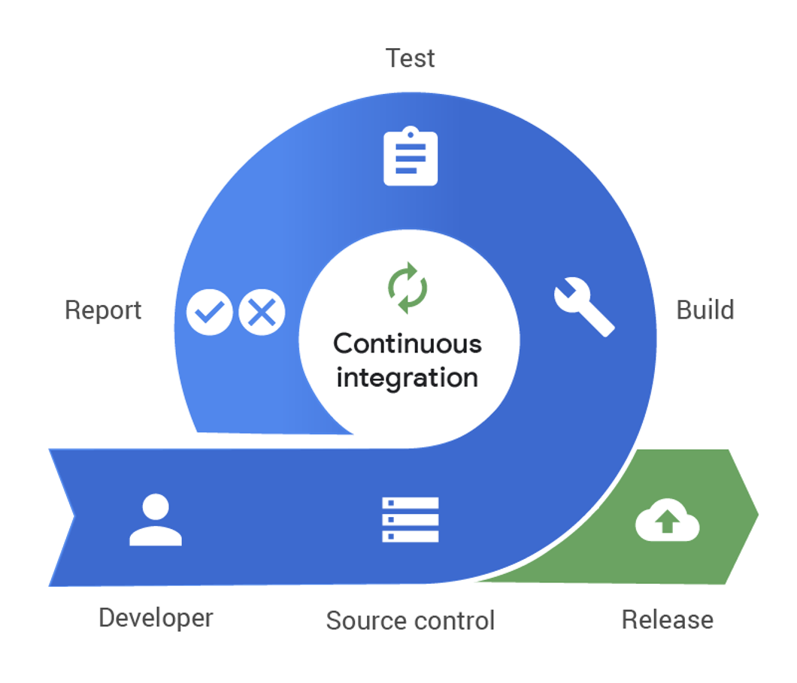
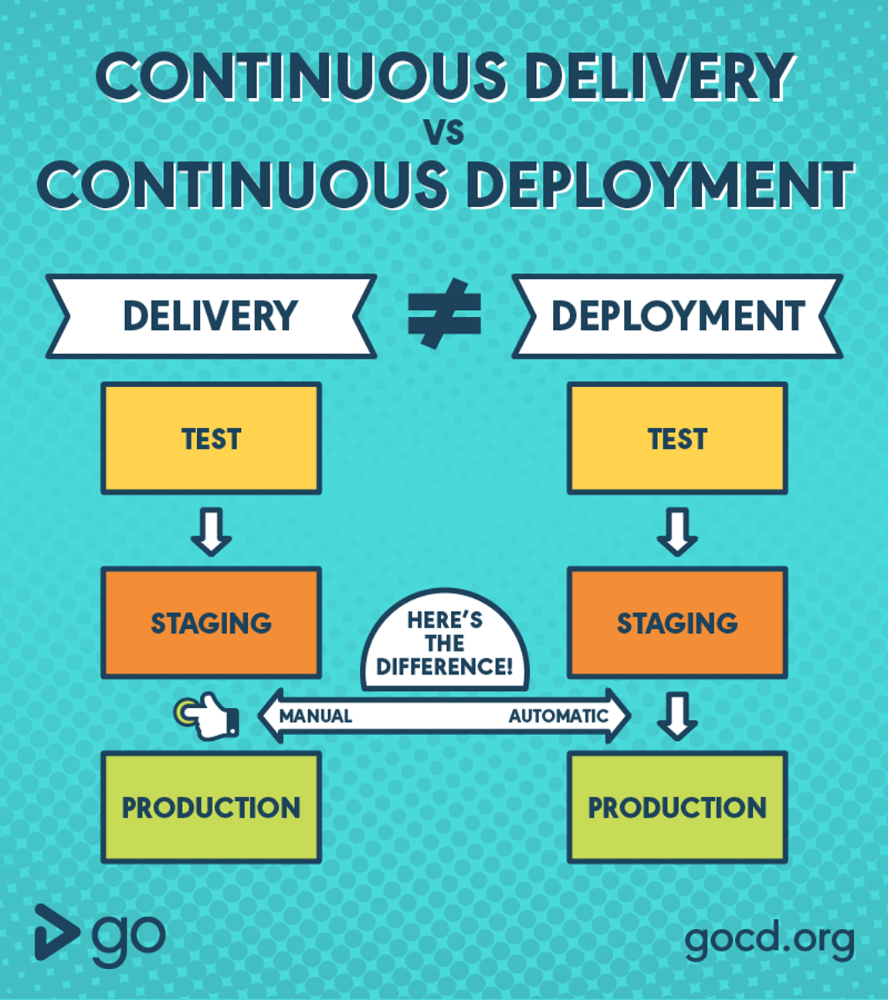

# Step1: 웹 서버 생성
## Health Check가 가능한 앱
- Spring Boot Actuator
    - [액추에이터를 이용한 헬스체크](../../java/spring/actuator.md)

## Phase 별 별도의 설정 관리
- Spring Boot Active Profiles
    - [액티브 프로파일을 이용한 패이즈 관리](../../java/spring/active_profiles.md)

### 안전 소프트웨어 공급 체인 구성

### phase 구분
- `dev`: 개발 환경
    - alpha: qa용 알파 릴리스 환경
- `stg`: 스테이징 환경
- `prod`: 운영 환경

### semantic versioning

# Step2: 빌드 환경 구축
## 1. 도커 엔진을 이용한 빌드 구축
- [도커 파일 및 도커 컴포즈 구성](../../cloud/docker/doc_docker.md)

## 참조 링크
    - [CI/CD 파이프라인: 개념, 방법, 장점, 구현 과정](https://www.redhat.com/ko/topics/devops/what-cicd-pipeline)
    - [docker 소개 블로그](https://www.44bits.io/ko/post/easy-deploy-with-docker)
    - [Docker Compose 소개 블로그](https://scarlett-dev.gitbook.io/all/docker/untitled)
- 데이터베이스 마스터/슬레이브를 이용한, CQRS 구성?

## 2. Github Action을 이용한 CI/CD 환경 구축
- Push, PR 등에 대해 Trigger

- 참조 링크
    - 깃헙 액션 공식 문서: <https://docs.github.com/en/actions>
    - [깃헙 액션 소개 블로그](https://www.daleseo.com/github-actions-basics/)

## CI

## CD
- Continuous Delivery
    - 보통 스테이징까지. 자동 전달
- Continuous Deployment
    - 배포. 선택적 수동 배포

## TEST
- Lint 체크
- Coverage 리포트
- Test 체크

## Phase 별 다른 파이프라인
- 예시1
    - `pr-ci`: PR 이 생성, 변경, 추가 되면 Test 및 Build 를 수행해 무결성을 검증
    - `dependency-integration`: 디펜던시를 관리하는 파일의 변경을 감시 
        - 해당 디펜던시를 미리 다운받고 별도 저장
        - 빌드 속도를 개선
    - `cd-alpha`: release-* 브랜치로 push가 발생시, **알파 환경**으로 테스트, 빌드, 배포
    - `cd-prod`: main 으로 push 가 발생시, **prod 환경**으로 테스트, 빌드, 사내 망에 배포
- 예시2
    - `pr-ci`: PR 이 생성/변경/추가시, Test 및 Build를 수행
        - 무결성 검증
    - `tag-ci`: 태그가 생성될 경우, 이미지 빌드 및 원격 레포지토리에 업로드
    - `deploy-bot`: 특정 태그와, 서비스를 명시하여, 해당 태그를 자동 배포하는 봇
    - `deploy-metadata`: 배포 환경변수 등의 설정을 다루는 레포지토리
- 케이스
    - 테스트와 빌드를 서로 다른 Job 으로 간주하고 병렬로 실행하여, 시간을 절약할 수 있다.
    - 이 때, 둘 중 하나가 실패하면 배포로 이어지지 않도록 한다.

# Step3: 배포 환경 구축 
## AWS 가상 머신 및 서비스를 이용한 배포 라인 구축
- Elastic Container Registry
    - CI를 통해 이미지 업로드
    - 이미지 관리 원격 레지스트리
- Elastic Container Service
    - 이미지를 컨테이너로 구동하는 분산 서비스
- ECS Fargate?
    - ECR로부터 이미지를 가져와 ECS에 구동하는 역할
    - 가상머신 메트릭스 설정을 관리하고, 컨테이너를 생성해주는 서버리스 기능
        - *Fargate 시작 유형* 또는 *Fargate 용량 공급자*를 사용하여 **Amazon ECS 태스크** 설정
            1. 서비스를 실행시, 컨테이너에 패키징할 애플리케이션을 설정
            2. VM 구성 요소 설정
                - 운영 체제
                - CPU 및 메모리 요구 사항
                - 네트워킹 및 IAM 정책 정의
            3. 애플리케이션 시작
        - 각 Fargate 태스크에는 자체 격리 경계가 있으며 다른 태스크와 기본 커널, CPU 리소스, 메모리 리소스 또는 탄력적 네트워크 인터페이스를 공유하지 않는다.

## 추가 고려 사항
- VPC
- network
- security

## 참조
- [IAM 통한 보안 권한 관리](https://dev.classmethod.jp/articles/what-is-aws-iam-kr/)
- [ECS 소개](http://ecs.catsdogs.kr.s3-website.ap-northeast-2.amazonaws.com/ko/1.-intro/)
- [Elastic Container Registry](https://aws.amazon.com/ko/ecr/)
- [Elastic Container Service on AWS Fargate](https://docs.aws.amazon.com/AmazonECS/latest/developerguide/AWS_Fargate.html)
- [AWS Fargate를 사용하여 아마존 ECS에 자바 마이크로서비스를 배포하세요](https://docs.aws.amazon.com/ko_kr/prescriptive-guidance/latest/patterns/deploy-java-microservices-on-amazon-ecs-using-aws-fargate.html)

