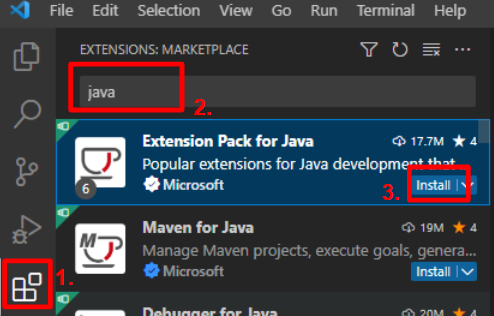
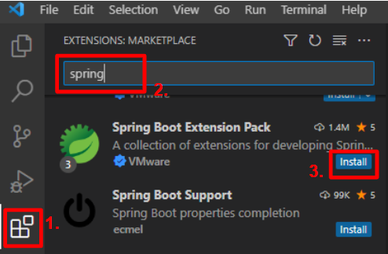
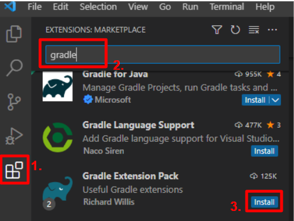

> [Home](../README.md)

# 0. Java 세팅
## 0.1. Java 설치

## 0.2. Java 시스템 환경변수 설정

---
# 1. IDE 세팅
- 명칭: Visual Studio Code

## 1.1. IDE에 Extensions 설치

### 1.1.1. Extension Pack for Java
    - 이름: Extension Pack for Java
    - ID: vscjava.vscode-java-pack
    - 설명: Popular extensions for Java development that provides Java IntelliSense, debugging, testing, Maven/Gradle support, project management and more
    - 버전: 0.25.7
    - 게시자: Microsoft

    1. Language Support for Java(TM) by Red Hat
    2. Debugger for Java
    3. Test Runner for Java
    4. Maven for Java
    5. Project Manager for Java
    6. IntelliCode

[VS Marketplace Link](https://marketplace.visualstudio.com/items?itemName=vscjava.vscode-java-pack)


1. marketplace 탭 선택
2. Java 검색
3. Extension Pack for Java 플러그인 패키지 설치
---

### 1.1.2. Spring Boot Extension Pack
    - 이름: Spring Boot Extension Pack
    - ID: vmware.vscode-boot-dev-pack
    - 설명: A collection of extensions for developing Spring Boot applications
    - 버전: 0.2.1
    - 게시자: VMware

    1. Spring Boot Tools
    2. Spring Initializr Java Support
    3. Spring Boot Dashboard

[VS Marketplace Link](https://marketplace.visualstudio.com/items?itemName=vmware.vscode-boot-dev-pack)


1. marketplace 탭 선택
2. Spring 검색
3. Spring Boot Extension Pack 플러그인 패키지 설치

### 1.1.3. Gradle Extension Pack
    - 이름: Gradle Extension Pack
    - ID: richardwillis.vscode-gradle-extension-pack
    - 설명: Useful Gradle extensions
    - 버전: 0.0.4
    - 게시자: Richard Willis

    1. Gradle for Java
    2. Gradle Language Support

[VS Marketplace Link](https://marketplace.visualstudio.com/items?itemName=richardwillis.vscode-gradle-extension-pack)


1. marketplace 탭 선택
2. Gradle 검색
3. Gradle Extension Pack 플러그인 패키지 설치

## 1.2. 컴퓨터 재부팅으로 IDE 캐싱된 정보 초기화
- IDE의 캐싱된 정보가 초기화 되어야, IDE가 프로젝트 내 Java, Spring, Gradle을 정상적으로 인식 가능합니다.

---
   
# 2. 소스 가져오기
## 2.1. Git 설치

## 2.2. SSL 설정
```bash
# SSL 설정
git config --global http.sslbackend schannel
```

## 2.3. Git 이메일, 이름 등록
```bash
# 이름 확인
git config user.name
# 이메일 확인
git config user.email
# 이메일 변경
git config --global user.email <이메일>
```

## 2.4. Git으로 소스 복제
```bash
# 클론
git clone https://git-pms.milkt.co.kr/milkt-core/java-style-guide.git
# GitLab(원격 레포지토리) 경로의 자격 증명이 필요하다.
```
