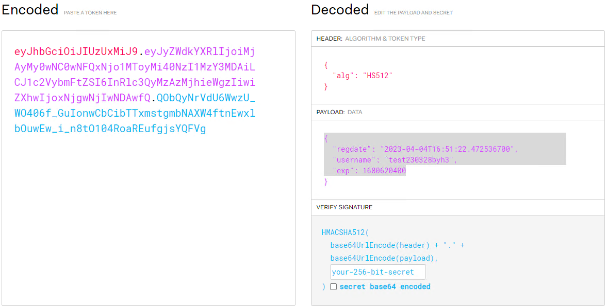
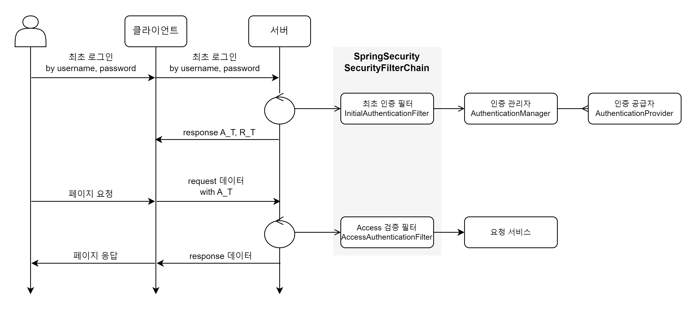
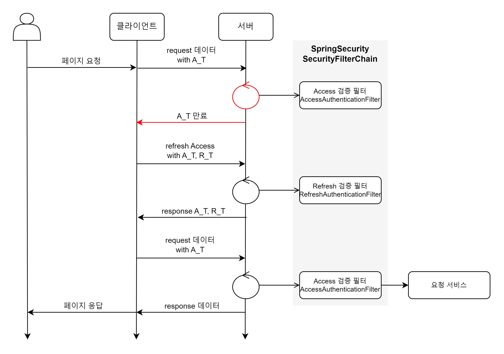

> [Home](../README.md)

- [6. SpringSecurity](#6-springsecurity)
    - [6.0 시큐리티 적용 가이드](#60-시큐리티-적용-가이드)
    - [6.1 gradle](#61-gradle)
    - [6.2 설정 관리](#62-설정-관리)
    - [6.3 config](#63-config)
        - [6.3.1 SecurityPreConfig](#631-securitypreconfig)
            - [6.3.1.1 인증 매니저 AuthenticationManager](#6311-인증-매니저-authenticationmanager)
        - [6.3.2 SecurityFilterChainConfig](#632-securityfilterchainconfig)
    - [6.4 filter](#64-filter)
        - [6.4.1 InitialAuthenticationFilter](#641-initialauthenticationfilter)
        - [6.4.2 JwtAuthenticationFilter](#642-jwtauthenticationfilter)
        - [6.4.3 AccessAuthenticationFilter](#643-accessauthenticationfilter)
        - [6.4.4 RefreshAuthenticationFilter](#644-refreshauthenticationfilter)
        - [6.4.5 RefreshLogoutFilter](#645-refreshlogoutfilter)
    - [6.5 provider](#65-provider)
        - [6.5.1 UsernamePasswordAuthenticationProvider](#651-usernamepasswordauthenticationprovider)
        - [6.5.2 thirdParty AuthenticationProvider](#652-thirdparty-authenticationprovider)
    - [6.6 SecurityService](#66-service)
        - [6.6.1 SecurityService](#661-securityservice)
            - [6.6.1.1 User CRUD](#6611-user-crud)
            - [6.6.1.2 UserToken CRUD](#6612-usertoken-crud)
            - [6.6.1.3 DisabledAccessToken CRUD](#6613-disabledaccesstoken-crud)
        - [6.6.2 SecurityService 구현 가이드](#662-securityservice-구현-가이드)
            - [6.6.2.1 UserDto](#6621-userdto)
                - [6.6.2.1.1 UserDelegator](#66211-userdelegator)
            - [6.6.2.2 User entity와 UserRepository 구현 가이드](#6622-user-entity와-userrepository-구현-가이드)
            - [6.6.2.3 UserToken entity와 UserTokenReporisory 구현 가이드](#6623-usertoken-entity와-usertokenreporisory-구현-가이드)
            - [6.6.2.4 DisabledAccessToken entity와 DisabledAccessToken 구현 가이드](#6624-disabledaccesstoken-entity와-disabledaccesstoken-구현-가이드)
    - [6.7 encoder](#67-encoder)
        - [6.7.1 PasswordEncoder](#671-passwordencoder)
            - [6.7.1.0 PlainTextEncoder](#6710-plaintextencoder)
            - [6.7.1.1 Sha512PasswordEncoder](#6711-sha512passwordencoder)
    - [6.8 helper](#68-helper)
        - [6.8.1 AuthorizationHeaderHelper](#681-authorizationheaderhelper)
        - [6.8.2 TokenHelper](#682-tokenhelper)

# 6. SpringSecurity
- 빠른 적용을 위한다면, [5.5 service](#65-service) 내용을 우선적으로 참고할 것을 추천
- 시큐리티 로직을 수정하지 않는다면, yml과 데이터를 제공하는 service 만을 작성한다.

## 6.0 시큐리티 기초
- 본 문서와 샘플은 Spring Security 6.0.2 버전으로 작성되었다.

### 6.0.1 시큐리티 구성도


#### 6.0.1.1 시큐리티 필터 체인
- 위 그림은 [Access와 Refresh 토큰]을 이용한 인증방식의 필터체인
- 기존 시큐리티의 세션 저장방식의 필터 체인과 상이하다.

#### 6.0.1.2 인증 공급자 (로그인)
- 인증Authentication이란, 접근이 가능한 유저임을 증명하는 것
- 인증 관리자 AuthenticationManager는 복수의 인증 공급자 AuthenticationProvider들을 가질 수 있다.
- 하나의 AuthenticationProvider에 의해서라도 인증된다면, 인증에 성공한다.
    - 이를 통해, 여러 로그인 방법을 추가할 수 있다.

### 6.0.2 Access와 Refresh, 그리고 JWT
#### 6.0.2.0 JWT

- [JSON Web Token](https://jwt.io/)
- 알고리즘 서명을 통해, 해당 요청이 인증된 요청임을 나타낼 수 있다.
    - 본 샘플은, Access와 Refresh 토큰을 JWT로 구현한다.

#### 6.0.2.1 Access


- Access 토큰이란?
    - 서버에 request시, 인증 받았다는 것을 인증하는 토큰
- 세션 대안으로 활용가능한, 방식
- 최초 로그인으로 토큰을 발급하고, Access 토큰을 검증하여, 인증 여부를 확인한다.
- 단점
    - Access 토큰의 탈취시, 위험하다.
    - Access 토큰이 만료시, 세션과 마찬가지로 재로그인을 필요로한다.
- 해결 방안
    - Access 토큰을 짧은 유효 기간으로 설정하고, 긴 유효기간의 [Refresh 토큰](#6042-refresh)과 같이 사용하여, 위 단점들을 모두 해결 가능하다.


#### 6.0.2.2 Refresh


- Refresh 토큰이란? 
    - Access 토큰 만료로 인한 신규 발급 단계에서, 인증 용도의 토큰
- Access 토큰에 비해, 긴 유효기간을 갖도록 설계한다.
- Refresh 토큰의 탈취에 대한 보안 로직을 설계한다.
    - 본 샘플에서는, Refresh 토큰에 대하여 마지막 발급된 Access 토큰을 영속성 시스템(DB)으로 관리하여, Refresh 탈취에 대비한다.
- Refresh 갱신 정책에 따라, 로그인 유지를 지원할 수 있다.
    - 본 샘플에서는, Refresh 만료까지 일주일 이하일 때, Access 갱신 요청시, 신규 Refresh 토큰을 발급해주어, 로그인을 유지해준다.


## 6.1 gradle
- [build.gradle](../build.gradle)에 수록
```gradle
	implementation 'org.springframework.boot:spring-boot-starter-security'
	implementation group: 'com.googlecode.json-simple', name: 'json-simple', version: '1.1.1'
	implementation 'io.jsonwebtoken:jjwt-api:0.11.2'
	implementation 'io.jsonwebtoken:jjwt-jackson:0.11.2'
	runtimeOnly 'io.jsonwebtoken:jjwt-impl:0.11.2'
	testImplementation 'org.springframework.security:spring-security-test'
```

## 6.2 설정 관리
- [application.yml](../src/main/resources/application.yml)에 수록
- yml 확장자 방식 적용
- 필요시, 적확한 이름의 설정 파일 추가 관리
- 싱글톤 컴포넌트에서의 `@Value` 활용 지향

```yaml
jwt:
  access: 
    secret: dGhpcy1pcy1hLXNhbXBsZS1tYWRlLWJ5LWxzaGgtand0LXRlc3Qtc2VjcmV0LWtleS10aGlzLWlzLWEtc2FtcGxlLW1hZGUtYnktbHNoaC1qd3QtdGVzdC1zZWNyZXQta2V5
    token-validity-in-days: 1
  refresh: 
    secret: dGhpcy1pcy1hLXNhbXBsZS1tYWRlLWJ5LWxzaGgtand0LXRlc3Qtc2VjcmV0LWtleS10aGlzLWlzLWEtc2FtcGxlLW1hZGUtYnktbHNoaC1qd3QtdGVzdC1zZWNyZXQta2V5
    token-validity-in-days: 30

security:
  filter-config:
    initial-authentication-filter:
      path: /login/in
    refresh-logout-filter:
      path: /login/out
    refresh-request:
      path: /login/refresh
    ignore-list: /login/test, /login/up
```

- secret: access 와 refresh의 서명 암호키
- token-validity-in-days: 만료 기간 일수
- filter-config 에서 각 필터에 단일로 적용될 전용 request path를 지정합니다.
- ignore-list에 들어간 path는 Security Filter를 거치지 않습니다.


## 6.3 config
- 애플리케이션에 스프링 시큐리티를 적용을 목표로 Bean 생성을 모아둔 패키지 입니다.
- `@Configuration`
- DI (Dependency Injection 의존성 주입) 루프로 인해, SecurityPreConfig와 SecurityFilterChainConfig 로 분리합니다.

### 6.3.1 SecurityPreConfig
- [/common/security/config/SecurityPreConfig.java](../src/main/java/chunjae/api/common/security/config/SecurityPreConfig.java)
- SecurityFilterChain Bean을 생성하기 전에, DI를 필요로 하는 Bean들을 모아둔 곳입니다.

#### 6.3.1.1 인증 매니저 AuthenticationManager
- 인증 매니저는 인증(로그인)을 관리합니다.
- [인증 공급자](#65-provider)를 주입합니다.
- BasicAuthenticationFilter를 대체하는 [InitialAuthenticationFilter](#631-initialauthenticationfilter)에서 여러 인증 공급자 중 하나가 통과하면, 다음 필터를 진행합니다.

### 6.3.2 SecurityFilterChainConfig
- 스프링 시큐리티 필터 체인에 주입되는 `SecurityFilterChain` Bean을 작성한 곳
- 여러 의존성들을 주입 받아 처리한다.

## 6.4 filter
- Spring에서 Filter는 진입과 반환 시점에 두 곳에서 일어난다.
- `OncePerRequestFilter`: 진입시에만 거치는 필터로, 이를 상속하여 만들어졌다.
- `@Override` 하는 메서드
    - `shouldNotFilter`: 필터를 거치지 않는지 판단하는 boolean 값을 반환하는 메서드
    - `doFilterInternal`: 필터를 거칠 때, 일어나는 로직을 담은 메서드
- 필터를 활성화 시키기 위해서는 [SecurityService](#661-securityservice) 구현이 필수

### 6.4.1 InitialAuthenticationFilter
- security.filter-config.initial-authentication-filter.path 경로에 대해 필터 적용
- [/common/security/filter/InitialAuthenticationFilter.java](../src/main/java/chunjae/api/common/security/filter/InitialAuthenticationFilter.java)
- 최초 로그인시 인증작업 것을 목표로 만들어진 필터
- `BasicAuthenticationFilter`를 대체
- [인증 공급자 구현](#65-provider)을 이용해, 여러 로그인 방식을 제공 가능

### 6.4.2 JwtAuthenticationFilter
- [/common/security/filter/JwtAuthenticationFilter.java](../src/main/java/chunjae/api/common/security/filter/JwtAuthenticationFilter.java)
- Access에 대하여, JWT 서명 검증하는 간단한 필터
- 기본 모델로, 샘플에서는 비활성화되어있다.

### 6.4.3 AccessAuthenticationFilter
- filter-config의 경로들을 제외한 모든 요청 경로들에 대하여 필터 적용
- [/common/security/filter/AccessAuthenticationFilter.java](../src/main/java/chunjae/api/common/security/filter/AccessAuthenticationFilter.java)
- 일반적인 데이터 요청에 대하여, Access를 검증하는 필터
- Access 토큰은 JWT로 서명되어야 하며, 이를 [TokenHelper](../src/main/java/chunjae/api/common/security/helper/TokenHelper.java)에서 `validateAccessToken`으로 검증

### 6.4.4 RefreshAuthenticationFilter
- security.filter-config.refresh-request.path 경로에 대해 필터 적용
- [/common/security/filter/AccessAuthenticationFilter.java](../src/main/java/chunjae/api/common/security/filter/RefreshAuthenticationFilter.java)
- 만료된 Access 토큰에 대하여, Refresh 요청시, Refresh 토큰의 유효성을 검증하는 필터
- Refresh와 Access를 동시에 받으며, Refresh에 대하여 마지막 Access 토큰인지 확인하여 Refresh 토큰의 탈취를 검증
- Refresh 검증 및 발급 로직
    1. Refresh 서명 확인
    2. 영속성 시스템(DB)에서 Refresh 토큰의 정보를 가져오기
    3. 탈취 확인
        - 가져온 정보의 마지막 발급된 Access 토큰과, 요청받은 Access 토큰의 일치 확인
    4. RefreshToken 만료일이 7일 이하라면, 신규 RefreshToken 발급
    5. 신규 AccessToken 발급
    6. 영속성 시스템에 갱신 혹은 신규발급된 Refresh와 Access 정보를 쓰기

### 6.4.5 RefreshLogoutFilter
- security.filter-config.refresh-logout-filter.path 경로에 대해 필터 적용
- [/common/security/filter/RefreshLogoutFilter.java](../src/main/java/chunjae/api/common/security/filter/RefreshLogoutFilter.java)
- 로그아웃 요청에 대하여 처리
- 헤더에 R_T를 담았다면, 해당 refresh 토큰에 대하여, 로그아웃
- 헤더에 R_T, username 같이 제공되었다면, 적절한 R_T임이 검증되면, username에 대해 모두 로그아웃

## 6.5 provider
- 인증 공급자는 로그인 같은 최초 인증 및 세션 인증을 의미
- 본래, BasicAuthenticationFilter에서 인증 매니저가 사용
- API 환경에서는 본 샘플의 [InitialAuthenticationFilter](#631-initialauthenticationfilter)와 같이 대체되어, 해당 필터 안에서 사용
- [AuthenticationManager](#6311-인증-매니저-authenticationmanager)에 주입된 인증 공급자들 중 하나라도 통과된다면, 인증에 통과
- 인증 공급자를 활성화 시키기 위해서는 [SecurityService](#661-securityservice) 구현이 필수

### 6.5.1 UsernamePasswordAuthenticationProvider
- 헤더의 `"Authorization": "Basic {username}:{password}"`로 인증

### 6.5.2 thirdParty AuthenticationProvider
- 구글/카카오/네이버/애플 등의 간편 로그인을 별도로 구현하고, 인증 관리자에 주입하여, 로그인 방법의 다양화가 가능하다.

## 6.6 service 
### 6.6.1 SecurityService
- [/common/security/service/SecurityService.java](../src/main/java/chunjae/api/common/security/service/SecurityService.java)
- 인증에 필요한 영속성 데이터를 조회/명령 하는 인터페이스
- 구현 필수적인 메서드와, 기본 로직이 있는 구현 선택적인 메서드로 나뉜다.

#### 6.6.1.1 User CRUD
- `UserDetails loadUserByUsername(String username)`
    - 회원과 회원의 보유 권한들을 종합적으로 조회
    - [UsernamePasswordAuthenticationProvider](#651-usernamepasswordauthenticationprovider)에서 사용
    - `UserDetails`를 상속받는 [UserDelegator](#66211-userdelegator)를 반환하도록 구현해야 한다.
    - 구현: 필수
- `Optional<UserDto> loadUser(String username)`
    - 사용자 조회
    - 구현: 필수
- `List<UserDto> list(int page, int pageSize)`
    - 사용자 리스트 조회
    - 구현: 필수
- `UserDto createUser(UserDto userDto)`
    - 사용자 생성
    - 구현: 필수
- `SaveResult trySignUp(UserDto userDto)`
    - 사용자 생성 시도
    - 구현: 선택

#### 6.6.1.2 UserToken CRUD
- `Optional<UserTokenDto> loadUserTokenDtoByRefreshToken(String refreshToken)`
    - 토큰 정보를 RefreshToken으로 조회
    - 구현: 필수
- `List<UserTokenDto> loadUserTokenDtoByUsername(String username)`
    - 토큰 정보를 사용자 식별자 값(username)으로 조회
    - 구현: 필수
- `SaveResult createUserToken(UserTokenDto userTokenDto)`
    - 토큰 정보를 UserTokenDto로 생성
    - 구현: 필수
- `SaveResult updateUserToken(UserTokenDto userTokenDto)`
    - 토큰 정보를 UserTokenDto로 갱신
    - 구현: 필수
- `SaveResult saveUserToken(String accessToken, String refreshToken, String username)`
    - access, refresh, username 정보로 토큰 정보를 생성 또는 갱신
    - 구현: 선택
- `SaveResult deleteUserToken(String refreshToken)`
    - refresh 토큰 정보를 소프트 딜리트
    - 구현: 선택
- `SaveResult deleteUserTokens(String username)`
    - username에 대한 토큰 정보들을 소프트 딜리트
    - 구현: 선택

#### 6.6.1.3 DisabledAccessToken CRUD
- `boolean isDisabledAccessToken(String accessToken)`
    - access token이 비활성화 되어 있는지 조회
    - 구현: 필수
- `SaveResult saveDisabledAccessToken(String refreshToken)`
    - access token을 비활성화
    - 구현: 필수
- `SaveResult saveDisabledAccessTokenByRefresh(String refreshToken)`
    - refresh 토큰의 access를 비활성화
    - 구현: 필수


### 6.6.2 SecurityService 구현 가이드
- 해당 샘플 [SecurityServiceImpl.java](../src/main/java/chunjae/api/service/security/SecurityServiceImpl.java)는 영속성 시스템으로 부터 데이터를 조회/명령한다.
- 필요시, User 프록시를 구현하여, User API등의 외부로부터, 데이터를 가져오도록 구현을 추천

#### 6.6.2.1 UserDto
- [](../src/main/java/chunjae/api/common/security/dto/UserDto.java)
##### 6.6.2.1.1 UserDelegator
- [/common/security/dto/UserDelegator.java](../src/main/java/chunjae/api/common/security/dto/UserDelegator.java)
- [/common/security/dto/UserDelegatorImpl.java](../src/main/java/chunjae/api/common/security/dto/UserDelegatorImpl.java)
- UserDetails을 상속
- UserDelegatorImpl에서 구현

#### 6.6.2.2 User entity와 UserRepository 구현 가이드
- [User.java](../src/main/java/chunjae/api/domain/entity/security/User.java)
    - `User` entity에 `public UserDto toDto()` 를 구현하면, 사용성이 좋다.
- [UserRepository.java](../src/main/java/chunjae/api/domain/repository/security/UserRepository.java)
    - `Optional<User> findUserByUsername(String username)`
        - 메서드의 단일 객체 반환시에는 옵셔널이 좋다.

#### 6.6.2.3 UserToken entity와 UserTokenReporisory 구현 가이드
- [UserToken.java](../src/main/java/chunjae/api/domain/entity/security/UserToken.java)
     - `User` entity에 `public UserDto toDto()` 를 구현하면, 사용성이 좋다.
     - delete 여부를 boolean get하는 메서드를 만들어두면, 사용성이 좋다.

```java
    public boolean isNotDeleted(){
            return this.deleteYN != 'Y';
        }

    public UserTokenDto toDto(){
        return UserTokenDto.builder()
                    .refresh(this.refresh)
                    .access(this.access)
                    .username(this.username)
                    .isNotDeleted(this.isNotDeleted())
                    .build();
    }
```

- [UserTokenRepository.java](../src/main/java/chunjae/api/domain/repository/security/UserTokenRepository.java)
    - `Optional<UserToken> findUserTokenByRefreshAndDeleteYN(String refresh, char deleteYN)`
        - 메서드가 단일 객체 반환시에는 옵셔널이 좋다.

    - `List<UserToken> findListByUsernameAndDeleteYN(String username, char deleteYN)`
        - 메서드가 리스트 반환시에는 옵셔널이 필요 없다.

#### 6.6.2.4 DisabledAccessToken entity와 DisabledAccessToken 구현 가이드
- [DisabledAccessToken.java](../src/main/java/chunjae/api/domain/entity/security/DisabledAccessToken.java)
- [DisabledAccessTokenRepository.java](../src/main/java/chunjae/api/domain/repository/security/DisabledAccessTokenRepository.java)

## 6.7 encoder
### 6.7.1 PasswordEncoder
- [/common/security/encoder/PasswordEncoder.java](../src/main/java/chunjae/api/common/security/encoder/PasswordEncoder.java)
- 메서드 목록
    - `String encode(CharSequence rawPassword)`
        - 구현: 필수
    - `boolean matches(CharSequence rawPassword, String encodedPassword)`
        - 구현: 필수
    - `boolean upgradeEncodeing(String encodedPassword)`
        - 구현: 선택

#### 6.7.1.0 PlainTextEncoder
- 아무것도 하지 않는 encoder
- 테스트용

#### 6.7.1.1 Sha512PasswordEncoder
- Sha512 이용

## 6.8 helper
- 기타 헬퍼

### 6.8.1 AuthorizationHeaderHelper
- [/common/security/helper/AuthorizationHeaderHelper.java](../src/main/java/chunjae/api/common/security/helper/AuthorizationHeaderHelper.java)
- 정적 메서드들을 보유하고 있다.
    - `String[] decodeBasic(HttpServletRequest request)`
        - Authorization 헤더안의 Basic64로 인코딩된 username:password를 디코딩
    - `String[] decodeBearer(HttpServletRequest request)`
        - Authorization 헤더안의 Bearer로 보내진 값들을 분리하여, 리스트로 반환

### 6.8.2 TokenHelper
- [/common/security/helper/TokenHelper.java](../src/main/java/chunjae/api/common/security/helper/TokenHelper.java)
- 토큰 생성 및 검증 지원
- `application.yml`로 부터 값을 주입받고 있다.
```yaml
jwt:
  access: 
    secret: dGhpcy1pcy1hLXNhbXBsZS1tYWRlLWJ5LWxzaGgtand0LXRlc3Qtc2VjcmV0LWtleS10aGlzLWlzLWEtc2FtcGxlLW1hZGUtYnktbHNoaC1qd3QtdGVzdC1zZWNyZXQta2V5
    token-validity-in-days: 1
  refresh: 
    secret: dGhpcy1pcy1hLXNhbXBsZS1tYWRlLWJ5LWxzaGgtand0LXRlc3Qtc2VjcmV0LWtleS10aGlzLWlzLWEtc2FtcGxlLW1hZGUtYnktbHNoaC1qd3QtdGVzdC1zZWNyZXQta2V5
    token-validity-in-days: 30
```

- 메서드 목록
    - `String createToken(Authentication authentication, int period, SecretKey secretKey)`
        - 토큰 생성
    - `String createAccessToken(Authentication authentication)`
    - `String createAccessToken(String username)`
        - Access 토큰 생성
    - `String createRefreshToken(Authentication authentication)`
    - `String createRefreshToken(String username)`
        - Refresh 토큰 생성
    - `Jws<Claims> validateToken(String jwt, SecretKey secretKey)`
        - 토큰을 검증하고, Jws를 반환한다.
    - `Claims validateAccessToken(String jwt)`
        - Access 토큰을 검증하고, Claims를 반환한다.
    - `Claims validateRefreshToken(String jwt)`
        - Refresh 토큰을 검증하고, Claims를 반환한다.
