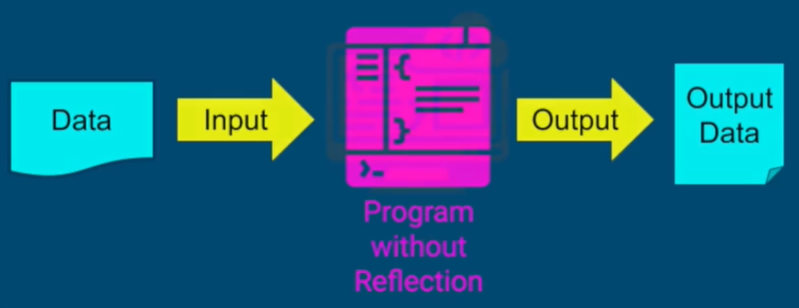
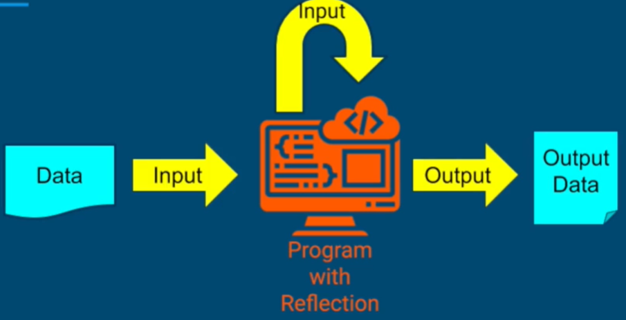

# Java Reflection?
- 자바의 런타임에서 클래스와 객체의 정보를 추출하는 기능
- JDK의 Reflection API

## 이점
- 유연한 코드
    - 런타임에서 다른 소프트웨어 컴포넌트를 Link 할 수 있다.
    - 코드 수정없이, program flow를 생성할 수 있다.
- 동적이기 때문에, 다목적 알고리즘 작성이 가능하다.

## 있을때 없을때 비교

- 단순 함수

- input에 대해 재분석(재 input)이 가능하다
    - 라이브러리
    - 프레임워크
    - 소프트웨어 디자인에 유리하다.

# Use Cases
## JUnit
```java
public class CarTest{
    @Before
    public void setUp(){...}

    @Test
    public void testDrive(){...}

    @Test
    public void testBrake(){...}
}
```
- JUnit이 알아서 어노테이션에 따라 테스트를 진행해준다.
    1. Start test program
        - JUnit이 새로운 프로그램을 만든다.
    2. Create CarTest object
        - test 클래스를 인스턴스화한다
    3. Find setup and test method
        - 어노테이션에 따라 메서드를 전부 찾는다.
    4. Run Tests
    5. Provide Test Report

## Spring
1. Dependency Injection
- 스프링은 Reflection을 사용하여, Autowired 어노테이션이 붙은 부분에서 자동으로 의존성을 주입해준다.
    - 실행 시간에 의존성이 주입된다.
```java
public class Car{
    ...
    @Autowired
    public Car(Engine engine, Driver driver){
        this.engine = engine;
        this.driver = driver;
    }

    ...
} 
```

2. Configuration
- 구체적인 의존을 만드는 메서드
    - @Bean으로 의존을 만들 수 있다.
```java
@Configuration
public class Config{
    @Bean
    public Engine createEngine(){...}

    @Bean
    public Driver createDrive(){...}
}
```

## JSON Serialization/Deserialization
- 라이브러리에 사용해서, 프로토콜 간의 변환을 돕는다.
    - JSON 문자열의 입력값을 분석하여, 객체를 만들어준다.
        - Jackson
        - Gson
1. json으로 Reflection을 이용해 Person 객체로 변환한다.
```java
// Jackson Parsing
String json = "{
    \"name\": \"lshh\",
    \"age\": \"20\",
    \"pets\": [\"kamang\", \"jenny\"]
}";

Person person = objectMapper.readValue(json, Person.class);
```

2. 또한 자바 객체도 JSON으로 변환해준다.
```java
String json = objectMapper.writeValueAsString(person);
```
## etc
- Logging Frameworks
- ORM tools
- Web Frameworks
- Developer tools
- Swagger

# Reflection의 문제점
- 유지보수 난이도가 올라간다.
    - 동적으로 접근하기 때문에, 어려움이 발생한다.
- 잘못 사용시, 느리게 동작할 수 있다.
- 잘못된 실행은 위험할 수 있다.
    - Reflection 코드가 앱을 망가뜨리면 복구가 불가능하다.
- *With Great Power, Comes Great Responsibility* *큰 힘에는, 큰 책임이 따른다.*
- **Correctly, Safely 하게 Reflection을 사용하자!**


