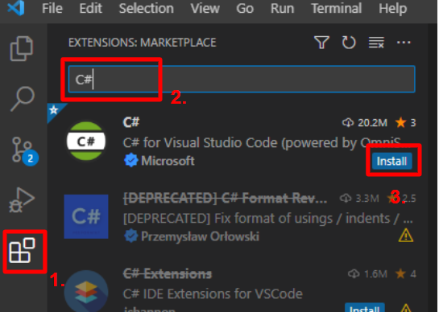
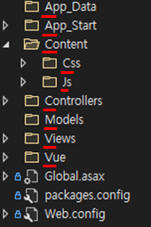
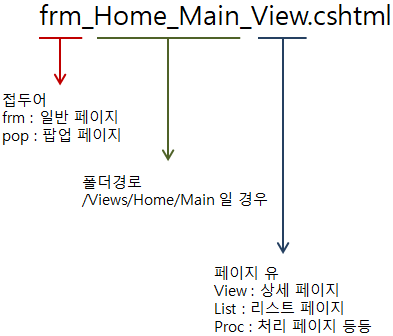
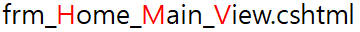
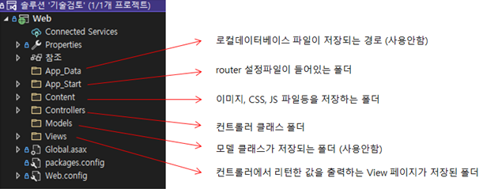
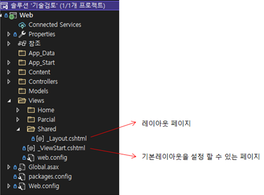
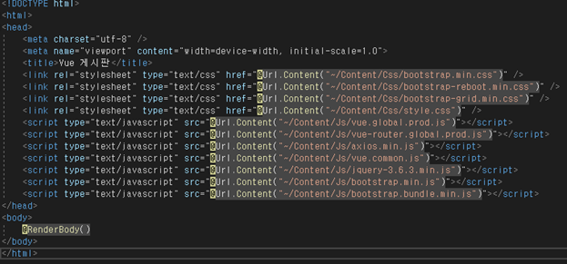
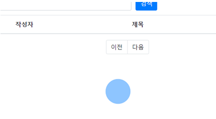

# Vue + C# Style Guide
- [0.1. IDE](#01-ide-세팅)
    - [0.1.1. Extensions](#011-extensions)
        - [0.1.1.1. C#](#0111-c)
        - [0.1.1.2. Vue Volar extension Pack](#0112-vue-volar-extension-pack) 
- [0.2. 소스 가져오기](#02-소스-가져오기)
    - [0.2.1. Git 설치](#021-git-설치)
    - [0.2.2. SSL 설정](#022-ssl-설정)
    - [0.2.3. Git 이메일, 이름 등록](#023-git-이메일-이름-등록)
    - [0.2.4. Git으로 소스 복제](#024-git으로-소스-복제)
- [1. 기본정보 ](#1-기본-정보) 
    - [1.1 언어 및 버전](#11-언어-및-버전)
    - [1.2 개발 공통사항](#12-개발-공통사항)
- [2. 폴더 및 파일 구조 ](#2-폴더-및-파일-구조)   
    - [2.1 폴더 및 파일 생성 ](#21-폴더-및-파일-생성)   
        - [2.1.1 폴더명명 규칙 ](#211-폴더명명-규칙)   
        - [2.1.2 파일명명 규칙 ](#212-파일명명-규칙)   
    - [2.2 ASP.NET MVC ](#22-aspnet-mvc)   
        - [2.2.1 MVC 기본 구조 ](#221-mvc-기본-구조)   
        - [2.2.2 Layout 페이지 활용하기 ](#222-layout-페이지-활용하기)
        - [2.2.3 파샬뷰(ParcialView) 생성 및 활용 ](#223-파샬뷰parcialview-생성-및-활용)
        - [2.2.4 Controller의 역할](#224-controller의-역할)
        - [2.2.5 View 페이지 생성 ](#225-view-페이지-생성)
- [3. 변수 및 함수 명명 규칙](#3-변수-및-함수-명명-규칙)
  - [3.1. 변수 명명 규칙](#31-변수-명명-규칙)
  - [3.2. 함수 명명 규칙](#32-함수-명명-규칙)
  - [3.3 HTML Element id명 규칙](#33-html-element-id명-규칙)

- [4 JavaScript 문법](#4-javascript-문법)
    - [4.1 변수](#41-변수)
        - [4.1.1 const와 let](#411-const와-let)
            - [4.1.1.1 const](#4111-const)
            - [4.1.1.2 let](#4112-let)
        - [4.1.2 호이스팅](#412-호이스팅)
    - [4.2 불변성](#42-불변성)
        - [4.2.1 배열](#421-배열)
            - [4.2.1.1 filter](#4211-filter)
            - [4.2.1.2 map](#4212-map)
            - [4.2.1.3 reduce](#4213-reduce)
            - [4.2.1.4 전개연산자 (...)](#4214-전개연산자)
    - [4.3 Null 유효성 관리](#43-null-유효성-관리)
        - [4.3.1 논리OR(||) VS 널병합연산자(??)](#431-논리or-vs-널병합연산자)
        - [4.3.2 옵셔널 체이닝(.?)](#432-옵셔널-체이닝)
    - [4.4 객체](#44-객체)
        - [4.4.1 프로퍼티](#441-프로퍼티)
            - [4.4.1.1 프로퍼티 축약 표현](#4411-프로퍼티-축약-표현)
            - [4.4.1.2 계산된 프로퍼티 이름](#4412-계산된-프로퍼티-이름)
        - [4.4.2 메서드](#442-메서드)
            - [4.4.2.1 메서드 축약 표현](#4421-메서드-축약-표현)
    - [4.5 함수](#45-함수)
        - [4.5.1 this](#451-this)
            - [4.5.1.1 일반 function](#4511-일반-function)
            - [4.5.1.2 화살표 함수](#4512-화살표-함수)
            - [4.5.1.3 생성자 함수(new)에 의한 인스턴스의 function](#4513-생성자-함수new에-의한-인스턴스의-function)
        - [4.5.2 함수 호이스팅 방지](#452-함수-호이스팅-방지)
        - [4.5.3 책임 분리](#453-책임-분리)
            - [4.5.3.1 데이터 호출 함수](#4531-데이터-호출-함수)
            - [4.5.3.2 비즈니스 로직 함수](#4532-비즈니스-로직-함수)
            - [4.5.3.3 프레젠테이션 로직 함수](#4533-프레젠테이션-로직-함수)
        - [4.5.4 매개변수](#454-매개변수)
            - [4.5.4.1 default 매개변수](#4541-default-매개변수)
            - [4.5.4.2 구조분해 할당](#4542-구조분해-할당)
            - [4.5.4.3 나머지 매개변수 (...)](#4543-나머지-매개변수)
    - [4.6 비동기](#46-비동기)
        - [4.6.1 프로미스 처리: 체이닝 함수 then](#461-프로미스-처리-체이닝-함수-then)
        - [4.6.2 async await](#462-async-await)
        - [4.6.3 중첩된 비동기 처리](#463-중첩된-비동기-처리)
            - [4.6.3.1 for ... of ... 순서대로 비동기 처리](#4631-for--of--순서대로-비동기-처리)
            - [4.6.3.2 reduce 함수](#4632-reduce-함수)
            - [4.6.3.3 Promise.all( ) 비동기 처리](#4633-promiseall--비동기-처리)
        - [4.6.4 쓰로틀링과 디바운스 처리](#464-쓰로틀링과-디바운스-처리)
            - [4.6.4.1 디바운스(Debouncing)](#4641-디바운스debouncing)
            - [4.6.4.2 쓰로틀링(Throttling)](#4642-쓰로틀링throttling)
- [5. Vue.js 작성 가이드](#5-vuejs-작성-가이드)
    - [5.1 기본 구성](#51-기본-구성)
    - [5.2 vue.common.js 활용](#52-vuecommonjs-활용)
        - [5.2.1 공통 컴포넌트 및 함수 등록](#521-공통-컴포넌트-및-함수-등록)
    - [5.3 라우터의 활용](#53-라우터의-활용)
        - [5.3.1 라우터의 구조](#531-라우터의-구조)
        - [5.3.2 setup](#532-setup)
            - [5.3.2.1 reactive](#5321-reactive)
            - [5.3.2.2 ref](#5322-ref)
            - [5.3.2.3 route](#5323-route)
            - [5.3.2.4 router](#5324-router)
    - [5.4 axios](#54-axios)
        - [5.4.1 비동기 API 호출](#541-비동기-api-호출)
    - [5.5 Spinner](#55-spinner)
    - [5.6 xlsx](#56-xlsx)

#### 참조
- [Google JavaScript Style Guide](https://google.github.io/styleguide/jsguide.html)
- [ECMAScript 262](https://262.ecma-international.org/13.0/)
- [MDN JavaScript](https://developer.mozilla.org/ko/docs/Web/JavaScript)

# 0.1. IDE 세팅
- 명칭: Visual Studio Code

## 0.1.1. Extensions

### 0.1.1.1. C#
    - Name: C#
    - Id: ms-dotnettools.csharp
    - Description: C# for Visual Studio Code (powered by OmniSharp).
    - Version: 1.25.4
    - Publisher: Microsoft
[VS Marketplace Link](https://marketplace.visualstudio.com/items?itemName=ms-dotnettools.csharp)


1. marketplace 탭 선택
2. C# 검색
3. C# 플러그인 설치


### 0.1.1.2. Vue Volar extension Pack
    - Name: Vue Language Features (Volar)
    - Id: Vue.volar
    - Description: Language support for Vue 3
    - Version: 1.2.0
    - Publisher: Vue

    1. JavaScript (ES6) code snippets
    2. Path Intellisense
    3. Auto Close Tag
    4. Auto Rename Tag
    5. Auto Import
    6. Sass (.sass only) 
        - 미사용
    7. DotENV
    8. SCSS Formatter 
        - 미사용
    9. Prettier - Code formatter
    10. Vue 3 Support - All In One
    11. Vue VSCode Snippets
    12. ESLint
    13. Vue Language Features (Volar)
    14. TypeScript Vue Plugin (Volar) 
        - 미사용
[VS Marketplace Link](https://marketplace.visualstudio.com/items?itemName=Vue.volar)


1. marketplace 탭 선택
2. vue 검색
3. Vue Volar extension Pack 플러그인 설치
   
# 0.2. 소스 가져오기
## 0.2.1. Git 설치
[Git Download Link](https://git-scm.com/download/win)

## 0.2.2. SSL 설정
```bash
# SSL 설정
git config --global http.sslbackend schannel
```

## 0.2.3. Git 이메일, 이름 등록
```bash
# 이름 확인
git config user.name
# 이메일 확인
git config user.email
# 이메일 변경
git config --global user.email <이메일>
```

## 0.2.4. Git으로 소스 복제
```bash
# 클론
git clone https://git-pms.milkt.co.kr/milkt-core/vue-style-guide.git
# GitLab(원격 레포지토리) 경로의 자격 증명이 필요하다.
```

# 1. 기본 정보
## 1.1 언어 및 버전
- 밀크티 v1.5의 Front-End는 VUE.JS와 ASP.NET MVC 로 구현한다.
- VUE.JS의 버전은 v3.0 이상을 기본으로 사용한다.
- 닷넷프레임워크는 v4.7.2이며 MVC5 최신버전을 사용한다.
- Jquery는 v3.6.3버전을 이용하지만 최대한 사용을 자제한다.
## 1.2 개발 공통사항
- 파일 인코딩은 UTF-8 로 설정한다.
- 들여쓰기는 탭 (4칸) 으로 설정한다. (VS Code > Ctrl + , > Editor: Tab Size > 4)
- import 된 라이브러리 중 사용되지 않는 라이브러리를 삭제한다.

# 2. 폴더 및 파일 구조
## 2.1 폴더 및 파일 생성
- 신규로 폴더 및 파일을 생성 할 시 명명 규칙을 따른다.

### 2.1.1 폴더명명 규칙
- ASP.NET은 기본적으로 파스칼표기법을 따른다.



- 폴더의 첫 단어를 대문자로 작성한다.

- 복수의 단어를 합칠 경우 다음과 같이 활용한다.
```
UserControl 
DomainModel
```


### 2.1.2 파일명명 규칙
- 파일명은 파스칼 표기법이 아닌 언더스코어 표기법을 사용한다.

- 파일 작성 구조는 다음을 참고하자.
```
frm_Home_List.aspx
frm_Home_View.aspx
pop_Home_Detail.aspx
```

- 첫 번째 블럭은 frm과 pop의 명칭만 이용한다.
    - frm : 일반 페이지
    - pop : 팝업 페이지
- 두 번째 블록은 폴더경로를 나타낸다.
- 세 번째 블록은 페이지의 유형을 나타낸다.




- 파일명은 접두어를 제외하고 첫자리는 대문자로 표현한다.




## 2.2 ASP.NET MVC
### 2.2.1 MVC 기본 구조




### 2.2.2 Layout 페이지 활용하기
- Layout 페이지는 기존 ASP.NET의 마스터페이지(.master)나 SpringBoot의 레이아웃과 동일한 기능이다.



- _Layout.cshtml에는 공통으로 사용되는 JAVASCRIPT 및 CSS가 정의되어 있으며 변경되지 않은 프레임 역할
의 HTML로 구성되어 있다.



- @RenderBody()에서 페이지별 컨텐츠의 내용을 출력한다.


### 2.2.3 파샬뷰(ParcialView) 생성 및 활용
- 파샬뷰는 부분적으로 필요한 내용을 INCLUDE 하여 페이지에 구성요소를 더하는 기능이다.
- 파샬뷰는 반드시 /Views/Parcial/ 하위 폴더에 생성하도록 한다. (아래의 그림을 참조)


  - /Views/Home/frm_Home_List.cshtml 에서 사용하는 파샬뷰를 만든다고 가정했을 경우
  - Parcial 폴더 하단의 동일한 Home폴더를 생성 후 pa_로 시작하는 페이지를 생성한다.
  - 파샬뷰를 INCLUDE 하기 위하여 파샬뷰를 호출하는 페이지에서 다음 코드를 추가한다.
```javascript
@Html.Partial("~/Views/Parcial/Home/App.csHtml")
```

### 2.2.4 Controller의 역할
- ASP.NET에서 Controller 기능은 **거의 사용하지 않는 것을 원칙으로 한다.**
- Controllers 폴더 하단에 HomeController.cs 컨트롤러 클래스를 추가한다.


- Controller의 간략한 내용은 아래와 같다.

```C#
[RoutePrefix('Home')] // 1. 컨트롤러 경로명 설정
public class HomeController : Controller
{
    [Route("{act}")] // 2. Action 메소드를 반드시 동적으로 설정한다.
    public ViewResult Index(int PageNo = 1)
    {
        ViewBag.PageNo = PageNo;

        return View("~/Views/Home/frm_Home_List.cshtml");
        // 생성한 cshtml 파일의 경로를 지정한다.
    }
}
```
2. 여러 이름의 Action으로 접근해도 Index 메소드를 호출하도록 하기 위함이다.

- Controller에서 최초 진입에 필요한 Action만 설정하면 ASP.NET Controller의 역할은 끝난다.


### 2.2.5 View 페이지 생성
- Views 폴더 하단에 Controller명의 폴더를 생성한다. (우리는 HomeController 이므로 Home이라고 생성)


- Home 폴더 하단에 frm_Home_List.cshtml 파일을 추가한다. (우리는 Action메소드에서 해당 페이지로 
이동하도록 설정 했었다.)


# 3. 변수 및 함수 명명 규칙
## 3.1. 변수 명명 규칙
- 변수명은 카멜 표기법을 사용한다.

```javascript
const nowDay = new Date();
const userName = 'ㅇㅇㅇ';
```
- 첫 문자를 대문자로 시작하여, 의미 구분을 위해 대문자를 사용한다.

## 3.2 함수 명명 규칙
- 카멜 표기법
- 동사 + 명사 [+ By 명사]
- 전역 함수 전치사 gf
- 지역 함수 전치사 mf

## 3.3 HTML Element id명 규칙
- HTML 객체의 id는 언더바 표기법을 사용한다.
- 언어바 이후 명칭의 첫자리는 대문자로 시작한다.

```html
<input type=”text” id=”txt_Title” />
<div id=”div_Name”>이름</div>
<span id=”spn_Content”>내용</span>
```

|Element Type|ID 규칙|
|:---:|:---:|
|DIV|div_Name|
|SPAN|spn_Name|
|SELECT|sel_Name|
|LABEL|lbl_Name|
|RADIO|rdo_Name|
|CHECKBOX|chk_Name|

## 4 JavaScript 문법
### 4.1 변수
- 자바스크립트는 동적 타입
- Call By Sharing

#### 4.1.1 const와 let
##### 4.1.1.1 const
- 변수는 기본적으로 `const`로 정의한다.
```javascript
const foo;
```

##### 4.1.1.2 let
- 반복의 인자로써 변수는 `let`로 정의한다.
```javascript
const fooArr = [1, 2, 3, 4];

for (let idx in fooArr) {
    console.log(fooArr[idx]);
}
```

#### 4.1.2 호이스팅
- 변수(함수 포함)의 호이스팅에 주의하여 작성한다.
- 변수들의 선언을, 사용되는 로직과 가까이하여, 쉐도잉을 방지한다.
- `var` 사용을 지양한다.
- 함수 선언시, `const`로 정의한 변수에 할당시켜 사용한다.  
---
### 4.2 불변성
- 모든 객체는 불변성 유지를 지향한다.
- 원본 데이터의 객체는, 다시 새 데이터를 입력받아서만 수정한다.
  - [4.5 axios 사용하기 참조](#45-함수)

#### 4.2.1 배열
- 속성 배열의 값이 바뀌었을때, deep copy를 통한 재할당을 지향한다.
- filter, map, reduce 함수 사용을 지향한다.
- 전개연산자 `...` 사용을 지향한다.

##### 4.2.1.1 filter
```javascript
const fooArr = [1,2,3,4];
const evenArr = fooArr.filter(e => e % 2 === 0);
```

##### 4.2.1.2 map
```javascript
const fooArr = [1,2,3,4];
const doubleArr = fooArr.map(e => e * 2);
```

##### 4.2.1.3 reduce
```javascript
const fooArr = [1,2,3,4];
const sum = fooArr.reduce((acc, e) => acc + e, 0);
```

##### 4.2.1.4 전개연산자 (`...`)
```javascript
const foo = {
    barArr: [1,2,3,4],
};
// put 5
foo.barArr = [...foo.barArr, 5];
// pop 5
foo.barArr = [...foo.barArr.pop()];
```

---
### 4.3 Null 유효성 관리
- null과 undefined 관리를 지향한다.
- 논리OR(`||`) 와 널병합연산자(`??`)를 적절한 곳에 사용한다.
- 옵셔널 체이닝(`.?`) 활용을 지향한다.

#### 4.3.1 논리OR(`||`) VS 널병합연산자(`??`)
```javascript
// 빈 문자열 할당 (논리 평가시 false)
let myText = '';

// # 논리OR
let notFalsyText = myText || 'Hello world';
console.log(notFalsyText); // Hello world

// # 널병합연산자
let preservingFalsy = myText ?? 'Hi neighborhood';
console.log(preservingFalsy); // '' -> undefined나 null이 아니므로!
```

#### 4.3.2 옵셔널 체이닝(`.?`)
```javascript
const adventurer = {
  name: 'Alice',
  cat: {
    name: 'Dinah'
  }
};

console.log(adventurer.cat?.name); // Dinah
console.log(adventurer.dog?.name); // undefined
console.log(adventurer.someNonExistentMethod?.()); // undefined
```
[참조: MDN Optional chaining](https://developer.mozilla.org/ko/docs/Web/JavaScript/Reference/Operators/Optional_chaining)

---
### 4.4 객체
- 프로토타입(`__proto__`) 활용을 추천하지 않는다.

##### 4.4.1 프로퍼티
- 프로퍼티 축약 표현을 추천한다.
- 계산된 프로퍼티 이름 활용 방식이 있다.

###### 4.4.1.1 프로퍼티 축약 표현
- 프로퍼티명과 프로퍼티에 할당하는 변수명이 같을 경우 그대로 쓴다.
```javascript
const name= 'john';

const member = {
  idx: 1,
  name,  // 프로퍼티 명과 프로퍼티에 할당하는 값의 변수명이 같다.
};

console.log(member); // {idx: 1, name: 'john'}
```

###### 4.4.1.2 계산된 프로퍼티 이름
```javascript
const prefix = 'prop';
let i = 0;

const obj = {
  [`${prefix}-${++i}`]:i,
  [`${prefix}-${++i}`]:i,
  [`${prefix}-${++i}`]:i,
};

console.log(obj); // {prop-1: 1, prop-2: 2, prop-3: 3}
```

#### 4.4.2 메서드
- 적절한 상황에 메서드 축약 표현을 사용한다.

##### 4.4.2.1 메서드 축약 표현
- ES6 이후에서의 메서드란, 축약 표현으로 정의된 함수만을 의미한다.
- 메서드는 생성자 함수로써 쓰일 수 없다.
- 메서드는 프로토타입이 없다.
- 메서드는 `super`를 사용 가능하다. (프로토타입)

```javascript
const obj = {
  name: 'Lee',
  sayHi() {
    console.log("Hi I'm" + this.name);
  }
};
```

---
### 4.5 함수
- JavaScript 함수는 다음과 같다.
  - 일반 function
    - 익명 함수
  - 화살표 함수
  - 생성자
  - 메서드

#### 4.5.1 this
- this는 함수 선언 방식에 따라, 위치가 다르므로, 사용을 최소화할 것을 추천한다.

##### 4.5.1.1 일반 function
- this는 function을 선언한 위치가 된다.
- call by sharing 이므로 this는 공유된다.
- 객체로서 객체 내부의 값을 연산할 필요성이 있을때 추천한다.

```javascript
const name = 'bar';

const foo = {
  name: 'foo',
  getName: function() {
    console.log(this.name);
  },
};

foo.getName(); //foo
```

##### 4.5.1.2 화살표 함수
- this는 화살표 함수를 호출한 위치가 된다.
- 모듈의 기능 제공에 추천한다.

```javascript
const name = 'bar';

const foo = {
  name: 'foo',
  getName: () => {
    console.log(this.name);
  },
};

foo.getName(); // bar
```

##### 4.5.1.3 생성자 함수(new)에 의한 인스턴스의 function
- this는 생성된 인스턴스를 의미한다.
- 객체 생성 방식을 추천하지 않는다.
  - 하나의 로직 안에서 동일한 구조의 객체를 여러번 생성할 때, 추천한다.
  - 생성자 함수로 사용시, return을 지양한다.

```javascript
const Circle = function(radius) {
  this.radius = radius;
  this.getDiameter = function() {
    return 2 * this.radius;
  };
};
const circle1 = new Circle(5);
const circle2 = new Circle(10);

// this는 각각의 인스턴스를 가리킨다.
console.log(circle1.getDiameter()); //10
console.log(circle2.getDiameter()); //20
```

#### 4.5.2 함수 호이스팅 방지
- const 로 변수 선언과 할당을 함으로써, 함수의 호이스팅을 방지한다.
```javascript
/* 함수 선언시 호이스팅이 적용되므로, const로 할당함으로써, 혼동을 방지한다.
 (컴파일러의 '=' 기준 우측 표현식 우선 파싱 특징을 이용한, 호이스팅 방지) */
const foo = function() {
  // ~
};
const bar = () => {
  // ~
};
```

#### 4.5.3 책임 분리
- 책임에 따라 적확하게 작명한다.
- 콜스택이 쌓이더라도, 하나의 함수는 하나의 동작만 하는 것을 추천한다.
- '데이터 호출' / '비즈니스' / '프레젠테이션'으로 로직을 분리할 것을 추천한다.
- parameter/return을 명확히하고 독립적으로 작성함으로써, 사이드이펙트를 줄이는 방향을 지향한다.

##### 4.5.3.1 데이터 호출 함수
- API로 부터 데이터 호출
- 사이드이펙트를 지양한다.
  - input과 output을 명확히 하고, 외부와 독립한다.
- [4.5 axios 사용하기 참조]()

##### 4.5.3.2 비즈니스 로직 함수
- 유효성 연산
- 기타 연산
- 사이드이펙트를 지양한다.
  - input과 output을 명확히 하고, 외부와 독립한다.

##### 4.5.3.3 프레젠테이션 로직 함수
- DOM 객체 어트리뷰트 / 프로퍼티에 영향
- event 처리

#### 4.5.4 매개변수
##### 4.5.4.1 default 매개변수
- 작성을 추천한다.
- 타입과 기본값 명시 용도
```javascript
const foo = function(bar = 1) {
  console.log(bar);
};
foo(); // 1
```

##### 4.5.4.2 구조분해 할당
- 인자를 facade하게 하는 것을 추천한다.
  - 매개변수 갯수는 3개 초과 되지 않는 것을 추천한다.
```javascript
const foo = function({name, age, depart}, kind = '참가자') {
  console.log(kind + '는 ' + age +'살 '+ name + '이며, '+ depart + '입니다.');
};

const bar = {
  name: '철수',
  age: 19,
  depart: '1반',
};
foo(bar, '도전자'); // 도전자는 19살 철수이며, 1반입니다.
```

##### 4.5.4.3 나머지 매개변수 (`...`)
- 나머지 매개변수 활용을 추천한다.
```javascript
const foo = function(...members) { // 나머지 매개변수
  const outputString = members.reduce((acc, cur, idx)=> acc + idx + '.' + cur + ' ', '');
  console.log(outputString);  // 0.철수 1.영희 2.짱구 3.훈이 
};

const members = ['철수', '영희', '짱구', '훈이'];
foo(...members); // 전개 연산자
```

---
### 4.6 비동기
- 콜백 방식 부정적
  - 콜백 지옥 우려
- 비동기를 위한, 프로미스 처리 기능 추천 (다음 중 택 1)
  1. 프로미스 처리 함수 then
  2. async await
- 쿼리 요청(트래픽)을 줄이고자, 쓰로틀링과 디바운스 처리를 지향한다.

#### 4.6.1 프로미스 처리: 체이닝 함수 `then`
- 세부적인 프로미스 처리가 가능하다.
- async await 방식을 좀 더 추천
  - then을 통해 코드의 들여쓰기가 많아지면, 가독성이 저해된다.
  - catch 구문이 많아지면, 가독성이 저해된다.

```javascript
const axios = require('axios');

const Test1ApiCall = () {
  axios
    .get('/user?ID=12345')
    // 응답(성공)
    .then(function(response) {
      console.log("Response >>", response.data);
    })
    // 응답(실패)
    .catch(function(error) {
      console.log("Error >>", error);
    })
    // 응답(항상 실행)
    .then(function() {
      // ...
    });
};

// then 을 연속적으로 호출하는 예시
// 복잡하다.. => async await 추천
const Test2ApiCall = () {
  // axios 요청1
  axios
    .get('https://test.com/api/v1')
    .then((response) => {
      const data = response.data;
      const userId = data.userId;
      // axios 요청2
      axios
        .get('https://test2.com/api/v2/' + userId)
        .then((response) => {
          console.log("Response >>", response.data);
        })
        .catch(() => {
          console.log("Error >>", err);
        })
    })
    .catch((error) => {
      console.log("Error >>", err);
    });
};
```

#### 4.6.2 async await
- try catch와 같이 사용이 용이하다.

```javascript
// async/await 를 활용하는 수정된 방식
const Test2ApiCall = async () {
  console.log(2);
  try {
    // axios 요청1
    const response = await axios.get('https://test.com/api/v1');
    console.log(7);
    const userId = response.data.userId;
    // axios 요청2
    const response2 = await axios.get('https://test2.com/api/v2/' + userId);
    console.log(8);
    console.log("Response >>", response2.data);
  } catch(err) {
    console.log("Error >>", err);
  } finally {
    console.log('끝');
  }
}

console.log(1);
Test2ApiCall();
console.log(3);
console.log(4);
console.log(5);
console.log(6);
// 출력 순서
// 1
// 2
// 3
// 4
// 5
// 6
// 7
// 8
// Response >> ~  or  Error >> ~ 
```
- 비동기 처리시, await을 만나는 순간, async 함수 바깥의 콜스택을 처리한다는 점을 주의

#### 4.6.3 중첩된 비동기 처리
```javascript
// 잘못된 예
import fs from 'fs-promise';

async function printFiles() {
  const files = await getFilePaths(); // Assume this works fine

  files.forEach(async (file) => {
    const contents = await fs.readFile(file, 'utf8');
    console.log(contents);
  });
}

printFiles();
// 작동하지만, printFiles가 비동기를 한번에 실행, 기다리지 않고 바로 리턴
```

- 바벨은 async/await를 generator 함수로 변환하는데, forEach를 쓰면 각각의 이터레이션이 개별 generator 함수를 갖게 된다. 
  - next( ) 컨텍스트가 아니다.

##### 4.6.3.1 `for ... of ...` 순서대로 비동기 처리
```javascript
async function printFiles() {
  const files = await getFilePaths();

  for (let file of files) {
    const contents = await fs.readFile(file, 'utf8');
    console.log(contents);
  }
}
```

##### 4.6.3.2 `reduce` 함수
- 순서를 보장하는 reduce를 사용
  - map, filter는 순서를 보장하지 않는다.
```javascript
async function printFiles() {
  const files = await getFilePaths();

  await files.reduce(async (promise, file) => {
    await promise; // 이전 프로미스들의 resolve를 기다린다.
    const contents = await fs.readFile(file, 'utf8');
    console.log(contents);
  }, Promise.resolve());
}
```

##### 4.6.3.3 `Promise.all( )` 비동기 처리
- map은 새 배열을 반환하기 때문에,
  - 매개변수로 배열을 받는 Promise.all 안에 배열을 매핑한다.
  - 같은 이유로 forEach는 안된다. 리턴값을 기다리지 않기 때문이다.
```javascript
async function printFiles() {
  const files = await getFilePaths();

  await Promise.all(files.map(async (file) => {
    const contents = await fs.readFile(file, 'utf8');
    console.log(contents);
  }));
}
```

- 참조
- [stackoverflow: Using async/await with a forEach loop](stackoverflow.com/questions/37576685/using-async-await-with-a-foreach-loop)
- [Handling Nested Promises Using Async/Await in React](www.pluralsight.com/guides/handling-nested-promises-using-asyncawait-in-react)

#### 4.6.4 쓰로틀링과 디바운스 처리
##### 4.6.4.1 디바운스(Debouncing)
  - 일정 시간동안 대기, 대기 중 함수가 호출된다면, 대기 시간 초기화
  - Ex) 단어 검색 자동 조회
```javascript
let timer;
document.querySelector('#input').addEventListener('input', function(e) {
    if (timer) {
        clearTimeout(timer);
    }
    timer = setTimeout(function() {
      // ~~~내용~~~
    }, 200);
});
```

##### 4.6.4.2 쓰로틀링(Throttling)
  - 마지막 실행후, 일정 시간까지 대기 
  - Ex) 스크롤 다운 추가 조회
```javascript
let timer;
document.querySelector('.body').addEventListener('scroll', function(e) {
  if (!timer) {
    timer = setTimeout(function() {
      timer = null;
      // ~~~내용~~~
    }, 200);
  }
});
```

# 5. Vue.js 작성 가이드
## 5.1 기본 구성
- vue.js 버전은 3.0 이상을 이용한다.
- 2.7에서 사용되던 data, mounted, watch, computed 등은 setup 함수 내에서 구현한다.
- ajax 통신은 axios를 이용한다.

## 5.2 vue.common.js 활용
- `/Content/Js/vue.common.js` 파일은 vue.js로 개발하면서 발생하는 전역변수(전역함수) 및 전역 컴포넌트 등을 담는다.

- `gfPaging` [컴포넌트]: 게시판 페이징 구현에 사용하는 공통 컴포넌트
- `gfFileUpload` [컴포넌트]: 파일 업로드 처리하는 공통 컴포넌트
- `gfSpinner` [함수]: axios 등에서 처리시, progress bar를 출력하는 공통 함수
- `gfTrySubmit` [함수]: submit form을 시도하는 공통 함수
- `gfSubmitForm` [함수]: 파일 전송을 제공하는 submit form 공통 함수

### 5.2.1 공통 컴포넌트 및 함수 등록
- vue.js에서 사용하고자 하는 기본 함수는 Vue 객체로 부터, 구조분해 할당을 통해, import 한다.
```javascript
const { createApp, onMounted, onUpdated, ref, reactive, computed, watchEffect } = Vue;
const { createWebHistory, createRouter, useRoute, useRouter } = VueRouter;
```

- 공통 함수 및 변수는 global function의 약자인 `gf`를 접두어로 붙인다.
```javascript
function gfFileUploadAndDataSend(url, arg) {
    const el = document.querySelectorAll('input[type="file"]');
    const formData = new FormData();
    // ~~~
}
```

## 5.3 라우터의 활용
- 라우터란 실제 페이지 이동이 없이 `History.State`를 변경하며 동작한다.
- URL 별로 Template가 출력된다.

### 5.3.1 라우터의 구조
```javascript
const router = createRouter({       // 라우터를 선언한다.
    history: createWebHistory(),    // createWebHistory 메소드는 일반 URL 패턴을 대체하여 동작된다.
    routes: [
        {
            path: "/Home/View",     // 라우터 URL을 설정
            name: "View",           // 라우터 명칭을 설정
            component: {
                template: '#templ_View',    // Template의 ID 값 또는 내용
                setup: function() {          // setup() 메소드 내에서 모든 작업이 이루어진다.
                    const $router = useRouter();
                    const $route = useRoute();
                    const $this = ref({});
                    const idx = $route.query.idx;
                    const pageNo = $route.query.pageno;
                    const key = $route.query.key;
                    const val = $route.query.val;

                    gfSpinner();

                    axios
                        .post("http://localhost:9090/home/jsonView", { "idx": idx })
                        .then(r=>{
                            if (r && r.data) {
                                $this.value = r.data;
                            }
                        }).catch{e=>{
                            alert(e);
                        }});

                    const mfList = function() {
                        $router.push({ "name": "Index", "query": { "pageno": pageNo, "key": key, "val": val } };)
                    }

                    const mfModify = function() {
                        $router.push({ "name": "Index", "query": { "pageno": pageNo, "key": key, "val": val , "idx": idx } };)
                    }

                    return {
                        "data": $this,      // 변수(함수)를 리턴하여, Template에서 사용할 수 있다.
                        mfList,
                        mfModify,
                    };
                }
            }
        },{
            // 다른 route 페이지
        }
    ]
})
```

### 5.3.2 setup
- 2.7 버전과 다르게 3.0 버전에서는 `setup()`에서 모두 선언 가능하다.
- setup 내부에서 onMounted, onUpdated, watch와 같은 기존 뷰 메서드를 실행한다.
- 변수/메서드를 리턴하여 Template에서 이용할 수 있다.


#### 5.3.2.1 reactive
- reactive는 연관 배열(또는 일반 배열) 형식의 값을 리턴할 때 사용한다.

```javascript
setup: function(props) {
    const $this = reactive({    // 연관 배열을 다음과 같이 reactive 안에 인자로 준다.
        startPage: 0,
        endPage: 0,
        pageCount: 0,
        pageList: [],
    });

    watchEffect(function() {
       // ~~~ 
    });

    return {
        "data": $this,          // 변수(함수)를 리턴하여, Template에서 사용할 수 있다.
    }
}
```

#### 5.3.2.2 ref
- ref는 reactive와 동일한 기능이나, 모든 타입의 속성을 포함할 수 있다.

```javascript
const $this = ref({});
```

- 값을 초기화 하거나, 가져올 때, value property를 사용한다.
```javascript
const id = $this?.value?.UserID ?? "";
const title = $this?.value?.Tittle ?? "";
const content = $this?.value?.Content ?? "";
```

- Template에서 이용시, value property를 생략한다.
```html
<tr>
    <th>아이디</th>
    <td>{{data.UserID}}</td>
</tr>
```

#### 5.3.2.3 route
- `route()`는 라우터에 보낸 파라미터 정보를 받아올 수 있다.

```javascript
// 1. 선언한다
const $route = useRoute();
// ~

// 2. 파라미터 값을 받아, 변수에 담는다
const idx = $route.query.idx ?? ""
const pageNo = $route.query.pageno ?? "1";
const key = $route.query.key ?? "";
const val = $route.query.val ?? "";
```

#### 5.3.2.4 router
- 다른 라우터로 이동시, `router()`를 이용한다.

```javascript
// 1. 선언한다.
const $router = useRouter();
// ~

// 2. 이동하려는 경로와 파라미터를 설정한다.
function mfView() {
    if (idx) {
        $router.push({ "name": "View", "query": { "pageno": pageNo, "key": key, "val": val , "idx": idx } };
    } else {
        $router.push({ "name": "Index", "query": { "pageno": pageNo, "key": key, "val": val } };
    }
}
```

## 5.4 axios
- API로부터 JSON 데이터를 받을 때 사용한다.

### 5.4.1 비동기 API 호출

```javascript
axios
    .post("http://localhost:9090/home/jsonView", { "idx": idx })
    .then( r => {   // 결과를 받아 처리
        if (r && r.data) {
            $this.value = r.data;
        }
    }).catch( e => {    // 오류시 처리
        alert(e);
    });
```

## 5.5 Spinner
- axios로 데이터 처리시 등의 처리 딜레이가 발생하는 경우, progress bar를 출력한다.



```javascript
gfSpinner();    // 소스코드에서 axios 동작 직전에 호출한다.

axios
    .post("http://localhost:9090/home/jsonView", { "idx": idx })
    .then(
        // ~~
```

## 5.6 xlsx
- `https://cdnjs.com/libraries/xlsx`