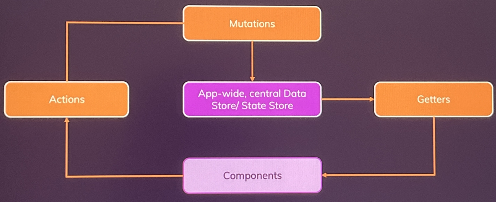

# Vuex?
- 전역 상태 관리 라이브러리
- 여러 컴포넌트 또는 앱 전체에서 공유하고 싶은 데이터를 **교체Replacing**, **제공provide**, **주입inject** 할 수 있다.

## 상태 state?
- 반응형 데이터. 화면을 트리거할 수 있는.
    - 상태 패턴
- local state
    - 하나의 컴포넌트에서 작동하며, 자식 컴포넌트에 props로 전달 가능한 상태
- global state
    - 여러 컴포넌트 혹은 앱 전반에 걸쳐 사용되는 상태
    - 로그인 정보, 인증/인가 정보
    - 장바구니 항목 등..

## 왜 Vuex?
- vs provide, injection
    - provide, injection 사용시, 하나의 객체에 너무 많은 데이터를 담게 되며,
        - 엄청나게 많은 로직이 포함된 거대 컴포넌트가 만들어질지도 모른다.
        - 반응성과 관련된 복잡한 문제를 일으킬 수 있다.    
    1. Fat Components 애플리케이션이 커지며, 관리해줄 전역 상태가 늘어나 유지 관리가 힘들어진다.
    2. Unpredictable 예측할 수 없는 동작이 일어날 수 있다.
        - 어디서 상태가 변경되는지 즉시 눈에 띄지 않거나, 원하지 않는 방향으로 상태가 변경될 수도 있다.
    3. Error-prone 실수로 상태 업데이트가 발생하거나 누락될 수 있다.
- with Vuex
    1. Outsourced state management 
        - 상태를 아웃소싱함으로써, 컴포넌트와 별개로 분리한다. Fat Components의 문제를 해결한다. 
    2. Predictable state management/flow
        - 상태가 어디서 관리되고, 어떻게 업데이트, 공유되어야 하는지에 대한 규칙이 있다.
    3. Clearly defined data flow: Less errors
        
# Vuex 사용

## Vuex 설치
```sh
npm install --save vuex
(npm install --save vuex@next)
```

## Vuex의 상태 관리를 위한 구성
>1. [state](#state) 상태
>    - 전역 상태 원본 데이터 그 자체
>2. [mutations](#mutations) 변형
>    - 동기적 동작을 처리하는 방법
>    - 전역 상태를 변형할 때 이용한다. (Setter)
>3. [actions](#actions) 액션
>    - 비동기적 동작을 처리하는 방법
>    - 상태의 변형이 이뤄지면 안된다. 
>        - 비동기적 동작은 순서가 보장되지 않기 때문이다.
>4. [getters](#getters) 게터
>    - 전역 상태 데이터를 받아오는 베스트 프렉티스
>    - 느슨한 결합을 위해서이다.

## 전역 구성
- main.js
```js
import { createApp } from 'vue';
import { createStore } from 'vuex';
import App from './App.vue';

const app = createApp(App);
const store = createStore({
  modules: {
    numbers: counterModule
  },
  state() {
    return {
        counter: 0,
        isLoggedIn: false
    };
  },
  mutations: rootMutations,
  actions: rootActions,
  getters: rootGetters
});

app.use(store);
app.mount('#app');
```
- createStore
    - vuex 저장소 생성
- router처럼 Vue 객체인 app에 use를 이용하여 붙인다.

## State
- App.js
```js
<template>
    <base-container title="Vuex">
        <h3>{{ $store.state.counter }}</h3>
        <h3>{{ counter }}</h3>
        <button>Add 1</button>
    </base-container>
</template>
<script>
computed: {
    counter(){
        return this.$store.state.counter;
    }
},
methods: {
    addOne(){
        this.$store.state.counter++;
    }
}
</script>
```
- $store
    - 저장소를 가리키는 프로퍼티
    - `$store.state` 상태에서 가져올 수 있다.
    - 프로퍼티를 대체하지는 않는다.
        - 부모 -> 자식 데이터 전달에는 프로퍼티가 더 유리
        - 다만, 전역 상태 관리에 더 유리
    - 다만 이와 같이, 직접 가져오지 않고, getter를 사용하도록 한다.

### how it works?

- vuex와 컴포넌트는 직접 연결되지 않는다.


## Mutations
- 명확하게 정의된 메서드로 상태를 업데이트하는 기능
    - setter 역할
- 직접 상태를 바꾸는 대신에, Mutations로 트리거한다.
    - 상태를 편집하고자 하는 모든 컴포넌트들은 동일한 방식으로 동작한다.

```js
import App from './App.vue';

const store = createStore({
    state(){
        return {
            counter: 0
        };
    },
    mutations: {
        increment(state){   // state: 현재 상태 - 최신 상태가 보장된다.
            state.counter++;
        },
        increate(state, payload){   // payload: 데이터 패키지
            state.counter = state.counter + payload.value;
        }
    }
})

```
### $store.commit
- mutation의 이름을 인자로 받아 해당 mutation을 실행한다.
- 동기적으로 실행, 반영된다.
    - js는 본래 비동기적으로 동작하기 때문에, 동기적으로 동작된다는 것은, js 엔진이 실행이 완료될 때까지 **다른 모든 동작을 잠근다**고 할 수 있다.

```js
methods: {
    addOne(){
        this.$store.commit('increment'); // 'increment' mutation을 반영하라.
    },
    add(some){
        // 1. 기본 예
        // this.$store.commit('increment', { value: some });  // some을 payload.value로 제공

        // 2. 하나의 인수 구문 예
        this.$store.commit({
            type: 'increase',
            value: 10
        })  // 여러 payload를 작성 가능하다.
    }
}
```
- 해당 방법을 통해, 상태를 직접 변경하지 않을 수 있다!
    - 컴포넌트 내부에서 직접 상태를 변경하는 것은 매우 안좋다!
    - 반드시 mutation을 사용할 것

- 왜 mutation을 commit으로 동기 동작시킬까?
    - 여러곳에서 처리시, 모든 mutation이 가장 최신 상태를 받아야만 하기 때문
        - 다른 mutation이 커밋(완료)되고 실행되는 방식이 아니라면, 
        - 상태 변형에 대한 순서에 문제가 생긴다.

## Getters
- 데이터를 직접 가져오는 것은 바람직하지 못하다.
    - 강한 결합은 높은 의존성을 요구하며, 코드의 중복을 높인다.
    - 때문에 loosed-coupling을 위해 지향한다.


```js
// vuex(store)에서..
// 1. mutations 작성 예
mutations: {
    increment(state){   // state: 현재 상태 - 최신 상태가 보장된다.
        state.counter++;
    },
    increase(state, payload){   // payload: 데이터 패키지
        state.counter = state.counter + payload.value;
    }
},
// 2. getters 작성 예
getters: {
    finalCounter(state){   // state: 현재 상태
        return state.counter * 2; 
    },
    normalizedCounter(_, getters){  // getters: 다른 게터 참조
        finalCounter = getters.finalCounter;
        if(finalCounter < 0){
            return 0;
        }
        else if(finalCounter > 100){
            return 100;
        }
        else{
            return finalCounter;
        }
    },
},
```

```js
// component 에서..
// getter로부터 가져와서 쓰기
computed: {
    counter(){
        return $this.store.getters.finalCounter;    // 포인터
    },
    normalizedCounter(){
        return $this.store.getters.normalizedCounter;
    }
},
```

## Actions
- vuex의 메서드 역할
- **mutation**은 **비동기로 동작해선 안된다.**
    - mutation은 단순한 setter이고, 상태는 예상 가능해야한다.
    - **비동기 동작은 순서를 보장하지 않기 때문에**, mutation은 비동기로 동작되어선 안된다.
- 때문에 비동기적 동작을 위해, mutation 이전에 한 단계를 더 둔다.
- 비동기적 동작을 위해서 action 사용을 지향하자.

- action이 mutation을 부르도록 한다. (컴포넌트와 mutation 사이에 action을 둔다.)

```js
// vuex(store)에서..
// - actions 작성 예
actions: {
    // 보통 mutation과 동일한 이름으로 작성하기도 한다.
    increment(context) { // context 객체는 인수를 자동으로 가져온다.
      setTimeout(function(){
        context.commit('increment'); // mutation을 컨텍스트를 통해 커밋할 수 있다.
      }, 2000);
    },
    increase(context, payload){ // payload 객체는 인수를 담을 수 있다.
        context.commit('increase', payload);
    }
}
```

```js
// component 에서..
// action을 사용하기
methods: {
    addOne(){
        // 1. 기본 예
        // this.$store.dispatch('increase', { value: 10 }); // 'increase' action을 배정하라
        
        // 2. 하나의 인수 구문 예
        this.$store.dispatch({
            type: 'increase',
            value: 1
        })
    }
}
```
- 사용하는 곳은 commit과 syntex가 동일하다.

- $store.dispatch
    - dispath 의미?
        - 배정, 보내다
        - cpu가 처리를 위해, 작업을 가져오다

## 중간 정리
- 비동기 언어로 개발함에 있어, 베스트 프렉티스를 위해, 반드시 구분해야 할 네가지
    - data (status): 상태 그 자체
    - method (action): 객체의 동작. 비동기 가능
    - setter (mutation): 상태 변형. 반드시 동기적 동작해야 한다.
    - getter: 최신 상태 가져오기
- vuex 는 이를 모두 반영한 상태 라이브러리이다.


## mapGetter
- getter를 가져오기 위해, 저장소를 파고들지 않으려면?
```js
// component 에서
import { mapGetters } from 'vuex';

export default {
    computed: {
        // finalCounter(){
        //     return this.$store.getters.finalCounter;
        // },
        ...mapGetters(['finalCounter']), // vuex 내부의 getter들을 이용할 수 있게 한다.
    }
}
```

## mapAction
```html
<template>
    <button @click="inc">Add 1</button>
    <button @click="increase({value: 10})">Add 10</button>
</template>
<script>
// component 에서
import { mapActions } from 'vuex';

export default {
    methods: {
        // increment() {
            //     this.$store.dispatch('increment');
        // }
        // ...mapActions(['increment', 'increase']),   // vuex 내부의 action 들을 이용할 수 있게 한다.
        ...mapActions({
            inc: 'increment',   // 이름을 매핑할 수 있다.
            increase
        })
    }
}
</script>
```

