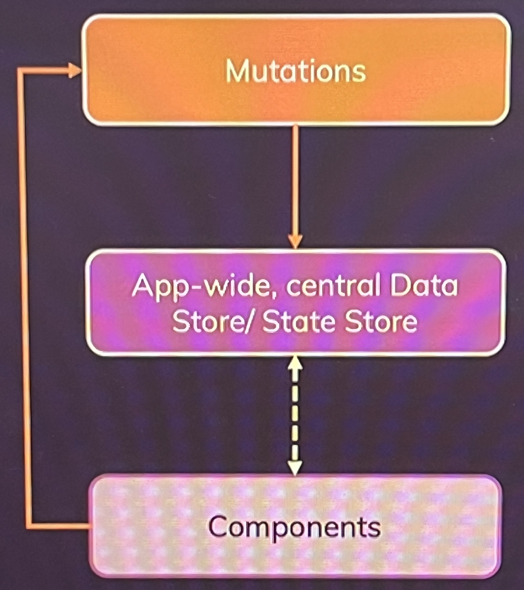
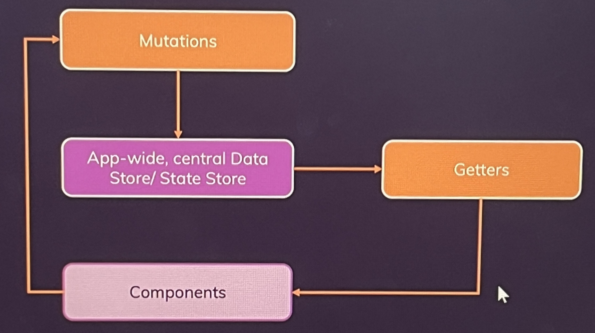

# Vuex?
- 전역 상태 관리 라이브러리
- 여러 컴포넌트 또는 앱 전체에서 공유하고 싶은 데이터를 **교체Replacing**, **제공provide**, **주입inject** 할 수 있다.

## 상태 state?
- 반응형 데이터. 화면을 트리거할 수 있는.
    - 상태 패턴
- local state
    - 하나의 컴포넌트에서 작동하며, 자식 컴포넌트에 props로 전달 가능한 상태
- global state
    - 여러 컴포넌트 혹은 앱 전반에 걸쳐 사용되는 상태
    - 로그인 정보, 인증/인가 정보
    - 장바구니 항목 등..

## 왜 Vuex?
- vs provide, injection
    - provide, injection 사용시, 하나의 객체에 너무 많은 데이터를 담게 되며,
        - 엄청나게 많은 로직이 포함된 거대 컴포넌트가 만들어질지도 모른다.
        - 반응성과 관련된 복잡한 문제를 일으킬 수 있다.    
    1. Fat Components 애플리케이션이 커지며, 관리해줄 전역 상태가 늘어나 유지 관리가 힘들어진다.
    2. Unpredictable 예측할 수 없는 동작이 일어날 수 있다.
        - 어디서 상태가 변경되는지 즉시 눈에 띄지 않거나, 원하지 않는 방향으로 상태가 변경될 수도 있다.
    3. Error-prone 실수로 상태 업데이트가 발생하거나 누락될 수 있다.
- with Vuex
    1. Outsourced state management 
        - 상태를 아웃소싱함으로써, 컴포넌트와 별개로 분리한다. Fat Components의 문제를 해결한다. 
    2. Predictable state management/flow
        - 상태가 어디서 관리되고, 어떻게 업데이트, 공유되어야 하는지에 대한 규칙이 있다.
    3. Clearly defined data flow: Less errors
        
# Vuex 설치
```sh
npm install --save vuex
(npm install --save vuex@next)
```

# Vuex 사용
- main.js
```js
import { createApp } from 'vue';
import { createStore } from 'vuex';
import App from './App.vue';

const app = createApp(App);
const store = createStore({
  modules: {
    numbers: counterModule
  },
  state() {
    return {
        counter: 0,
        isLoggedIn: false
    };
  },
  mutations: rootMutations,
  actions: rootActions,
  getters: rootGetters
});

app.use(store);
app.mount('#app');
```
## createStore
- vuex 저장소 생성

- App.js
```js
<template>
    <base-container title="Vuex">
        <h3>{{ $store.state.counter }}</h3>
        <h3>{{ counter }}</h3>
        <button>Add 1</button>
    </base-container>
</template>
<script>
    ...
    computed: {
        counter(){
            return this.$store.state.counter;
        }
    },
    methods: {
        addOne(){
            this.$store.state.counter++;
        }
    }
    ...
</script>

```
## $store
- 저장소를 가리키는 프로퍼티
- `$store.state` 상태에서 가져올 수 있다.
- 프로퍼티를 대체하지는 않는다.
    - 부모 -> 자식 데이터 전달에는 프로퍼티가 더 유리
    - 다만, 전역 상태 관리에 더 유리

# how it works?

- vuex와 컴포넌트는 직접 연결되지 않는다.
## Mutations 변형(내장)
- 명확하게 정의된 메서드로 상태를 업데이트하는 기능
- 직접 상태를 바꾸는 대신에, Mutations로 트리거한다.
    - 상태를 편집하고자 하는 모든 컴포넌트들은 동일한 방식으로 동작한다.

```js
import App from './App.vue';

const store = createStore({
    state(){
        return {
            counter: 0
        };
    },
    mutations: {
        increment(state){   // state: 현재 상태 - 최신 상태가 보장된다.
            state.counter++;
        },
        increate(state, payload){   // payload: 데이터 패키지
            state.counter = state.counter + payload.value;
        }
    }
})

```
### $store.commit
- mutation의 이름을 인자로 받아 해당 mutation을 실행한다.
```js
methods: {
    addOne(){
        this.$store.commit('increment');
    },
    add(some){
        this.$store.commit('increment', { value: some });  // some을 payload.value로 제공

        this.$store.commit({
            type: 'increment',
            value: 10
        })  // 여러 payload를 작성 가능하다.
    }
}
```
- 해당 방법을 통해, 상태를 직접 변경하지 않을 수 있다!
    - 컴포넌트 내부에서 직접 상태를 변경하는 것은 매우 안좋다!
    - 반드시 mutation을 사용할 것

## Getter
- 데이터를 직접 가져오는 것도 바람직하지 못하다.


- main.js
```js
import App from './App.vue';

const store = createStore({
    state(){
        return {
            counter: 0
        };
    },
    mutations: {
        increment(state){   // state: 현재 상태 - 최신 상태가 보장된다.
            state.counter++;
        },
        increate(state, payload){   // payload: 데이터 패키지
            state.counter = state.counter + payload.value;
        }
    },
    getters: {
        finalCounter(state){   // state: 현재 상태
            return state.counter * 2; 
        },
        normalizedCounter(state, getters){  // getters: 계산 결과가 다른 게터에 영향을 받을 때
            finalCounter = state.counter * 3;
            if(finalCounter < 0){
                return 0;
            }
            else if(finalCounter > 100){
                return 100;
            }
            else{
                return finalCounter;
            }
        },
    },
})
```

```js
...
computed: {
    counter(){
        return $this.store.getters.finalCounter;    // 그저 포인트
    },
    normalizedCounter(){
        return $this.store.getters.normalizedCounter;
    }
},
...
```
