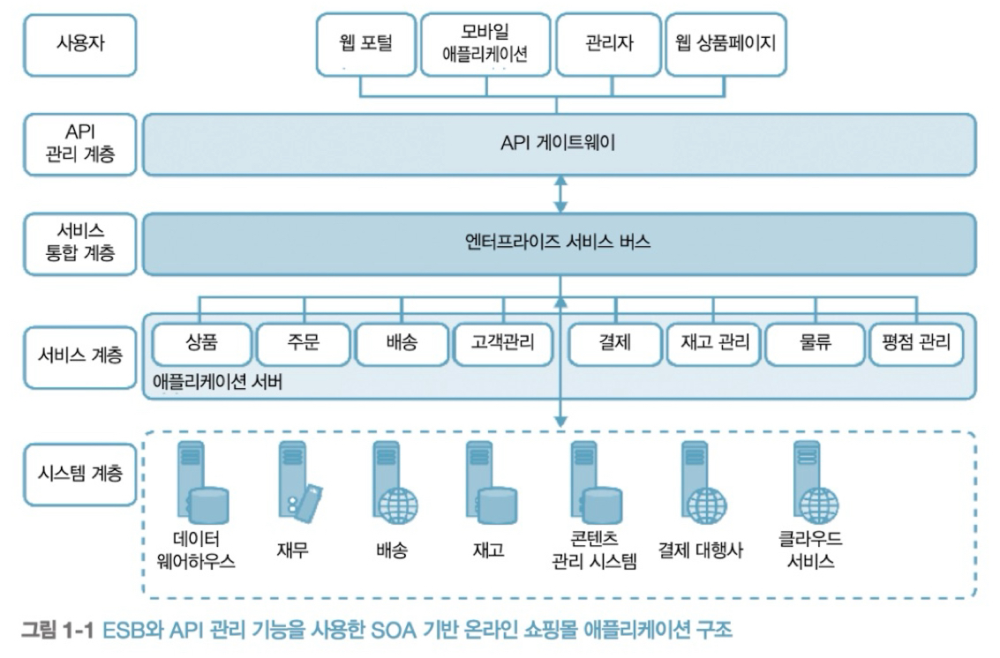
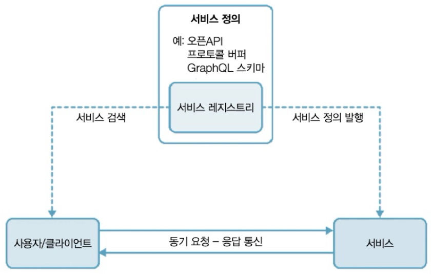
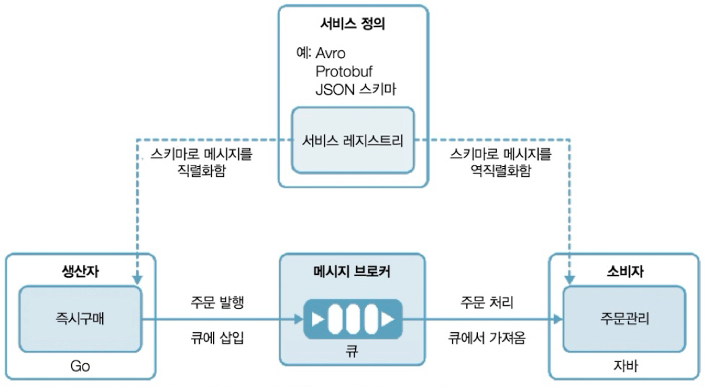
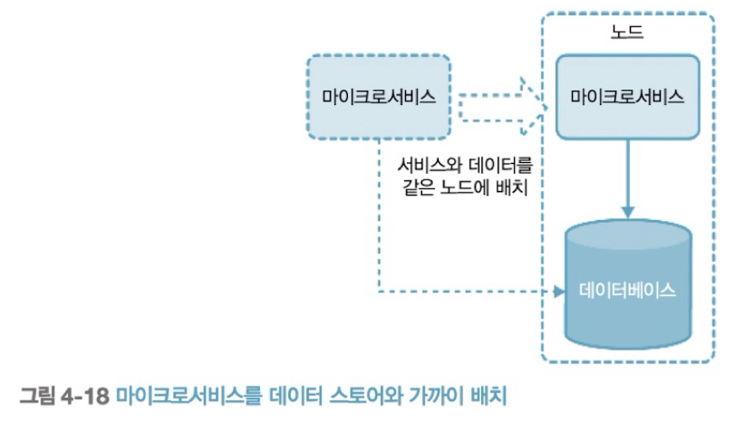

# 목차
>- [참조](#참조)
>- [MSA란?](#msa란)
>   - [Service란?](#service란)
>   - [프런트엔드와 백엔드](#프론트엔드와-백엔드)
>   - [다시, MSA란?](#다시-msa란)
>   - [MSA 고려 포인트](#msa-고려-포인트)
>- [연결](#연결)
>   - [동기 통신](#동기-통신)
>       - [Service Registry](#service-registry)
>       - [Service Discovery란?](#service-discovery서비스-검색-란)
>- [비동기 통신: 메시지 브로커 & 이벤트 브로커](#비동기-통신-메시지-브로커--이벤트-브로커)
>   - [비동기 통신의 서비스 정의](#비동기-통신의-서비스-정의)
>- [조합](#조합)
>   - [서비스 연결성](#서비스-연결성)
>   - [서비스 탄력성](#서비스-탄력성)
>   - [조합 방식(패턴)](#조합-방식패턴)
>       - [1. 오케스트레이션](#1-오케스트레이션-orchestration)
>       - [2. 코레오그래피](#2-코레오그래피-choreography)
>           - [중재자 오케스트레이션](#중재자-오케스트레이션-패턴-책임을-중앙-집중화)
>           - [파이프라인 앤 필터](#파이프라인-앤-필터-패턴-책임을-각-마이크로-서비스에-분산)
>       - [사가 - 분산트랜잭션 목적](#사가-saga---분산트랜잭션-목적)
>- [데이터 관리](#데이터-관리)
>      - [데이터 타입](#데이터-타입)
>      - [데이터 형태](#데이터-형태)
>   - [성능 고려한 데이터 관리 패턴](#성능-고려한-데이터-관리-패턴)
>       - [구체화된 뷰](#구체화된-뷰)
>       - [데이터 지역성 패턴](#데이터-지역성-패턴)

### 참조
- 클라우드 네이티브 애플리케이션 디자인 패턴
    - 저자: 카순 인드라시리, 스리스칸다라자 수호타얀
- 엔터프라이즈 환경을 위한 마이크로서비스
    - 저자: 카순 인드라시리, 프라바스 시리와데나
- 삼성 SDS 인사이트 <https://www.samsungsds.com/kr/insights/msa_and_netflix.html>
- 서비스 방법론 12단계 <https://12factor.net/ko>

# MSA란?
- Micro Service Architecture

## Service란?
- 서비스란, 비즈니스 로직을 처리해주는 애플리케이션을 의미한다.
- 구 웹 사이트는 기술적으로 구성시, 완전한 SSR(Server Side Rendering) 방식이었다.
    - Spring, .Net Framework 등에서 템플릿 엔진을 이용하여, 서버 사이드에서 화면을 만들고, 클라이언트 사이드로 Dom tree가 담긴 문서를 제공했다.
    - 즉, 비즈니스 로직 처리와 UI가 담긴 View를 그리는 처리가 모두 한 곳에서 이루어졌다.
        - 여기서 MVC(모델, 뷰, 컨트롤러) 패턴이 등장한다.
        - 페이지의 기능이 복잡해질수록, 상태 관리 때문에, MVC는 UI(User Interface)를 처리하기에 난해해졌다.
        - 이를 위해 비즈니스 로직의 처리와 뷰 렌더링 처리를 분리하기로 했다.

## 프론트엔드와 백엔드?
1. 과거에는 UI 처리와 비즈니스 로직의 처리가 **서버 사이드 한 곳에서 이루어졌다.**
    1. 구 **프론트엔드**(Front End)는 고객을 상대하는 페이지(Front Office)를 의미했다.
    2. 구 **백엔드**(Back End)는 운영과 관리자를 상대하는 페이지(Back Office)를 의미했다.

2. UI의 처리와 비즈니스 로직의 처리하는 곳을 완전히 분리함에 따라, 지칭하는 명칭이 필요해졌다.
    1. **백엔드**(서비스)란, 비즈니스 로직을 처리하는 서버 사이드의 API 앱을 의미한다.
    2. **프론트엔드**란, 클라이언트 사이드의 View의 렌더링과, UI를 처리하는 클라이언트 사이드 웹 앱을 의미한다.

## 다시, MSA란?
- **아주 작은 단위**의 **서비스**(백엔드 앱)들로 이루어진 **설계**를 의미한다.

- MSA의 도입 배경을 살펴보자
- 요청은 이벤트에 따라 서비스의 이용 빈도가 매우 상이했다.
    - 극단적인 예시로 요청의 빈도가 다음과 같은 사이트가 있다고 하자.
|서비스|요청 비율|
|--|--|
|결제|1|
|회원 정보|10|
|콘텐츠 정보1|100000|
|콘텐츠 정보2|1|
    - 위 사이트는 콘텐츠 정보1의 100000에 맞추어 자원을 설정하여, 결제의 입장에선 아주 비효율적이다.
    - 각각의 서비스들은 요청 뿐만 아니라, 배포 이슈, 에러 등의 **가장 최악의 상황들을 공유하게 된다.**
    - 그래서 분리하기로 했다.

- 이를 **SOA**(Service Oriented Architecture: 서비스 지향 아키텍처)라고 한다.

- 이 아키텍처에는 아주 큰 문제가 있었는데, 서비스들이 많아짐에 따라, 관리 포인트가 기하급수적으로 증가한다.

- 이때 혜성처럼 등장한 것이, Netplix에서 Spring을 기반으로 만든, **Netflix OSS**(Open Source Software)이다. 
    - 당시 실리콘벨리의 IT업체들은 Netflixed(넷플릭스 당하다) 되었다고 했다.
        - 넷플릭스가 OSS를 만든 이유는, 2007년 심각한 데이터베이스 손상으로 3일간의 서비스 장애를 겪었고, 이를 위해 MSA를 도입하였다.
        - MSA를 적용하기위해, 또한 클라우드 환경으로 이전하기 위해, 거대 자본의 7년간의 노하우가 집약된 프로젝트인 것이다.
    - 이후, 모든 아이티 업체들이 이와 비슷한 아키텍처로 출시하거나 수정했다.
        - 현재, Netplix OSS의 Eureka만 업데이트되고, 다른 것들은 전부 deprecated되었으며, 스프링 재단의 스프링 클라우드 프로젝트 내에서 이어나가고 있다.

- 'MSA'는 'ESB의 SOA'와 무슨 차이가 있길래? 
    - MSA란 ESB의 기능(관리 포인트)마저 여러개의 마이크로서비스들로 잘게 쪼갠다. 
    - MSA란 **잘 정의된 비즈니스 기능을 제공하는 서비스들의 아키텍처**이며, 
    - **서비스가 서비스 간 통신 및 구성 로직을 관리하게 된다**.

- MSA에서 서비스 설계시 가장 중요한 점 중 하나는
    - '**하나의 Service는 오직 한 가지 일에만 집중하고, 완벽하게 처리한다.**' 일 것이다.
    - 특정 서비스가 특정 **비즈니스 목적**을 충족하고 잘 정의된 책임을 가지도록 설계해야만 한다.
        - 너무 큰 덩어리로 된 SOA와 같은 서비스도, 너무 작아 하나의 비즈니스 기능에 매핑되지 않게 세분화된 것도 MSA의 서비스에 맞지 않는 안티 패턴이다.
    - 이외 주요 시사점을 서비스 방법론 12단계 <https://12factor.net/ko>에서 확인할 수 있다.

## MSA 고려 포인트
- 많은 서비스들을 관리/운영/개발하는데 고려해야할 포인트들에는 어떤 것들이 있을까?
    - 다음 두 가지에 대해 설명하는 것이 MSA에 대한 전반적인 이해도를 높일 수 있다고 생각했다.
    1. [서비스간 연결성](#연결)
    2. [데이터 관리 패턴](#데이터-관리)

# 연결
## 동기 통신
- 동기 통신의 경우, 서비스 정의를 서비스 레지스트리라는 중앙화된 곳에서 이뤄진다.

### Service Registry
- 서비스 레지스트리란, 서비스(백엔드 api app) 정보를 등록해두는 기능을 의미한다.
    - 서비스의 이름, 서비스 ip, port 등의 메타데이터를 등록하고 관리해주는, 하나의 **메타데이터 스토어** 마이크로 서비스를 의미한다.

- 넷플릭스의 주요 관심사는 가용성과 확장성이었다.
    - 트래픽이 일순간 기하급수적으로, 백배-천배-일억배 증가할 때, 서비스를 추가로 올려야한다고 하자.
    - 늘어나는 서비스만큼 IP와 Port를 일일히 적어주고, 게이트웨이 또는 LB에도 일일히 명시해줘야한다.
    - 이를 운영자가 직접 관리한다면, 트래픽 이슈때마다 출근해서 한땀 한땀 설정파일을 작성하고 띄워야 한다.
- 넷플릭스에서는 Service Registry를 **Eureka**라는 이름으로 만들었다.
    - 한 서비스의 애플리케이션을 수평 확장을 목적으로 실행할 때, Eureka에 등록하는 설정만 있다면,
    - Eureka가 알아서, 해당 메타데이터를 등록하고 관리한다.
- 또한 서비스 레지스트리는 기본적으로 **서비스 디스커버리** 기능을 제공한다.

### Service Discovery(서비스 검색) 란?
- 서비스 이름으로 서비스를 찾는 기능을 의미한다.
- 서비스를 찾을 때, 서비스 이름으로 물어보면, 서비스 이름에 등록된 주소를 제공해준다!
    - 로드밸런싱 기능을 덧붙여 사용한다.

- 서비스 레포지토리를 적용한다면, 서비스의 주소를 일일히 게이트웨이에 등록할 필요 없이, 서비스 이름만 등록해주면 찾아갈 수 있게 돕는다.
    - 즉, 운영자가 트래픽 이슈마다 출근하지 않아도, 설정만 잘 해놓으면, 서비스를 수평 확장할때 자동으로 서비스가 등록되고 알아서 로드밸런싱되어, 서비스가 원활하게 돌아갈 수 있게 해준다.

### 어떤 것들이 있을까?
- MSA의 시초가 되는 Spring Cloud Netflix Eureka
- HashiCorp Consul
- Apache Zookeeper
- Kubernetes Service Repository

## 비동기 통신: 메시지 브로커 & 이벤트 브로커
### 언제 비동기 통신일까?
- 데이터 처리 요청을 명령(Command)이라고 한다.
    - 질의(Query)는 동기적으로 데이터 조회시 알맞지만,
    - 처리가 **딱 한번 처리** 되어야 하는(성공이든 실패든 간에), 명령(Command)은 **단방향 처리 요청**으로서, 비동기 통신으로 처리하는게 바람직하다.
- 명령시에, 처리의 **확인**이 필요하다면? 
    - 두 개의 단방향 처리 요청을 조합하여, 요청-응답 비동기 통신을 구성하거나,
    - Kafka의 경우, 기능을 제공한다.
- Apache ActiveMQ, RabbitMQ, Kafka
- CloudEvents

### 비동기 통신의 서비스 정의

- 비동기 통신 또한 Service Registry를 사용하기도 한다.
    - 이때, 이곳에 메시징을 위한 스키마(서비스간 약속된 형식)를 등록하게 된다.

## 조합
### 서비스 연결성

- 서비스는 개별 기능이나 도구 단위가 아닌, **비즈니스 기능** 단위로 정의한다.
- 통신 방식을 분리한다.
    - 상품 검색에는 동기 통신
    - 주문 생성과 처리는 비동기 통신

### 서비스 탄력성
- 수 많은 서비스들이 중간에 에러가 발생했을 때, 에러 전파 방지를 사람이 수동으로 처리하기란 난해하다.
    - 처리를 자동화할 필요가 있다. 다음은 처리 패턴들이다.

- 타임아웃
    - 서비스를 호출하고 완료되기까지 일정 시간을 기다려서 페일시킨다
- 데드라인
    - 서비스의 호출이 완료되어야하는 고정 시각을 정한다
- 재시도
    - 실패시, 최대 횟수까지 재 호출한다
- 서킷 브레이커
    - 특정 서비스가 계속 실패할 경우, 해당 서비스 호출시, 시스템의 더 큰 손상을 불러일으키고, 오류가 전파될 수 있다.
    - 실패 횟수가 특정 임계치를 넘으면, 해당 서비스의 호출을 막는다. (동작closed -> 차단open)
    - 차단된 서비스를 초기화하여 서비스를 복구시키는 동작을 설정할 수 있다.
- 페일 패스트
    - 빠른 실패가 느린 실패 응답보다 더 좋다
    
### 조합 방식(패턴)
#### 1. 오케스트레이션 Orchestration
- 여러 마이크로서비스를 **한 곳**에서 시스템들을 통합하고 호출하는 비즈니스 로직을 구현
- 연결된 모든 다른 서비스에 **강한 의존성**을 갖게 된다.

#### 2. 코레오그래피 Choreography
- 조합 로직을 하나의 서비스에만 집중해서 구현하지 않고 **여러 서비스에 나누어** 만들때 사용
- 마이크로서비스와 시스템 간 비동기 통신을 통해 서비스를 조합한다.
- 직접적 연결이 아니어서, **느슨한 결합 구조**를 갖는다.
- 딱 한번 전달 이라는, **신뢰성을 보장** 할 수 있다.

##### * 중재자 오케스트레이션 패턴 (책임을 중앙 집중화)

##### * 파이프라인 앤 필터 패턴 (책임을 각 마이크로 서비스에 분산)
- 업무 분리에 유리하지만, 반드시 이벤트에 대한 팀 간의 적확한 조율이 필요하다.

- 위 [서비스 연결성 예시](#서비스-연결성)와 같이, 두 가지 패턴을 혼합하여 사용한다.

#### 사가 Saga - 분산트랜잭션 목적
- 사가 패턴은 오케스트레이션 패턴을 분산 트랜잭션을 목적으로 구현시킨 패턴이다.

- 작업을 취소하는 **보상 작업**(compensating operation)을 페어로 구현해야 한다.
- 이 조합 로직은 **사가 실행 관리자**(Saga Execution Coordinator)로 구현한다.
- SEC는 사가 로그를 반드시 기록하도록 한다.
    - **로그 상태**에는 다음과 같은 종류가 있다.
        - 사가 시작
        - 사가 종료
        - 사가 취소
        - T-i 시작
        - T-i 종료
        - C-i 시작
        - C-i 종료

- 사가를 **코레오그래피 형식**으로 사용할 수 있다. (코레오그래피 사가)
    - 이 경우 SEC가 불필요하며, **메시지 브로커를 이용한 트랜잭션 작업**을 수행하게 된다.
    - 각 서비스가 메시지 브로커에서 트랜잭션의 상태를 읽고 자체적으로 보상 작업을 실행하도록 한다.
- 다음은 모 여행사의 구현 예시이다.

- 참조 교재에서는 사가 패턴은 밑바닥부터 만들기에는 너무 복잡하므로, 프레임워크나 솔루션을 사용할 것을 권장하고 있다.
    - Camunda, Apache Camel, Netflix Conductor, Uber Cadence 등의 프레임 워크와 워크플로 엔진
    - 클라우드 서비스에서 제공하는 서버리스 기능과 이벤트 브로커를 통한 사가 패턴 구현 지원

# 데이터 관리
## 클라우드 네이티브 앱의 데이터 아키텍처 추상화

- 데이터 소스: 데이터의 입력이 이루어지는 곳

- 데이터 인제스천 시스템 data ingestion system: 메시지 브로커와 같은, 메시지 로그성 데이터가 쌓이는 곳
    - 카프카, RabbitMQ 등
- 데이터 스토어: 데이터 아키텍처의 핵심. 다양한 형태의 데이터를 저장하고, 수평 확장 관리. API 제공
    1. 관계형 데이터베이스
        - 상품ID, 이름, 세부정보, 가격과 같이 중요하고 자주 사용하는 필드에 적합하다. (트랜잭션을 필요로 하거나, 강한 연관성을 가진 데이터)
        - 트랜잭션은 ACID 특징을 갖는다.
            - 원자성 Atomicity: 트랜잭션은 하나의 동작이다. 트랜잭션은 전체를 모두 실행했거나, 하나의 부분도 전혀 실행하지 않았거나 둘 중 하나이다.
            - 일관성 Consistency: 트랜잭션 동작의 결과는 일관된다. 따라서 결과 예측이 가능하다.
            - 고립성 Isolation: 트랜잭션 동안의 중간 상태 데이터는, 다른 트랜잭션이 볼 수 없다.
            - 지속성 Durability: 트랜잭션 이후의 데이터는 저장된다.
        - 확장성에서 Primary, Secondary(읽기만 가능) 구조만 지원

    2. NoSQL 데이터베이스(not only SQL)
        - 상품 리뷰 목록 등에 적합하다. (반정형, 비정형 필드를 가진 데이터)
        - 트랜잭션 지원을 안할 수도 있다.
        - 분산환경은 CAP의 특징을 갖는다.
            - 일관성 Consistency: 특정 노드의 데이터 변경은, 모든 노드에 전파된다.
            - 가용성 Availability: 일부 노드에 장애가 생겨도, 전체 시스템은 문제 없다.
            - 분할 내성 partition tolerance: 일부 노드가 다른 노드와 연결이 끊어져도, 시스템에는 이상이 없다.
        - NoSQL은 각각 제품마다, 설계에 따라 CAP의 우선 순위가 다르므로, 적절한 선택이 필요하다.
    3. 파일 시스템
        - 오픈소스: 하둡 분산 파일 시스템 HDFS
        - 클라우드 서비스: AWS S3, Asure Storage Service, GC Storage
        - 이에 성능 향상을 위해 정적 콘텐츠 호스팅(CDN)을 같이 사용할 수 있다.

- 실시간/스트림 프로세싱 시스템 real-time/stream-processing system: 이벤트를 즉시 처리하여 결과를 만들어내는 시스템. 경고/알림을 제공할 수 있다.
    - 배치 프로세싱 시스템 batch processing system: 데이터 소스의 데이터를 처리하고, 유의미한 형태의 데이터로 데이터 스토어에 저장

- 클라우드 네이티브 데이터는, 
    - 고정된 스키마를 갖지 않으며
    - 가용성, 성능 등의 이유로 여러 곳에 중복하여 존재하는 것이 좋다.
    - 서비스는 가급적 같은 데이터베이스를 사용하지 않도록 하고
    - 대신 각 서비스 고유의 데이터 스토어를 가지며, 데이터에 접근할 수 있는 API를 제공한다
    - 데이터 분리를 통해, 크기를 쉽게 확장할 수 있어야 한다.

### 데이터 타입
- **입력 데이터**: 사용자 또는 클라이언트를 통해 입력되는 메시지
- **설정 데이터**: 환경 등과 관련된 값
- **상태 데이터**: 애플리케이션의 메시지나 이벤트 등의 상태 자체를 기록하고 저장하는 데이터. 이를 통해, 애플리케이션 재시작에도 처리하던 작업을 처리할 수 있게 된다.

- 애플리케이션이 오로지 입력과 설정 데이터와만 관련되어있다면, 무상태Stateless 애플리케이션이라고 한다.
- 상태 또한 관리해야 한다면, 상태Stateful 애플리케이션이라고 한다

### 데이터 형태
- 정형 데이터: 정의된 스키마에 맞는 데이터. 관계형 데이터와 잘 맞는다
- 반정형 데이터: JSON, YAML의 형태
- 비정형 데이터: 이미지, 비디오, 저수준 텍스트. 그냥 저장

## 성능 고려한 데이터 관리 패턴
### 구체화된 뷰
- 미리 구체화된 뷰로 캐싱하여, 데이터 조회를 효과적으로 처리할 수 있다.
- 서비스의 ORM에 유리하다
- 대상 데이터의 크기가 작거나, CPU를 많이 소모하는 복잡한 조인, 데이터 변환 같은 작업에 좋다.

### 데이터 지역성 패턴
- 데이터 처리 로직을 최대한 데이터와 가까운곳에서 실행
    - 서비스와 데이터를 같은 위치에 배포하거나, 데이터 스토어에서 로직(**저장 프로시저**, PL/SQL)을 실행
    - 동일 노드에서 실행할 수 없다면, 최대한 같은 리전, 같은 데이터센터에 배치하여 네트워크 대역폭 소비를 최소화

- 주의사항
    - 질의의 결과가 입력 데이터 크기와 거의 차이가 없는 경우, 이 패턴은 사용하지 않는 것이 좋다.
        - 데이터 노드의 부하만 가중시키기 때문
    - **질의 전용** 데이터베이스의 경우에만 이 패턴을 사용하는 것이 좋다.
        - 공유 데이터베이스에서 저장 프로시저를 실행하는 것은 성능 및 관리 문제를 일으킬 수 있어, 반드시 지양한다.
    - **성능상 이점**이 없는 경우, 마이크로서비스에서 비즈니스 로직을 실행하도록 한다.

## 이외 검토 사항
- 이외에도 확인이 필요한 사항이 있다.
    - 인증/인가
    - CI/CD
    - 샤딩
    - IaC (코드로서의 인프라)
    - 컨테이너 환경 구성
    - 클라우드 환경 구성

# 실습: 작업 환경 구성 (Spring with Docker)
- 실제 엔터프라이즈급 프로덕트 환경을 로컬에 구축하긴 쉽지 않다.
- 간단한, MSA의 로컬 작업 환경을 구성해보겠다.
- 스프링 클라우드 프로젝트를 활용했으며, 소스는 준비되어있다.

1. 도커 데스크탑 설치(도커 엔진 설치)
    - [도커 데스크탑 설치 위치](docker.com/products/docker-desktop)
    - 스웜 모드로 할 필요 없다.(단일 로컬 머신으로 테스트하므로)
    - 설치를 완료되었다면, 도커는 더이상 신경 쓸 필요가 없다. 
    - 도커 엔진만 실행되는 상태이면 된다. 
        - 도커 파일과 도커 컴포즈 파일을 모두 미리 작성해두었으므로..
    - 도커에 대한 설명은 생략한다.

2. 깃헙 소스 클론 받기
    - `git clone https://github.com/Iol-lshh/boilerplate.git`

3. 컴포즈 실행

4. 추가 테스트용 인스턴스 로컬 머신에서 실행
